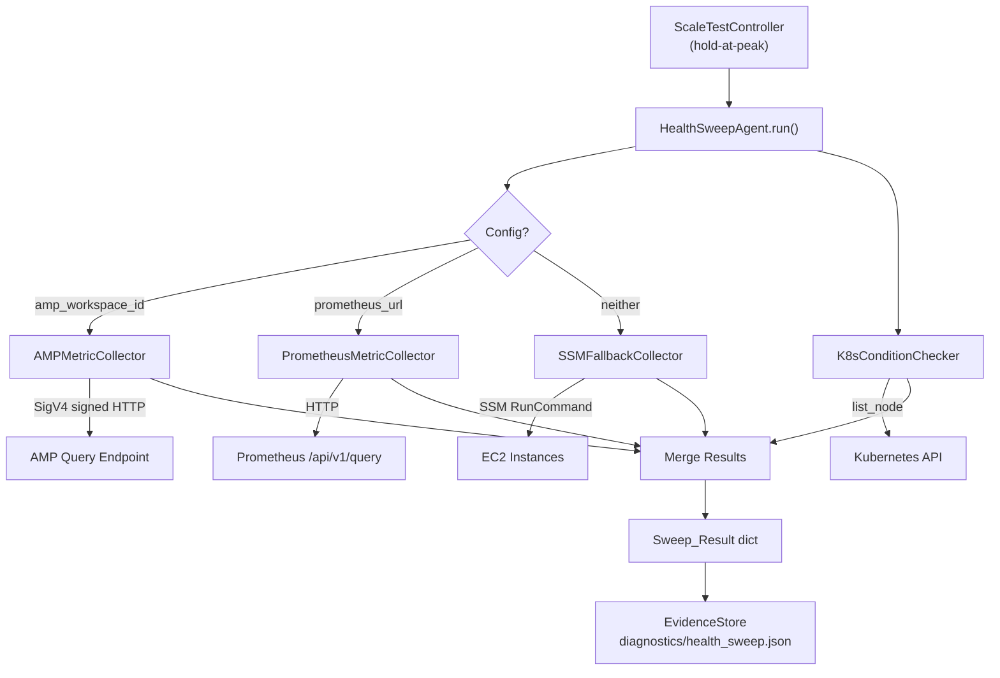

# Design Document: AMP Health Sweep

## Overview

This design replaces the SSM-based `HealthSweepAgent` with a new implementation that uses AMP (Amazon Managed Prometheus) PromQL queries for fleet-wide metrics and the Kubernetes API for node conditions. The key architectural change is moving from a per-node SSH-style approach (SSM into each node) to a centralized query approach (ask Prometheus and the K8s API for data about all nodes at once).

The new `HealthSweepAgent` selects its data collection strategy based on TestConfig:
- If `amp_workspace_id` is set → AMP PromQL queries (SigV4-signed)
- Else if `prometheus_url` is set → direct Prometheus HTTP queries
- Else → SSM fallback (existing behavior)

K8s API node conditions are always checked regardless of which metric source is used, replacing the broken kubelet healthz curl. SSM is retained as an optional fallback for low-level node data (PSI pressure, bpftrace probes, BPF tooling) that isn't exported to Prometheus.

The output format (`Sweep_Result` dict) remains identical so the downstream pipeline (summary, chart, operator prompt) requires no changes.

## Architecture



## Components and Interfaces

### 1. AMPMetricCollector

Queries AMP or direct Prometheus for fleet-wide node metrics via PromQL.

```python
class AMPMetricCollector:
    """Collects node metrics from AMP or direct Prometheus via PromQL."""
    
    def __init__(self, amp_workspace_id: str | None, prometheus_url: str | None,
                 aws_profile: str | None = None, region: str = "us-west-2") -> None:
        ...
    
    async def collect_all(self) -> dict[str, list[NodeMetricResult]]:
        """Run all PromQL queries concurrently. Returns dict keyed by metric category.
        
        Keys: "cpu", "memory", "disk", "network_errors", "pod_restarts"
        Values: list of NodeMetricResult per node
        """
        ...
    
    async def _query_promql(self, query: str) -> dict:
        """Execute a single PromQL instant query. Returns raw Prometheus JSON response."""
        ...
```

PromQL queries used:

| Metric | PromQL Query |
|--------|-------------|
| CPU utilization | `100 - (avg by(node)(rate(node_cpu_seconds_total{mode="idle"}[5m])) * 100)` |
| Memory usage | `100 * (1 - node_memory_MemAvailable_bytes / node_memory_MemTotal_bytes)` |
| Disk usage | `100 - (node_filesystem_avail_bytes{mountpoint="/",fstype!="tmpfs"} / node_filesystem_size_bytes{mountpoint="/",fstype!="tmpfs"} * 100)` |
| Network errors | `sum by(node)(rate(node_network_receive_errs_total[5m]) + rate(node_network_transmit_errs_total[5m]))` |
| Pod restarts | `sum by(node)(increase(kube_pod_container_status_restarts_total[15m]))` |

For AMP, the query endpoint is:
```
https://aps-workspaces.{region}.amazonaws.com/workspaces/{workspace_id}/api/v1/query
```

Requests are signed with SigV4 using `botocore.auth.SigV4Auth` against the `aps` service.

For direct Prometheus, the endpoint is:
```
{prometheus_url}/api/v1/query
```

### 2. K8sConditionChecker

Reads node conditions from the Kubernetes API in a single `list_node` call.

```python
class K8sConditionChecker:
    """Checks node conditions via the Kubernetes API."""
    
    CONDITION_TYPES = ("Ready", "DiskPressure", "MemoryPressure", "PIDPressure")
    
    def __init__(self, k8s_client) -> None:
        ...
    
    async def check_all(self) -> list[NodeConditionResult]:
        """Query all node conditions in one API call. Returns per-node results."""
        ...
```

A node is flagged as having an issue when:
- `Ready` status is not `"True"`
- `DiskPressure` status is `"True"`
- `MemoryPressure` status is `"True"`
- `PIDPressure` status is `"True"`

### 3. SSMFallbackCollector

Wraps the existing SSM sweep logic for low-level node data collection. Reuses `parse_sweep_output` and the `NodeDiagnosticsCollector.run_single_command` method. Supports optional extra commands for bpftrace, BPF tooling, or other low-level diagnostics.

```python
class SSMFallbackCollector:
    """SSM-based sweep — used when AMP/Prometheus are not configured,
    or for collecting low-level data (PSI, bpftrace, BPF tools) not in AMP."""
    
    def __init__(self, k8s_client, node_diag: NodeDiagnosticsCollector,
                 extra_commands: dict[str, str] | None = None) -> None:
        ...
    
    async def collect(self, sample_size: int = 10) -> dict:
        """Sample Ready nodes via SSM. Returns partial Sweep_Result dict.
        
        Runs the standard health check command plus any extra_commands.
        Extra command output is stored in node_details[].extra_diagnostics.
        """
        ...
```

`extra_commands` is a dict mapping a label to a shell command, e.g.:
```python
{
    "bpftrace_runqlat": "bpftrace -e 'tracepoint:sched:sched_switch { @[comm] = count(); }' -c 'sleep 5'",
    "biolatency": "biolatency-bpfcc 5 1",
}
```

This is essentially the existing `HealthSweepAgent.run()` body extracted into its own class, with the addition of extra command support.

### 4. HealthSweepAgent (refactored)

Orchestrates the collection strategy and merges results into the canonical `Sweep_Result` format.

```python
class HealthSweepAgent:
    """Samples fleet health at peak load using AMP, K8s API, or SSM fallback."""
    
    def __init__(self, config: TestConfig, k8s_client,
                 node_diag: NodeDiagnosticsCollector,
                 evidence_store: EvidenceStore, run_id: str) -> None:
        ...
    
    async def run(self, sample_size: int = 10) -> dict:
        """Execute health sweep. Returns Sweep_Result dict."""
        ...
```

Strategy selection in `run()`:
1. If `config.amp_workspace_id` or `config.prometheus_url` → use `AMPMetricCollector` + `K8sConditionChecker`
2. Else → use `SSMFallbackCollector`

### 5. NodeMetricResult / NodeConditionResult (internal dataclasses)

```python
@dataclass
class NodeMetricResult:
    node_name: str
    metric_category: str  # "cpu", "memory", "disk", "network_errors", "pod_restarts"
    value: float

@dataclass
class NodeConditionResult:
    node_name: str
    issues: list[str]  # e.g. ["NotReady: KubeletNotReady", "MemoryPressure: MemoryPressureExists"]
```

### Threshold Configuration

Issue thresholds for AMP metrics (applied when converting raw metrics to issues):

| Metric | Threshold | Issue String Format |
|--------|-----------|-------------------|
| CPU utilization | > 90% | `"High CPU utilization {value:.1f}% on {node}"` |
| Memory usage | > 90% | `"High memory usage {value:.1f}% on {node}"` |
| Disk usage | > 85% | `"High disk usage {value:.1f}% on {node}"` |
| Network errors | > 0 errors/s | `"Network errors {value:.1f}/s on {node}"` |
| Pod restarts | > 5 restarts/15m | `"Pod restarts {value:.0f} in 15m on {node}"` |

### Result Merging Logic

The `HealthSweepAgent.run()` method merges AMP metrics and K8s conditions into a single `Sweep_Result`:

```python
def _merge_results(self, amp_metrics: dict, k8s_conditions: list,
                   raw_metrics: dict) -> dict:
    """Merge AMP metrics and K8s conditions into Sweep_Result format."""
    all_nodes = set()
    node_issues: dict[str, list[str]] = defaultdict(list)
    
    # Add AMP metric issues (threshold violations)
    for category, results in amp_metrics.items():
        for r in results:
            all_nodes.add(r.node_name)
            issue = self._check_threshold(r)
            if issue:
                node_issues[r.node_name].append(issue)
    
    # Add K8s condition issues
    for cond in k8s_conditions:
        all_nodes.add(cond.node_name)
        node_issues[cond.node_name].extend(cond.issues)
    
    # Build result
    issues = []
    node_details = []
    healthy = 0
    for node in sorted(all_nodes):
        ni = node_issues.get(node, [])
        node_details.append({
            "node_name": node,
            "status": "Unhealthy" if ni else "Healthy",
            "issues": ni,
        })
        if ni:
            issues.extend(ni)
        else:
            healthy += 1
    
    return {
        "nodes_sampled": len(all_nodes),
        "healthy": healthy,
        "issues": issues,
        "node_details": node_details,
        "raw_metrics": raw_metrics,
    }
```

## Data Models

### Sweep_Result (dict format — unchanged from current implementation)

```python
{
    "nodes_sampled": int,       # Total nodes assessed
    "healthy": int,             # Nodes with zero issues
    "issues": list[str],        # Flat list of issue strings
    "node_details": [           # Per-node breakdown
        {
            "node_name": str,
            "status": str,      # "Healthy" or "Unhealthy" (AMP/K8s) or SSM status
            "issues": list[str],
            # SSM-only fields (when using fallback):
            "instance_id": str,  # optional
            "raw_output": str,   # optional
            "extra_diagnostics": dict,  # optional — keyed by command label
        }
    ],
    # AMP-only fields:
    "raw_metrics": dict,        # optional — raw PromQL responses keyed by category
}
```

### NodeMetricResult

```python
@dataclass
class NodeMetricResult:
    node_name: str
    metric_category: str  # "cpu", "memory", "disk", "network_errors", "pod_restarts"
    value: float
```

### NodeConditionResult

```python
@dataclass
class NodeConditionResult:
    node_name: str
    issues: list[str]
```

### PromQL Response Parsing

AMP/Prometheus returns JSON in this format for instant queries:
```json
{
  "status": "success",
  "data": {
    "resultType": "vector",
    "result": [
      {
        "metric": {"node": "ip-10-0-1-100.ec2.internal", ...},
        "value": [1234567890.123, "85.5"]
      }
    ]
  }
}
```

The parser extracts `metric.node` (or `metric.instance` mapped to node name) and `value[1]` as a float.


## Correctness Properties

*A property is a characteristic or behavior that should hold true across all valid executions of a system — essentially, a formal statement about what the system should do. Properties serve as the bridge between human-readable specifications and machine-verifiable correctness guarantees.*

### Property 1: Node condition classification

*For any* node with conditions where Ready is not "True", or DiskPressure/MemoryPressure/PIDPressure is "True", the `K8sConditionChecker` should report an issue string identifying the node and the specific condition. Conversely, for any node where Ready is "True" and all pressure conditions are "False", the checker should report zero issues.

**Validates: Requirements 2.2, 2.3, 2.4, 2.5**

### Property 2: Strategy selection by config

*For any* `TestConfig`, if `amp_workspace_id` is set or `prometheus_url` is set, the `HealthSweepAgent` should use the AMP/Prometheus metric collector and not invoke SSM. If neither is set, the agent should use the SSM fallback collector.

**Validates: Requirements 3.1, 3.2**

### Property 3: Threshold violation detection

*For any* `NodeMetricResult` where the value exceeds the threshold for its metric category (CPU > 90%, memory > 90%, disk > 85%, network errors > 0/s, pod restarts > 5), the threshold checker should produce a non-empty issue string containing the node name and the metric value. For values at or below the threshold, no issue should be produced.

**Validates: Requirements 4.2, 4.3, 4.4, 4.5, 4.6**

### Property 4: Result structure and count invariants

*For any* set of AMP metric results and K8s condition results, the merged `Sweep_Result` should satisfy:
- `nodes_sampled` equals the number of unique node names across all inputs
- `healthy` equals the number of nodes in `node_details` with empty `issues` lists
- `healthy + len([n for n in node_details if n["issues"]])` equals `nodes_sampled`
- Every node from the inputs appears exactly once in `node_details`
- Each `node_details` entry contains `node_name`, `status`, and `issues` keys

**Validates: Requirements 4.1, 4.8, 4.9, 4.10**

### Property 5: PromQL response parsing

*For any* valid Prometheus vector response JSON (with `status: "success"`, `data.resultType: "vector"`, and a list of results each containing `metric.node` and `value[1]` as a numeric string), the parser should produce one `NodeMetricResult` per result entry with the correct node name and float value. Parsing then re-serializing the metric values should preserve the node-to-value mapping.

**Validates: Requirements 1.1, 1.2, 1.3, 1.4, 1.5**

### Property 6: Raw metrics inclusion when AMP is used

*For any* successful AMP collection run, the merged `Sweep_Result` should contain a `raw_metrics` key whose value is a dict with one entry per metric category queried. When SSM fallback is used, `raw_metrics` should not be present.

**Validates: Requirements 7.2**

## Error Handling

| Failure Mode | Component | Behavior |
|---|---|---|
| Single PromQL query fails (timeout, HTTP error) | AMPMetricCollector | Log warning, return empty list for that metric category. Other categories still collected. |
| All PromQL queries fail | AMPMetricCollector | Log error, return empty dict. HealthSweepAgent adds a top-level issue string. |
| SigV4 signing fails (no credentials) | AMPMetricCollector | Log error, return empty dict. Same as all-queries-fail. |
| K8s API list_node fails | K8sConditionChecker | Log error, return empty list. Sweep continues with AMP metrics only. |
| K8s API timeout | K8sConditionChecker | Same as list_node failure — 10s request timeout. |
| SSM send_command fails | SSMFallbackCollector | Per-node: log debug, mark node as SSM failed. Same as current behavior. |
| Evidence store write fails | HealthSweepAgent | Log error, do not raise. Sweep result still returned to controller. |

All error handling follows the existing pattern: log and continue. The health sweep must never crash the test run.

## Testing Strategy

### Property-Based Testing

Use `hypothesis` (already in the project) for property-based tests. Each property test runs a minimum of 100 iterations.

| Property | Test Approach |
|---|---|
| P1: Condition classification | Generate random node names and condition combinations (Ready status, pressure booleans). Verify issue list matches expected classification. |
| P2: Strategy selection | Generate random TestConfig with various combinations of amp_workspace_id and prometheus_url (None or string). Verify correct collector type is selected. |
| P3: Threshold violation | Generate random NodeMetricResult with values spanning 0–100 for each category. Verify issue string presence matches threshold comparison. |
| P4: Result structure invariants | Generate random sets of NodeMetricResult and NodeConditionResult. Verify merged result satisfies all structural invariants. |
| P5: PromQL response parsing | Generate random Prometheus vector response JSON with valid structure. Verify parsed results match input data. |
| P6: Raw metrics inclusion | Generate random collection results with AMP vs SSM mode flag. Verify raw_metrics key presence. |

### Unit Testing

Unit tests cover specific examples and edge cases:

- AMP endpoint URL construction (amp_workspace_id → correct URL, prometheus_url → correct URL)
- SigV4 signing is applied for AMP, not for direct Prometheus
- Empty PromQL response (no nodes reporting) → nodes_sampled=0
- All queries fail → issue string in result
- K8s API failure → empty conditions, sweep still returns
- SSM fallback produces same format as current implementation
- `parse_sweep_output` continues to work (existing tests)
- Threshold boundary values (exactly at threshold → no issue, just above → issue)

### Test Configuration

- Property-based testing library: `hypothesis`
- Minimum iterations: 100 per property
- Tag format: `Feature: amp-health-sweep, Property {N}: {title}`
- Tests located in `tests/test_health_sweep.py`
