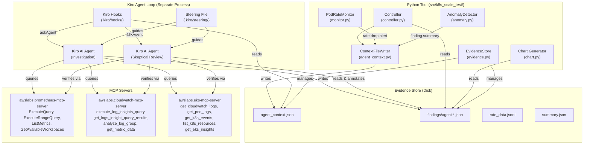

# Design Document: AWS Observability Integration via AI Sub-Agent

## Overview

This design replaces the current static diagnostics approach (hardcoded SSM commands on 3 nodes) with an AI sub-agent that uses MCP servers to dynamically investigate fleet-wide observability data during EKS scale tests. The architecture has three layers:

1. **Python tool (writer)** — The existing controller writes a `agent_context.json` file to the evidence store during the test lifecycle. This file contains everything the agent needs: run ID, timestamps, namespaces, node lists, alerts, and AWS resource identifiers (AMP workspace ID, CloudWatch log group, EKS cluster name). The Python tool's changes are minimal — it writes context and reads findings.

2. **Kiro hooks + steering (orchestration)** — Hook files trigger the AI sub-agent at key moments: proactively during scaling/hold-at-peak, and reactively when alerts appear. A steering file provides domain knowledge about EKS scale test observability patterns. The hooks use `askAgent` action type to invoke the agent with prompts that reference the context file.

3. **AI sub-agent + MCP servers (investigator)** — The Kiro agent reads the context file, uses the three MCP servers (Prometheus, CloudWatch, EKS) as tools to query observability data, reasons about what it finds, and writes structured findings as JSON files to the evidence store. The agent decides what PromQL to run, what logs to search, and what EKS state to check — no hardcoded queries.

4. **Skeptical review agent (verifier)** — A second agent hook triggers after the investigation agent writes a finding. This agent independently re-queries MCP servers to verify key claims, checks source code and documentation for context, assigns a confidence level, lists alternative explanations, and writes checkpoint questions when confidence is below "high". This prevents runaway analysis where an early mistake propagates through subsequent reasoning steps. The review is appended to the finding as a `review` field before it reaches the operator.

The key insight: the agent runs in Kiro's separate agent loop, completely decoupled from the Python tool's asyncio event loop. The context file is the only interface. This means the monitor ticker (5-second loop) is never blocked, and the agent can take as long as it needs to investigate.

## Architecture



### Lifecycle Integration

The context file writer hooks into the controller's existing lifecycle phases. The Kiro agent hooks trigger independently based on file changes:

```
Phase 1: Preflight
  └─ No agent involvement (preflight is fast, no observability data yet)

Phase 5: Set up monitoring
  └─ ContextFileWriter created with run config
  └─ Initial agent_context.json written (phase: "initializing")

Phase 6: Scaling (monitor + anomaly detection active)
  └─ ContextFileWriter updates phase to "scaling" with start timestamp
  └─ Proactive scan hook triggers → agent scans AMP for emerging issues
  └─ On rate drop: ContextFileWriter appends alert → reactive hook triggers
  └─ On finding: ContextFileWriter appends finding summary
  └─ Skeptical review hook triggers → review agent verifies findings

Phase 7: Hold-at-peak
  └─ ContextFileWriter updates phase to "hold-at-peak"
  └─ Proactive scan hook triggers → agent does deep fleet health scan
  └─ Skeptical review hook triggers → review agent verifies findings
  └─ This is the critical window — signal disappears after cleanup

Phase 8: Cleanup
  └─ ContextFileWriter updates phase to "cleanup"
  └─ Agent hooks stop triggering (no point scanning during teardown)

Phase 9: Summary + Chart
  └─ Controller reads agent-*.json findings from evidence store
  └─ Findings included in TestRunSummary and HTML chart
```

### Decoupled Execution Model

The Python tool and the Kiro agent are completely decoupled:

- **Python tool**: Runs in its own Python asyncio event loop. Writes `agent_context.json` synchronously (single JSON write, <10ms). Never waits for the agent.
- **Kiro agent**: Runs in Kiro's agent loop (separate process). Reads context file, calls MCP tools, writes findings. Can take 30-60 seconds per investigation without affecting the test.
- **Shared interface**: The evidence store directory on disk. Context file flows Python→Agent. Finding files flow Agent→Python.

This is fundamentally different from the old design where observability clients ran inside the Python tool's event loop and had to use `run_in_executor` to avoid blocking the monitor.

## Components and Interfaces

### ContextFileWriter (`agent_context.py`)

New Python module. Responsible for writing and updating the agent context file.

```python
class ContextFileWriter:
    """Writes agent_context.json to the evidence store run directory.
    
    All writes are synchronous JSON dumps to local disk (<10ms).
    The context file is the sole interface from Python tool → Kiro agent.
    """
    
    def __init__(self, evidence_store: EvidenceStore, run_id: str, config: TestConfig):
        """Initialize with run directory path and test configuration.
        Extracts AMP workspace ID, CloudWatch log group, EKS cluster name from config."""
    
    def write_initial_context(self, namespaces: list[str], node_list: list[str]) -> None:
        """Write the initial context file when monitoring starts.
        Includes: run_id, config summary, namespaces, phase='initializing'."""
    
    def update_phase(self, phase: str, timestamp: datetime) -> None:
        """Update the current test phase and its start timestamp.
        Phases: 'scaling', 'hold-at-peak', 'cleanup', 'complete'."""
    
    def append_alert(self, alert: Alert) -> None:
        """Append a rate drop alert to the alerts list in the context file.
        Includes: timestamp, alert_type, message, current_rate, rolling_avg, ready, pending."""
    
    def append_finding_summary(self, finding: Finding) -> None:
        """Append a finding summary to the findings list in the context file.
        Includes: finding_id, severity, symptom, affected_resources (first 10)."""
```

### Agent Context File Schema (`agent_context.json`)

```json
{
  "run_id": "2024-01-15_14-30-00",
  "test_start": "2024-01-15T14:30:00Z",
  "target_pods": 5000,
  "namespaces": ["scale-test-ns-1", "scale-test-ns-2"],
  "current_phase": "scaling",
  "phase_start": "2024-01-15T14:31:00Z",
  "amp_workspace_id": "ws-abc123def456",
  "cloudwatch_log_group": "/eks/my-cluster/nodes",
  "eks_cluster_name": "my-scale-test-cluster",
  "alerts": [
    {
      "timestamp": "2024-01-15T14:35:00Z",
      "alert_type": "rate_drop",
      "message": "Ready rate 2.50/s dropped below threshold",
      "current_rate": 2.5,
      "rolling_avg": 15.0,
      "ready_count": 1200,
      "pending_count": 350
    }
  ],
  "finding_summaries": [
    {
      "finding_id": "finding-abc12345",
      "severity": "critical",
      "symptom": "FailedCreatePodSandBox x47",
      "affected_resources": ["node-1", "node-2", "node-3"]
    }
  ],
  "evidence_dir": "/path/to/scale-test-results/2024-01-15_14-30-00"
}
```

### Agent Finding Schema (`agent-{id}.json`)

```json
{
  "finding_id": "agent-proactive-20240115T143500",
  "timestamp": "2024-01-15T14:35:00Z",
  "source": "proactive-scan",
  "severity": "warning",
  "title": "Rising memory pressure on 12 nodes in us-west-2b",
  "description": "AMP metrics show memory utilization climbing above 85% on 12 nodes...",
  "affected_resources": ["ip-10-0-47-12", "ip-10-0-47-15", "ip-10-0-48-3"],
  "evidence": [
    {
      "source": "prometheus",
      "tool": "ExecuteRangeQuery",
      "query": "node_memory_MemAvailable_bytes / node_memory_MemTotal_bytes * 100",
      "summary": "12 nodes below 15% available memory"
    },
    {
      "source": "cloudwatch",
      "tool": "execute_log_insights_query",
      "query": "filter @message like /OOM/",
      "summary": "3 OOM kill events in last 3 minutes"
    }
  ],
  "recommended_actions": [
    "Monitor these nodes closely — evictions likely within 5 minutes",
    "Consider reducing pod density on us-west-2b nodes"
  ],
  "review": {
    "confidence": "medium",
    "reasoning": "Independent AMP query confirms memory pressure on 10 of the 12 reported nodes. 2 nodes show recovery. However, CPU cores 0-1 are also saturated on 4 of these nodes, which the investigation did not mention.",
    "alternative_explanations": [
      "CPU contention on reserved system cores may be the primary bottleneck, with memory pressure as a secondary effect",
      "IPAMD memory leak (known issue at high pod density) rather than workload memory pressure"
    ],
    "checkpoint_questions": [
      "4 nodes show CPU core saturation alongside memory pressure. Should we investigate CPU contention as the primary cause?",
      "Are these nodes running the VPC CNI version with the known IPAMD memory leak?"
    ],
    "verification_results": [
      {
        "claim": "12 nodes above 85% memory utilization",
        "verified": "partial",
        "detail": "Confirmed 10/12 nodes. ip-10-0-47-15 and ip-10-0-48-3 have recovered to 72% and 68%."
      }
    ]
  }
}
```

### Kiro Hook: Proactive Scan (`.kiro/hooks/scale-test-proactive-scan.md`)

The proactive scan hook triggers when the context file indicates the test is in an active phase. It instructs the agent to scan AMP for fleet-wide anomalies without specifying exact queries.

```markdown
---
triggers:
  - type: file_change
    path: "**/agent_context.json"
    condition: "phase is 'scaling' or 'hold-at-peak'"
actions:
  - type: askAgent
    prompt: |
      Read the agent context file at {evidence_dir}/agent_context.json.
      You are monitoring an EKS scale test in the '{current_phase}' phase.
      
      Use the Prometheus MCP server tools to scan AMP for fleet-wide anomalies.
      Look for emerging issues — rising CPU/memory pressure, network errors,
      disk IO saturation, pod restart spikes — without hardcoded thresholds.
      
      If you find anything concerning, write a finding to
      {evidence_dir}/findings/agent-{id}.json following the Agent Finding schema.
      
      Focus on issues that could cause pod ready rate drops.
      Time is critical — signal disappears after cleanup.
---
```

### Kiro Hook: Reactive Investigation (`.kiro/hooks/scale-test-reactive-investigation.md`)

The reactive investigation hook triggers when new alerts appear in the context file. It instructs the agent to investigate using all three MCP servers.

```markdown
---
triggers:
  - type: file_change
    path: "**/agent_context.json"
    condition: "new alert entries added"
actions:
  - type: askAgent
    prompt: |
      Read the agent context file at {evidence_dir}/agent_context.json.
      A rate drop alert has been detected.
      
      Investigate using all available MCP servers:
      1. Prometheus MCP: query AMP for resource metrics around the alert timestamp
      2. CloudWatch MCP: search logs for errors correlated with the alert
      3. EKS MCP: check cluster state, pod logs, and K8s events
      
      Correlate findings across sources. Follow the evidence dynamically.
      Write your investigation report to {evidence_dir}/findings/agent-{id}.json.
---
```

### Kiro Hook: Skeptical Review (`.kiro/hooks/scale-test-skeptical-review.md`)

The skeptical review hook triggers when a new agent finding file appears. It invokes a separate agent pass that independently verifies the investigation's claims, assigns confidence, and surfaces alternative explanations. This is the key mechanism to prevent runaway analysis.

```markdown
---
triggers:
  - type: file_change
    path: "**/findings/agent-*.json"
    condition: "new finding file without review field"
actions:
  - type: askAgent
    prompt: |
      A new investigation finding has been written. Your role is SKEPTICAL REVIEWER.
      
      Read the finding at {finding_path}. Your job:
      
      1. VERIFY: Pick the most important claim in the finding and independently
         re-query the MCP servers to confirm it. Do NOT trust the investigation
         agent's evidence at face value.
      
      2. CONFIDENCE: Assign a confidence level (high/medium/low) with reasoning.
         - high: your independent verification confirms the key claims
         - medium: partial confirmation, or the evidence is ambiguous
         - low: your verification contradicts the finding, or key data is missing
      
      3. ALTERNATIVES: List other explanations the investigation may have missed.
         Check the source code and documentation for context the investigation
         agent might not have considered.
      
      4. CHECKPOINT: If confidence is medium or low, write specific questions
         for the operator. Example: "The finding blames memory pressure, but
         CPU cores 0-1 are also saturated. Should we investigate CPU contention?"
      
      Append a "review" field to the finding JSON with your assessment:
      {
        "review": {
          "confidence": "medium",
          "reasoning": "Independent AMP query confirms memory pressure on 10/12 nodes...",
          "alternative_explanations": ["CPU contention on reserved cores", "..."],
          "checkpoint_questions": ["Should we investigate CPU contention?"],
          "verification_results": [
            {"claim": "12 nodes above 85% memory", "verified": true, "detail": "..."}
          ]
        }
      }
---
```

### Steering File (`.kiro/steering/scale-test-observability.md`)

The steering file provides persistent domain knowledge to the agent. Key sections:

1. **EKS Scale Test Context** — What the test does, what phases mean, why timing matters
2. **AMP Metric Patterns** — Types of metrics available (node_exporter, kube-state-metrics, cadvisor), what anomalous patterns look like at scale
3. **CloudWatch Log Patterns** — Common error patterns in kubelet, containerd, IPAMD logs during scale tests
4. **EKS Cluster Context** — How to interpret control plane health, addon status, what matters during scaling
5. **Agent Finding Schema** — Exact JSON schema the agent must follow when writing findings, including the review field structure
6. **Investigation Strategies** — How to correlate across sources, what to prioritize, when to escalate severity
7. **Skeptical Review Process** — How to independently verify claims, assign confidence levels, identify alternative explanations, and write checkpoint questions for the operator

### Evidence Store Extensions (`evidence.py`)

```python
# New methods added to EvidenceStore

def write_agent_context(self, run_id: str, context: dict) -> None:
    """Write agent_context.json to the run directory. Uses _write_json."""

def load_agent_context(self, run_id: str) -> dict | None:
    """Load agent_context.json if it exists. Returns None if not present."""

def load_agent_findings(self, run_id: str) -> list[dict]:
    """Load all agent-*.json files from findings/ directory.
    Skips malformed files with a warning log. Returns list of parsed dicts."""
```

### Controller Changes (`controller.py`)

Minimal changes to the existing controller:

```python
# In ScaleTestController.__init__:
self._ctx_writer: ContextFileWriter | None = None

# In run(), after monitoring setup (Phase 5):
self._ctx_writer = ContextFileWriter(self.evidence_store, run_id, self.config)
self._ctx_writer.write_initial_context(namespaces, node_list)

# In _execute_scaling_via_flux(), at start:
if self._ctx_writer:
    self._ctx_writer.update_phase("scaling", datetime.now(timezone.utc))

# In hold-at-peak section:
if self._ctx_writer:
    self._ctx_writer.update_phase("hold-at-peak", datetime.now(timezone.utc))

# In anomaly detector callback path, after finding is produced:
if self._ctx_writer:
    self._ctx_writer.append_finding_summary(finding)

# In monitor alert callback:
if self._ctx_writer:
    self._ctx_writer.append_alert(alert)

# In _make_summary(), before building TestRunSummary:
agent_findings = self.evidence_store.load_agent_findings(run_id)
```

### TestConfig Changes (`models.py`)

```python
# New optional fields added to TestConfig
amp_workspace_id: Optional[str] = None
cloudwatch_log_group: Optional[str] = None
eks_cluster_name: Optional[str] = None
```

### CLI Changes (`cli.py`)

```python
# New arguments in parse_args()
p.add_argument("--amp-workspace-id", type=str, default=None,
               help="AMP workspace ID for Prometheus MCP server")
p.add_argument("--cloudwatch-log-group", type=str, default=None,
               help="CloudWatch log group for node logs")
p.add_argument("--eks-cluster-name", type=str, default=None,
               help="EKS cluster name for EKS MCP server")
```

### Chart Changes (`chart.py`)

The chart generator loads agent findings and renders them as event markers on the timeline:

```python
# In generate_chart():
findings_dir = Path(run_dir) / "findings"
agent_findings = []
if findings_dir.exists():
    for f in sorted(findings_dir.glob("agent-*.json")):
        try:
            agent_findings.append(json.loads(f.read_text()))
        except Exception:
            pass

# Render as vertical annotation lines on the Chart.js time axis
# Color-coded by severity: info=blue, warning=orange, critical=red
# Tooltip shows finding title and description
```

## Data Models

### New TestConfig Fields

Three optional string fields added to the existing `TestConfig` dataclass:

| Field | Type | Default | Description |
|-------|------|---------|-------------|
| `amp_workspace_id` | `Optional[str]` | `None` | AMP workspace ID for the Prometheus MCP server |
| `cloudwatch_log_group` | `Optional[str]` | `None` | CloudWatch log group name for node logs |
| `eks_cluster_name` | `Optional[str]` | `None` | EKS cluster name for the EKS MCP server |

### Agent Context Schema

The context file is a flat JSON object. No nested dataclass — it's written by Python and read by the AI agent, so simplicity matters more than type safety.

| Field | Type | Description |
|-------|------|-------------|
| `run_id` | `string` | Test run identifier |
| `test_start` | `string` (ISO 8601) | Test start timestamp |
| `target_pods` | `integer` | Target pod count |
| `namespaces` | `string[]` | K8s namespaces under test |
| `current_phase` | `string` | Current test phase |
| `phase_start` | `string` (ISO 8601) | When current phase started |
| `amp_workspace_id` | `string` (optional) | AMP workspace ID |
| `cloudwatch_log_group` | `string` (optional) | CloudWatch log group |
| `eks_cluster_name` | `string` (optional) | EKS cluster name |
| `alerts` | `object[]` | List of rate drop alerts |
| `finding_summaries` | `object[]` | List of anomaly detector finding summaries |
| `evidence_dir` | `string` | Absolute path to run directory |

### Agent Finding Schema

| Field | Type | Description |
|-------|------|-------------|
| `finding_id` | `string` | Unique identifier (e.g., `agent-proactive-{timestamp}`) |
| `timestamp` | `string` (ISO 8601) | When the finding was produced |
| `source` | `string` | `"proactive-scan"`, `"reactive-investigation"`, or `"skeptical-review"` |
| `severity` | `string` | `"info"`, `"warning"`, or `"critical"` |
| `title` | `string` | Short summary of the finding |
| `description` | `string` | Detailed explanation with evidence |
| `affected_resources` | `string[]` | Node names, pod names, etc. |
| `evidence` | `object[]` | List of MCP queries executed and their summaries |
| `recommended_actions` | `string[]` | Suggested next steps |
| `review` | `object` (optional) | Skeptical review assessment, added by review agent |

### Review Field Schema (within Agent Finding)

| Field | Type | Description |
|-------|------|-------------|
| `confidence` | `string` | `"high"`, `"medium"`, or `"low"` |
| `reasoning` | `string` | Explanation of confidence assessment |
| `alternative_explanations` | `string[]` | Other possible causes the investigation may have missed |
| `checkpoint_questions` | `string[]` | Questions for the operator (present when confidence < high) |
| `verification_results` | `object[]` | Independent verification of key claims |

### Evidence Store File Layout (Updated)

```
{run_id}/
  agent_context.json              ← NEW: written by Python, read by agent
  config.json
  preflight.json
  rate_data.jsonl
  events.jsonl
  summary.json
  findings/
    finding-{id}.json             ← existing anomaly detector findings
    agent-{id}.json               ← NEW: written by Kiro agent
  diagnostics/
    {node}_{ts}.json
    health_sweep.json
```

### MCP Server Configuration (`~/.kiro/settings/mcp.json`)

The three MCP servers to add to the user's Kiro MCP configuration:

```json
{
  "mcpServers": {
    "awslabs.prometheus-mcp-server": {
      "command": "uvx",
      "args": ["awslabs.prometheus-mcp-server"],
      "env": {
        "PROMETHEUS_URL": "https://aps-workspaces.us-west-2.amazonaws.com/workspaces/{workspace_id}",
        "AWS_REGION": "us-west-2"
      }
    },
    "awslabs.cloudwatch-mcp-server": {
      "command": "uvx",
      "args": ["awslabs.cloudwatch-mcp-server"],
      "env": {
        "AWS_REGION": "us-west-2"
      }
    },
    "awslabs.eks-mcp-server": {
      "command": "uvx",
      "args": ["awslabs.eks-mcp-server"],
      "env": {
        "AWS_REGION": "us-west-2",
        "EKS_CLUSTER_NAME": "{cluster_name}"
      }
    }
  }
}
```

### Serialization

The `ContextFileWriter` uses `json.dumps(data, indent=2, default=str)` matching the existing `EvidenceStore._write_json` pattern. Agent findings are plain JSON files — no `_SerializableMixin` needed since they're written by the AI agent and read as raw dicts by the Python tool.

## Correctness Properties

*A property is a characteristic or behavior that should hold true across all valid executions of a system — essentially, a formal statement about what the system should do. Properties serve as the bridge between human-readable specifications and machine-verifiable correctness guarantees.*

### Property 1: Context file correctly maps TestConfig fields

*For any* TestConfig with any combination of `amp_workspace_id`, `cloudwatch_log_group`, and `eks_cluster_name` set or None, the ContextFileWriter SHALL produce an `agent_context.json` where: (a) every non-None config field appears in the JSON with its exact value, (b) every None config field is absent from the JSON (not present as null), and (c) the `run_id`, `target_pods`, and `namespaces` fields are always present and match the input.

**Validates: Requirements 2.1, 2.6, 8.2, 8.3, 8.4, 8.5**

### Property 2: Context file phase updates are consistent

*For any* sequence of phase transitions (from the set: "initializing", "scaling", "hold-at-peak", "cleanup", "complete"), after each call to `update_phase(phase, timestamp)`, the context file SHALL have `current_phase` equal to the last phase set and `phase_start` equal to the last timestamp set. All other fields in the context file SHALL remain unchanged.

**Validates: Requirements 2.2**

### Property 3: Context file appends accumulate correctly

*For any* sequence of N alerts and M finding summaries appended to the context file (in any interleaving order), the resulting context file SHALL have exactly N entries in the `alerts` list and exactly M entries in the `finding_summaries` list, each containing the data from the corresponding append call, in the order they were appended.

**Validates: Requirements 2.3, 2.4**

### Property 4: Agent findings round-trip through Evidence Store

*For any* set of valid agent finding JSON files written to the `findings/` directory with filenames matching `agent-*.json`, calling `load_agent_findings(run_id)` SHALL return a list containing exactly the parsed contents of each file. The count of returned findings SHALL equal the count of `agent-*.json` files in the directory.

**Validates: Requirements 6.3, 6.4**

### Property 5: Malformed agent findings are skipped gracefully

*For any* mix of valid and malformed JSON files in the `findings/` directory matching `agent-*.json`, calling `load_agent_findings(run_id)` SHALL return only the successfully parsed findings and SHALL not raise an exception. The count of returned findings SHALL equal the count of valid JSON files.

**Validates: Requirements 6.6, 11.5**

### Property 6: Agent finding schema validation

*For any* valid agent finding dict containing all required fields (`finding_id`, `timestamp`, `source`, `severity`, `title`, `description`, `affected_resources`, `evidence`, `recommended_actions`), the finding SHALL pass schema validation. For any dict missing one or more required fields, the validation SHALL identify the missing fields. When a `review` field is present, it SHALL contain `confidence`, `reasoning`, `alternative_explanations`, `checkpoint_questions`, and `verification_results`.

**Validates: Requirements 6.1, 6.2**

### Property 7: Agent findings included in test run summary

*For any* set of agent findings loaded from the evidence store (including findings with and without review fields), the TestRunSummary SHALL include an `agent_findings` field containing: (a) a count matching the number of loaded findings, (b) a severity breakdown matching the actual severity distribution, and (c) a list of finding summaries preserving the finding IDs and review confidence levels where present.

**Validates: Requirements 9.1**

### Property 8: Chart renders agent finding markers when findings exist

*For any* non-empty set of agent findings in the run directory, the generated chart HTML SHALL contain annotation markers for each finding. For an empty set of agent findings, the chart HTML SHALL be generated successfully without annotation markers.

**Validates: Requirements 9.2, 9.3**

## Error Handling

### Context File Write Errors

The ContextFileWriter wraps all file writes in try/except. If a write fails (disk full, permissions):
- The failure is logged at WARNING level
- The controller continues — context file writes are best-effort
- The test run is not affected; the context file is supplementary

### Agent Finding Load Errors

The `load_agent_findings` method handles three error cases:
1. **Findings directory doesn't exist**: Returns empty list (normal case when agent hasn't run)
2. **Malformed JSON file**: Logs warning with filename, skips the file, continues loading others
3. **File read permission error**: Logs warning, skips the file

This matches the existing pattern in `EvidenceStore.load_run()` where individual file failures don't block the overall load.

### Agent Context File Corruption

If the context file becomes corrupted mid-write (e.g., process killed during write):
- The ContextFileWriter reads the existing file, updates it, and writes the full file atomically
- If the read fails (corrupted JSON), the writer recreates the context file from the current state
- The agent may miss one update cycle but will pick up the next write

### MCP Server Unavailability

When MCP servers are not configured or unavailable:
- The Python tool is completely unaffected — it only writes context files and reads findings
- The Kiro agent hooks may trigger but the agent will report that tools are unavailable
- No findings are produced, which is handled by the "no agent findings" path in summary/chart generation

### Controller Integration Errors

All ContextFileWriter calls in the controller are guarded by `if self._ctx_writer:` checks:
- If ContextFileWriter initialization fails, `_ctx_writer` stays None
- All subsequent calls are no-ops
- The test runs exactly as it did before this feature

## Testing Strategy

### Unit Tests

Unit tests cover specific examples and edge cases:

- **ContextFileWriter**: Write initial context with specific config, verify JSON structure. Update phase, verify only phase fields change. Append alert, verify alert list grows. Append finding summary, verify finding list grows.
- **Evidence Store extensions**: Write and load agent context round-trip. Load agent findings from directory with mix of valid/invalid files. Load from empty directory. Load from non-existent directory.
- **TestConfig**: Verify new fields default to None. Verify serialization round-trip with new fields.
- **CLI**: Verify new arguments are parsed correctly. Verify missing arguments default to None.
- **Chart**: Generate chart with agent findings present. Generate chart without agent findings. Verify annotation markers in HTML output.

### Property-Based Tests

Property-based tests use `hypothesis` (Python PBT library). Each test runs a minimum of 100 iterations.

Properties to implement as PBT:

1. **Property 1** — Generate random TestConfig with random combinations of None/set observability fields, random namespaces, random target_pods. Verify context file JSON structure.
   - Tag: **Feature: aws-observability-integration, Property 1: Context file correctly maps TestConfig fields**

2. **Property 2** — Generate random sequences of phase transitions with random timestamps. Verify each update produces correct phase/timestamp and preserves other fields.
   - Tag: **Feature: aws-observability-integration, Property 2: Context file phase updates are consistent**

3. **Property 3** — Generate random interleaved sequences of alerts and finding summaries. Verify counts and ordering in the resulting context file.
   - Tag: **Feature: aws-observability-integration, Property 3: Context file appends accumulate correctly**

4. **Property 4** — Generate random sets of valid agent finding JSON files, write them to a temp directory, verify load_agent_findings returns all of them.
   - Tag: **Feature: aws-observability-integration, Property 4: Agent findings round-trip through Evidence Store**

5. **Property 5** — Generate random mixes of valid JSON and malformed strings, write as agent-*.json files, verify only valid ones are returned.
   - Tag: **Feature: aws-observability-integration, Property 5: Malformed agent findings are skipped gracefully**

6. **Property 6** — Generate random dicts with random subsets of required fields. Verify schema validation correctly identifies complete vs incomplete findings.
   - Tag: **Feature: aws-observability-integration, Property 6: Agent finding schema validation**

7. **Property 7** — Generate random lists of agent findings with random severities. Verify summary contains correct counts and severity breakdown.
   - Tag: **Feature: aws-observability-integration, Property 7: Agent findings included in test run summary**

8. **Property 8** — Generate random sets of agent findings (including empty set). Verify chart HTML contains correct number of annotation markers.
   - Tag: **Feature: aws-observability-integration, Property 8: Chart renders agent finding markers when findings exist**

### Test Configuration

- PBT library: `hypothesis`
- Minimum iterations: 100 per property (via `@settings(max_examples=100)`)
- Async testing: Not needed — all testable code is synchronous (file I/O)
- Mocking: Minimal — tests use temp directories for file I/O, no network mocking needed
- The Python tool code being tested is all synchronous JSON file operations, making tests fast and deterministic
