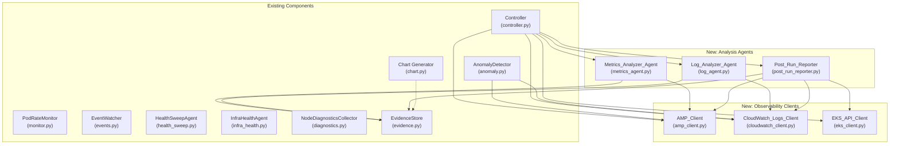

# Design Document: AWS Observability Integration

## Overview

This design adds three AWS observability client modules (AMP, CloudWatch Logs, EKS API), two analysis agents (Metrics Analyzer, Log Analyzer), and a Post-Run Reporter to the existing scale test tool. The integration follows the tool's established patterns: all network I/O runs in thread executors or background asyncio tasks, evidence is persisted to the EvidenceStore in JSON, and every new component degrades gracefully when its backing service is unconfigured.

The key architectural insight is that these observability sources fill specific gaps in the current evidence pipeline:

1. **AMP fills the fleet-wide metrics gap.** The current tool gets per-node resource data only via SSM (3 nodes max during anomaly investigation) or metrics-server (point-in-time, no history). AMP provides continuous time-series across all 200+ nodes — CPU, memory, network, disk — so the anomaly detector can see fleet-wide trends, not just spot-checks.

2. **CloudWatch Logs fills the log correlation gap.** Currently, kubelet/containerd logs are collected via SSM on investigated nodes only. CloudWatch Logs Insights can query across the entire fleet in seconds, finding patterns like "IPAMD datastore exhaustion on 47 nodes" without touching SSM.

3. **EKS API fills the control plane gap.** The tool checks Karpenter pod health but has no visibility into EKS control plane status, addon health, or platform version. The EKS API provides this context for the post-run report.

## Architecture



### Lifecycle Integration

The observability components hook into the controller's existing lifecycle phases:

```
Phase 1: Preflight
  └─ EKS_API_Client.get_cluster_info() — cluster version, addon health (added to preflight report)

Phase 5: Set up monitoring
  └─ Create AMP_Client, CWL_Client, EKS_API_Client
  └─ Pass AMP_Client + CWL_Client to AnomalyDetector

Phase 6: Scaling (monitor + anomaly detection active)
  └─ AnomalyDetector.handle_alert() now includes:
      Layer 7: AMP metrics for investigated nodes
      Layer 8: CloudWatch Logs errors for investigated nodes

Phase 7: Hold-at-peak
  └─ asyncio.gather(
       health_sweep.run(),
       metrics_agent.run(start, end),    ← NEW
       log_agent.run(start, end),         ← NEW
     )

Phase 8: Post-cleanup
  └─ post_run_reporter.generate(run_id, start, end)  ← NEW
  └─ chart.generate_chart() — now includes AMP data if available
```

### Threading and Async Model

The tool's threading model is critical. The monitor ticker runs on the main asyncio event loop every 5 seconds. Nothing can block it.

All new observability clients follow the existing pattern from `diagnostics.py`:
- boto3 calls run in `loop.run_in_executor(None, ...)` (thread pool)
- HTTP calls to AMP use `aiohttp` or `run_in_executor` with `requests`
- Analysis agents run as `asyncio.create_task()` during hold-at-peak
- Anomaly detector queries run inside `asyncio.gather()` alongside existing evidence collection

The anomaly detector already runs in its own thread via `_safe_callback` in the monitor. New observability queries inside `handle_alert` are safe because they execute in that separate event loop, not the monitor's.

## Components and Interfaces

### AMP Client (`amp_client.py`)

```python
@dataclass
class AMPTimeSeries:
    metric_name: str
    labels: dict[str, str]
    values: list[tuple[float, float]]  # (timestamp_epoch, value)

@dataclass
class AMPQueryResult:
    query: str
    status: str  # "success", "error", "timeout", "unavailable"
    series: list[AMPTimeSeries]
    error_message: str = ""

class AMPClient:
    def __init__(self, workspace_url: str | None, aws_session=None):
        """Initialize with AMP workspace query endpoint URL.
        If workspace_url is None, all queries return unavailable status."""

    async def query_range(
        self, query: str, start: datetime, end: datetime,
        step: str = "60s"
    ) -> AMPQueryResult:
        """Execute a PromQL range query. Runs HTTP call in executor."""

    async def query_instant(self, query: str) -> AMPQueryResult:
        """Execute a PromQL instant query."""

    # Pre-built queries
    async def get_node_cpu_utilization(
        self, start: datetime, end: datetime
    ) -> AMPQueryResult:
        """PromQL: 100 - (avg by(node)(rate(node_cpu_seconds_total{mode='idle'}[5m])) * 100)"""

    async def get_node_memory_utilization(
        self, start: datetime, end: datetime
    ) -> AMPQueryResult:
        """PromQL: (1 - node_memory_MemAvailable_bytes / node_memory_MemTotal_bytes) * 100"""

    async def get_node_network_bytes(
        self, start: datetime, end: datetime
    ) -> AMPQueryResult:
        """PromQL: rate(node_network_transmit_bytes_total{device!='lo'}[5m])"""

    async def get_node_disk_io_utilization(
        self, start: datetime, end: datetime
    ) -> AMPQueryResult:
        """PromQL: rate(node_disk_io_time_seconds_total[5m]) * 100"""

    async def get_pod_cpu_by_namespace(
        self, start: datetime, end: datetime
    ) -> AMPQueryResult:
        """PromQL: sum by(namespace)(rate(container_cpu_usage_seconds_total[5m]))"""

    async def get_pod_memory_by_namespace(
        self, start: datetime, end: datetime
    ) -> AMPQueryResult:
        """PromQL: sum by(namespace)(container_memory_working_set_bytes)"""

    async def get_pod_restarts_by_namespace(
        self, start: datetime, end: datetime
    ) -> AMPQueryResult:
        """PromQL: sum by(namespace)(increase(kube_pod_container_status_restarts_total[5m]))"""

    def is_available(self) -> bool:
        """Return True if AMP workspace URL is configured."""
```

### CloudWatch Logs Client (`cloudwatch_client.py`)

```python
@dataclass
class CWLQueryResult:
    query: str
    status: str  # "success", "error", "timeout", "unavailable"
    results: list[dict[str, str]]  # Each dict is a row from Logs Insights
    statistics: dict  # bytes_scanned, records_matched, records_scanned
    error_message: str = ""

class CloudWatchLogsClient:
    def __init__(
        self, log_group: str | None, aws_session=None,
        query_timeout: float = 30.0
    ):
        """Initialize with CloudWatch log group name.
        If log_group is None, all queries return unavailable status."""

    async def run_insights_query(
        self, query: str, start: datetime, end: datetime
    ) -> CWLQueryResult:
        """Start a Logs Insights query, poll with exponential backoff, return results.
        Cancels query if timeout exceeded."""

    # Pre-built queries
    async def get_kubelet_errors(
        self, start: datetime, end: datetime
    ) -> CWLQueryResult:
        """Logs Insights: filter @logStream like /kubelet/ | filter @message like /error|Error|ERROR/
        | stats count(*) as error_count by hostname, @message | sort error_count desc | limit 50"""

    async def get_containerd_errors(
        self, start: datetime, end: datetime
    ) -> CWLQueryResult:
        """Logs Insights: filter @logStream like /containerd/
        | filter @message like /error|Error|level=error/
        | stats count(*) by hostname | sort count desc | limit 50"""

    async def get_ipamd_exhaustion(
        self, start: datetime, end: datetime
    ) -> CWLQueryResult:
        """Logs Insights: filter @logStream like /ipamd|aws-node/
        | filter @message like /no available IP|datastore.*empty|failed to assign/
        | stats count(*) as exhaustion_count by hostname | sort exhaustion_count desc"""

    async def get_oom_events(
        self, start: datetime, end: datetime
    ) -> CWLQueryResult:
        """Logs Insights: filter @message like /oom_kill|Out of memory|OOMKilled/
        | stats count(*) by hostname | sort count desc"""

    async def get_node_errors(
        self, node_hostname: str, start: datetime, end: datetime
    ) -> CWLQueryResult:
        """Query all error logs for a specific node."""

    def is_available(self) -> bool:
        """Return True if log group is configured."""
```

### EKS API Client (`eks_client.py`)

```python
@dataclass
class EKSAddonInfo:
    name: str
    version: str
    status: str
    health_issues: list[str]

@dataclass
class EKSClusterInfo:
    cluster_name: str
    status: str  # "ACTIVE", "CREATING", etc.
    kubernetes_version: str
    platform_version: str
    endpoint: str
    addons: list[EKSAddonInfo]
    error_message: str = ""

class EKSAPIClient:
    def __init__(self, cluster_name: str | None, aws_session=None):
        """Initialize with EKS cluster name.
        If cluster_name is None, all queries return unavailable status."""

    async def get_cluster_info(self) -> EKSClusterInfo:
        """Call DescribeCluster + ListAddons + DescribeAddon for each addon."""

    def is_available(self) -> bool:
        """Return True if cluster name is configured."""
```

### Metrics Analyzer Agent (`metrics_agent.py`)

```python
@dataclass
class NodeResourceSummary:
    node_name: str
    avg_cpu_pct: float
    max_cpu_pct: float
    avg_memory_pct: float
    max_memory_pct: float
    avg_network_bytes_sec: float
    avg_disk_io_pct: float

@dataclass
class MetricsAnalysisSummary:
    status: str  # "complete", "partial", "unavailable"
    time_range_start: str
    time_range_end: str
    fleet_avg_cpu_pct: float
    fleet_avg_memory_pct: float
    nodes_cpu_above_80: list[NodeResourceSummary]
    nodes_memory_above_85: list[NodeResourceSummary]
    nodes_network_anomalies: list[NodeResourceSummary]
    top_resource_consumers: list[NodeResourceSummary]  # top 10 by CPU
    error_message: str = ""

class MetricsAnalyzerAgent:
    def __init__(self, amp_client: AMPClient, evidence_store: EvidenceStore):
        pass

    async def run(
        self, run_id: str, start: datetime, end: datetime
    ) -> MetricsAnalysisSummary:
        """Query AMP for fleet metrics, analyze, persist to evidence store."""
```

### Log Analyzer Agent (`log_agent.py`)

```python
@dataclass
class LogErrorGroup:
    source: str  # "kubelet", "containerd", "ipamd"
    message_pattern: str
    count: int
    affected_nodes: list[str]

@dataclass
class LogAnalysisSummary:
    status: str  # "complete", "partial", "unavailable"
    time_range_start: str
    time_range_end: str
    total_errors: int
    error_groups: list[LogErrorGroup]
    ipamd_exhaustion_nodes: list[str]
    oom_kill_nodes: list[str]
    error_message: str = ""

class LogAnalyzerAgent:
    def __init__(self, cwl_client: CloudWatchLogsClient, evidence_store: EvidenceStore):
        pass

    async def run(
        self, run_id: str, start: datetime, end: datetime
    ) -> LogAnalysisSummary:
        """Query CloudWatch Logs for error patterns, analyze, persist to evidence store."""
```

### Post-Run Reporter (`post_run_reporter.py`)

```python
@dataclass
class ObservabilityReport:
    status: str  # "complete", "partial"
    sources_available: list[str]  # ["amp", "cloudwatch_logs", "eks_api"]
    sources_unavailable: list[str]
    metrics_summary: MetricsAnalysisSummary | None
    log_summary: LogAnalysisSummary | None
    cluster_info: EKSClusterInfo | None
    correlation_notes: list[str]  # Cross-references with anomaly findings

class PostRunReporter:
    def __init__(
        self, amp_client: AMPClient,
        cwl_client: CloudWatchLogsClient,
        eks_client: EKSAPIClient,
        evidence_store: EvidenceStore,
    ):
        pass

    async def generate(
        self, run_id: str, start: datetime, end: datetime,
        findings: list[Finding] | None = None,
    ) -> ObservabilityReport:
        """Generate comprehensive post-run report. Persists to evidence store."""
```

## Data Models

### New TestConfig Fields

```python
# Added to TestConfig in models.py
amp_endpoint: Optional[str] = None          # AMP workspace query URL
cloudwatch_log_group: Optional[str] = None  # CloudWatch log group name
eks_cluster_name: Optional[str] = None      # EKS cluster name
```

### New CLI Arguments

```
--amp-endpoint URL          AMP workspace query endpoint URL
--cloudwatch-log-group NAME CloudWatch log group for node logs
--eks-cluster-name NAME     EKS cluster name for API queries
```

### Evidence Store Extensions

New files persisted per run:

```
{run_id}/
  metrics_analysis.json     # MetricsAnalysisSummary from Metrics_Analyzer_Agent
  log_analysis.json         # LogAnalysisSummary from Log_Analyzer_Agent
  observability_report.json # ObservabilityReport from Post_Run_Reporter
```

### Serialization

All new dataclasses extend the existing `_SerializableMixin` pattern from `models.py`, providing `to_dict()` and `from_dict()` methods. The `AMPTimeSeries.values` field (list of tuples) serializes as a list of `[timestamp, value]` arrays in JSON.

### AMP SigV4 Authentication

The AMP client uses `botocore.auth.SigV4Auth` to sign HTTP requests to the AMP query endpoint. The AWS session is obtained from the existing `aws_client` (boto3 session) passed through the controller, consistent with how `diagnostics.py` gets its SSM client.

```python
# Signing pattern for AMP queries
from botocore.auth import SigV4Auth
from botocore.awsrequest import AWSRequest

request = AWSRequest(method="POST", url=query_url, data=params)
SigV4Auth(credentials, "aps", region).add_auth(request)
response = session.send(request.prepare())
```


## Correctness Properties

*A property is a characteristic or behavior that should hold true across all valid executions of a system — essentially, a formal statement about what the system should do. Properties serve as the bridge between human-readable specifications and machine-verifiable correctness guarantees.*

### Property 1: AMP query results are well-structured

*For any* valid PromQL query string, time range (start < end), and step interval, the AMP_Client SHALL return an AMPQueryResult where: status is one of ("success", "error", "timeout", "unavailable"), series is a list (possibly empty), and each AMPTimeSeries has a non-empty metric_name, a dict of labels, and a list of (timestamp, value) tuples where timestamps are monotonically increasing.

**Validates: Requirements 1.1, 1.2**

### Property 2: Observability client errors never propagate as exceptions

*For any* HTTP error status code (4xx, 5xx) or network exception returned by the backing service, the AMP_Client, CloudWatch_Logs_Client, and EKS_API_Client SHALL return a result object with error status and message, never raising an exception to the caller.

**Validates: Requirements 1.3, 3.3**

### Property 3: AMP requests include SigV4 authentication

*For any* query executed by the AMP_Client when a workspace URL is configured, the outgoing HTTP request SHALL include an Authorization header containing "AWS4-HMAC-SHA256" and the required SigV4 signed headers (X-Amz-Date, X-Amz-Security-Token if using session credentials).

**Validates: Requirements 1.6**

### Property 4: Unconfigured clients return unavailable status

*For any* observability client (AMP_Client, CloudWatch_Logs_Client, EKS_API_Client) initialized with None configuration, `is_available()` SHALL return False, and every query method SHALL return a result with status "unavailable" and empty data (empty series, empty results, or empty cluster info).

**Validates: Requirements 1.7, 2.6, 3.4**

### Property 5: CloudWatch Logs query lifecycle completes correctly

*For any* Logs Insights query string and time range, the CloudWatch_Logs_Client SHALL call StartQuery, poll GetQueryResults until status is "Complete" or "Failed", and return a CWLQueryResult with the matching status and results. The query_id from StartQuery SHALL be used in all subsequent GetQueryResults calls.

**Validates: Requirements 2.1, 2.2**

### Property 6: CloudWatch Logs query timeout triggers cancellation

*For any* query where GetQueryResults never returns "Complete" within the configured timeout, the CloudWatch_Logs_Client SHALL call StopQuery with the query_id and return a CWLQueryResult with status "timeout".

**Validates: Requirements 2.3**

### Property 7: CloudWatch Logs node-specific queries filter by hostname

*For any* hostname string passed to `get_node_errors()`, the generated Logs Insights query string SHALL contain a filter clause that matches the hostname, ensuring results are scoped to that specific node.

**Validates: Requirements 2.5**

### Property 8: CloudWatch Logs polling uses exponential backoff

*For any* sequence of N poll attempts before query completion, the sleep interval before attempt i (0-indexed) SHALL be `min(0.5 * 2^i, 5.0)` seconds. The intervals SHALL be: 0.5, 1.0, 2.0, 4.0, 5.0, 5.0, ...

**Validates: Requirements 2.7**

### Property 9: EKS cluster info contains all required fields

*For any* successful DescribeCluster API response, the returned EKSClusterInfo SHALL have non-empty cluster_name, status, kubernetes_version, platform_version, and endpoint fields. For each addon returned by ListAddons/DescribeAddon, the EKSAddonInfo SHALL have non-empty name, version, and status fields.

**Validates: Requirements 3.1, 3.2**

### Property 10: Metrics agent correctly identifies threshold violations and ranks by severity

*For any* set of node resource metrics returned by AMP, the MetricsAnalysisSummary SHALL include exactly those nodes with avg CPU > 80% in `nodes_cpu_above_80` and exactly those nodes with avg memory > 85% in `nodes_memory_above_85`. The `top_resource_consumers` list SHALL contain at most 10 nodes, sorted by descending CPU utilization.

**Validates: Requirements 4.2, 4.3**

### Property 11: Log agent correctly groups errors by source

*For any* set of CloudWatch Logs Insights results containing error entries, the LogAnalysisSummary SHALL group errors by source (kubelet, containerd, ipamd), and the sum of all error_group counts SHALL equal total_errors. Each LogErrorGroup SHALL have a non-empty source, message_pattern, and count > 0.

**Validates: Requirements 5.2**

### Property 12: Log agent detects IPAMD exhaustion nodes

*For any* set of CloudWatch Logs results where some entries match IPAMD datastore exhaustion patterns ("no available IP", "datastore.*empty", "failed to assign"), the LogAnalysisSummary.ipamd_exhaustion_nodes SHALL contain exactly the hostnames from those matching entries.

**Validates: Requirements 5.3**

### Property 13: Post-run reporter handles partial source availability

*For any* combination of available and unavailable observability sources (2^3 = 8 combinations), the ObservabilityReport SHALL list each source correctly in either `sources_available` or `sources_unavailable`, and the report status SHALL be "complete" when all sources are available, "partial" when at least one is unavailable.

**Validates: Requirements 6.2, 6.3**

### Property 14: Anomaly detector includes observability evidence when configured

*For any* alert investigation where AMP_Client and/or CloudWatch_Logs_Client are configured and return data, the resulting Finding.evidence_references SHALL contain entries prefixed with "amp:" and/or "cwl:" respectively, in addition to the existing evidence layers.

**Validates: Requirements 7.1, 7.2**

### Property 15: Anomaly detector produces valid findings despite observability failures

*For any* alert investigation where AMP_Client or CloudWatch_Logs_Client raise exceptions or return errors, the Anomaly_Detector SHALL still produce a valid Finding with non-empty finding_id, timestamp, severity, and symptom. The Finding SHALL contain evidence from all non-failing evidence layers.

**Validates: Requirements 7.3, 7.4**

### Property 16: Analysis summary serialization round-trip

*For any* valid MetricsAnalysisSummary, LogAnalysisSummary, or ObservabilityReport, calling `to_dict()` then `from_dict()` on the result SHALL produce an object equivalent to the original.

**Validates: Requirements 4.6, 5.5, 6.4**

### Property 17: Chart includes resource utilization section when AMP data exists

*For any* run directory containing a valid `metrics_analysis.json` file, the generated chart HTML SHALL contain a canvas element for the resource utilization chart and the corresponding Chart.js dataset configuration.

**Validates: Requirements 11.1**

## Error Handling

### Client-Level Error Handling

All three observability clients follow the same error handling pattern:

1. **Unconfigured**: When initialized with `None` configuration, `is_available()` returns `False`. All query methods return immediately with status `"unavailable"` and empty data. No network calls are made.

2. **Network errors**: HTTP timeouts, connection refused, DNS failures — caught by the client, returned as status `"error"` with the exception message. Never propagated to the caller.

3. **Authentication errors**: SigV4 signing failures or expired credentials — caught and returned as status `"error"`. The AMP client logs the specific auth error for debugging.

4. **Service errors**: AMP returns 4xx/5xx, CloudWatch Logs returns error status, EKS API throws ClientError — all caught and returned as error results.

### Agent-Level Error Handling

The Metrics_Analyzer_Agent and Log_Analyzer_Agent wrap all client calls in try/except:
- If the client returns error/unavailable status, the agent returns a summary with status `"unavailable"` or `"partial"`.
- If an unexpected exception occurs, the agent logs it and returns an empty summary with status `"error"`.

### Anomaly Detector Error Handling

The new observability evidence layers (7 and 8) are wrapped in individual try/except blocks inside `handle_alert()`. If either fails:
- The failure is logged at WARNING level.
- The investigation continues with remaining evidence layers.
- The Finding is produced with whatever evidence was successfully collected.

This matches the existing pattern where SSM failures on individual nodes don't block the overall investigation.

### Controller Error Handling

- Client initialization failures (bad credentials, missing boto3) are caught during setup. The controller logs a warning and sets the client to `None`, which causes all downstream code to treat it as unconfigured.
- Agent failures during hold-at-peak are caught by `asyncio.gather(return_exceptions=True)`, matching the existing pattern for the health sweep.
- Post-run reporter failures are caught and logged; they don't affect the test summary or chart generation.

## Testing Strategy

### Unit Tests

Unit tests cover specific examples and edge cases:

- AMP client: mock HTTP responses for success, 4xx, 5xx, timeout, malformed JSON
- CloudWatch Logs client: mock StartQuery/GetQueryResults lifecycle, timeout cancellation, exponential backoff timing
- EKS API client: mock DescribeCluster/ListAddons/DescribeAddon responses, ClientError handling
- Metrics agent: specific threshold boundary cases (exactly 80% CPU, exactly 85% memory)
- Log agent: specific IPAMD pattern matching, empty results, mixed sources
- Post-run reporter: all 8 combinations of source availability
- Chart generator: with and without metrics_analysis.json
- Serialization: specific edge cases (empty lists, None fields, datetime serialization)

### Property-Based Tests

Property-based tests use `hypothesis` (Python PBT library). Each test runs a minimum of 100 iterations.

Properties to implement as PBT:

1. **Property 1** — Generate random PromQL strings, time ranges, step intervals; verify AMPQueryResult structure invariants.
2. **Property 2** — Generate random HTTP error codes and exception types; verify no exception propagates from any client method.
3. **Property 4** — For each client type, verify all methods return unavailable when unconfigured.
4. **Property 8** — Generate random poll counts (1-20); verify backoff intervals match formula.
5. **Property 10** — Generate random node metrics (0-100% CPU, 0-100% memory); verify threshold filtering and top-10 ranking.
6. **Property 11** — Generate random log entries with random sources; verify grouping correctness and count consistency.
7. **Property 12** — Generate random log entries, some matching IPAMD patterns; verify exact node detection.
8. **Property 13** — Generate all 8 combinations of source availability; verify report classification.
9. **Property 15** — Generate random alerts with random client failure modes; verify Finding is always produced.
10. **Property 16** — Generate random summary objects; verify serialization round-trip.

Each property test is tagged with: **Feature: aws-observability-integration, Property {N}: {title}**

### Test Configuration

- PBT library: `hypothesis`
- Minimum iterations: 100 per property (via `@settings(max_examples=100)`)
- Mocking: `unittest.mock` for boto3 clients and HTTP responses
- Async testing: `pytest-asyncio` for async method tests
