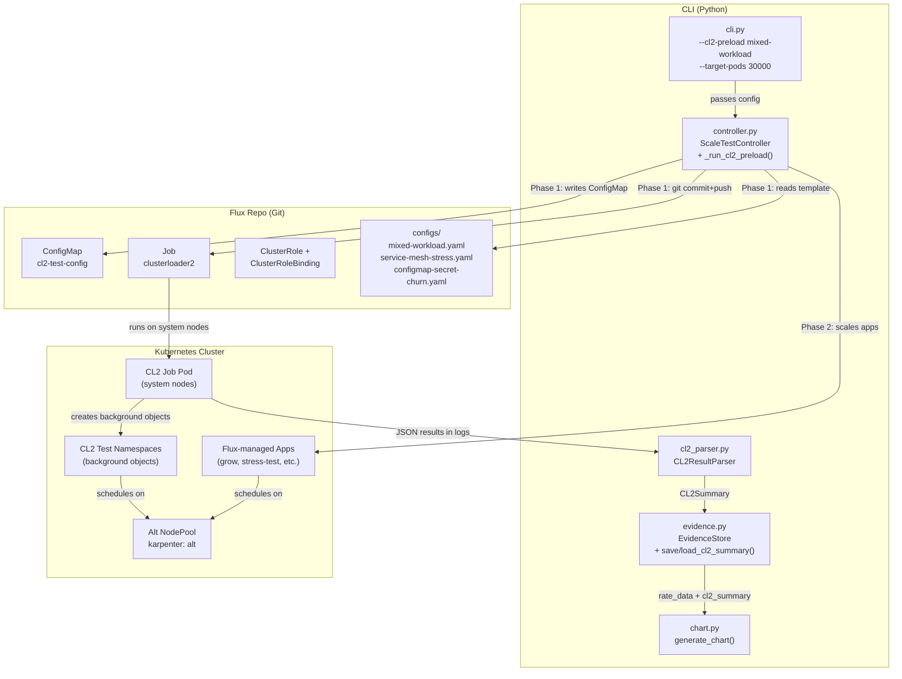

# Design Document: ClusterLoader2 Preload Integration

## Overview

This design adds an optional CL2 preload phase to the existing `ScaleTestController`. When `--cl2-preload <config-name>` is passed, the controller runs CL2 as a Kubernetes Job to populate the cluster with background objects before the pod scaling test begins. There is no separate `CL2Controller` — the preload logic lives as a `_run_cl2_preload()` method on the existing controller.

The integration has two surfaces:

1. **Flux GitOps manifests** — A new app in `flux2/apps/base/clusterloader2/` that deploys CL2 as a Job with RBAC, a ConfigMap for the test config, and an emptyDir for results.
2. **Python CLI/tooling** — New `--cl2-preload`, `--cl2-timeout`, `--cl2-params` flags on the CLI, a `_run_cl2_preload()` method on `ScaleTestController`, a CL2 result parser module, updated evidence store, and extended chart generation.

### Key Design Decisions

- **No separate controller class** — CL2 preload is a step in the existing `ScaleTestController.run()` flow, not a separate orchestrator. This keeps the single-controller model and avoids duplicating git/K8s/evidence plumbing.
- **Preload inserts between operator approval and pod scaling** — After step 2 (operator approval) and before step 3 (discover deployments). CL2 objects remain in the cluster during pod scaling.
- **CL2 cleanup after pod scaling cleanup** — After the existing `_cleanup_pods()` step, the controller triggers CL2's cleanup phase to remove background objects.
- **CL2 runs as a Job, not a CronJob** — Each preload is a single Job triggered by updating the ConfigMap and committing to the Flux repo.
- **Results via pod logs, not PVC** — CL2 writes JSON summaries to stdout. The controller retrieves results via `kubectl logs`.
- **Separate `cl2_summary.json`** — CL2 metrics go into their own file in the evidence store. Preserves backward compatibility.
- **No `--test-type` flag** — CL2 is a preload step, not an alternative test mode.

## Architecture



### Updated Controller Flow

The `ScaleTestController.run()` method gains two new steps:

```
1.  Preflight capacity validation
2.  Operator approval
2a. [NEW] CL2 preload (if --cl2-preload set)
    - Read config template from configs/
    - Inject into Flux repo ConfigMap
    - Update Job name with timestamp suffix
    - Git commit + push -> Flux reconciles -> CL2 Job runs
    - Poll Job status every 10s
    - On completion: retrieve pod logs, parse results, save to evidence store
    - Leave preload objects in cluster
3.  Discover deployments from Flux repo, distribute target pods
4.  Delete existing events for clean baseline
5.  Set up monitoring (PodRateMonitor, EventWatcher, AnomalyDetector)
6.  Start watchers
7.  Scale via Flux repo (set replicas, git commit+push, monitor until done)
8.  Cleanup pods (reset replicas to 0, git commit+push)
8a. [NEW] CL2 cleanup (if preload was run)
    - Delete CL2-created namespaces to remove background objects
9.  Generate summary + chart
10. Drain nodes
```

## Components and Interfaces

### 1. Flux Manifests (`flux2/apps/base/clusterloader2/`)

```
flux2/apps/base/clusterloader2/
├── kustomization.yaml
├── namespace.yaml
├── serviceaccount.yaml
├── rbac.yaml
├── job.yaml
├── configmap.yaml
└── configs/
    ├── mixed-workload.yaml
    ├── service-mesh-stress.yaml
    └── configmap-secret-churn.yaml
```

**kustomization.yaml** — References all manifests. The `configs/` directory is not directly referenced by kustomize; configs are read by the CLI and injected into `configmap.yaml`.

**job.yaml** — Runs `gcr.io/k8s-staging-perf-tests/clusterloader2` with args:
```
--testconfig=/config/config.yaml
--provider=eks
--kubeconfig=""
--report-dir=/results
--v=2
```
The Job uses `restartPolicy: Never`, `backoffLimit: 0`, and `activeDeadlineSeconds: 3600`. The CLI updates the Job name with a timestamp suffix before each run to avoid K8s Job immutability constraints. The Job runs on system nodes (no nodeSelector on the Job itself — only the workloads created by CL2 target the alt NodePool).

**rbac.yaml** — ClusterRole `clusterloader2` with broad permissions:
- `""` (core) API group: namespaces, pods, services, configmaps, secrets, replicasets, endpoints, persistentvolumeclaims, events
- `apps` API group: deployments, daemonsets, replicasets, statefulsets
- `batch` API group: jobs
- All verbs: create, get, list, watch, update, patch, delete, deletecollection

**configmap.yaml** — Contains the CL2 test config YAML. The CLI overwrites the `data.config.yaml` field with the selected template content before each run.

### 2. CL2 Preload Methods on `ScaleTestController`

Added to the existing `ScaleTestController` class in `controller.py`:

```python
class ScaleTestController:
    # ... existing methods ...

    async def _run_cl2_preload(self) -> CL2Summary | None:
        """Execute CL2 preload phase: inject config, trigger Job, collect results.
        Returns CL2Summary on success. Prompts operator on failure."""
        ...

    def _read_cl2_config_template(self, name: str) -> str:
        """Read a CL2 config template from flux2/apps/base/clusterloader2/configs/.
        Raises FileNotFoundError if template doesn't exist."""
        ...

    def _inject_cl2_config(self, config_content: str, params: dict[str, str] | None) -> None:
        """Write config content into the Flux repo's configmap.yaml.
        Applies parameter overrides if provided."""
        ...

    def _update_cl2_job_name(self) -> str:
        """Update job.yaml with a timestamped name suffix. Returns the new Job name."""
        ...

    async def _wait_for_cl2_job(self, job_name: str, namespace: str, timeout: float) -> str:
        """Poll Job status until complete/failed. Returns 'Complete' or 'Failed'."""
        ...

    async def _collect_cl2_results(self, job_name: str, namespace: str) -> str:
        """Retrieve CL2 JSON output from Job pod logs."""
        ...

    async def _cleanup_cl2(self) -> None:
        """Remove CL2 preload objects after pod scaling completes.
        Deletes CL2-created namespaces (prefixed with cl2-test-)."""
        ...
```

The `_run_cl2_preload()` method reuses existing controller infrastructure:
- `_git_commit_push()` for Flux repo commits
- `_refresh_k8s_token()` for token refresh on 401
- `_prompt_operator()` for operator decisions on CL2 failure

### 3. CL2 Result Parser (`src/k8s_scale_test/cl2_parser.py`)

```python
class CL2ResultParser:
    """Parses CL2 JSON summary output into structured data models."""

    @staticmethod
    def parse(raw_json: str) -> CL2Summary:
        """Parse CL2 JSON output into a CL2Summary. Raises CL2ParseError on failure."""
        ...

    @staticmethod
    def extract_pod_startup_latency(data: dict) -> list[LatencyPercentile]:
        """Extract PodStartupLatency percentiles from CL2 data."""
        ...

    @staticmethod
    def extract_api_responsiveness(data: dict) -> list[APILatencyResult]:
        """Extract APIResponsiveness metrics grouped by verb/resource."""
        ...

    @staticmethod
    def extract_scheduling_throughput(data: dict) -> SchedulingThroughputResult | None:
        """Extract scheduling throughput (pods/sec)."""
        ...
```

### 4. Updated CLI (`src/k8s_scale_test/cli.py`)

New arguments added to `parse_args`:
```python
p.add_argument("--cl2-preload", type=str, default=None,
               help="CL2 config template name for preload phase (e.g., mixed-workload)")
p.add_argument("--cl2-timeout", type=float, default=3600.0,
               help="CL2 Job timeout in seconds (default: 3600)")
p.add_argument("--cl2-params", type=str, default=None,
               help="Comma-separated CL2 template params (e.g., REPLICAS=100,SERVICES=50)")
```

The `main()` function passes CL2 config to `TestConfig`. No branching — the controller handles the preload step internally based on whether `cl2_preload` is set.

### 5. Updated TestConfig (`src/k8s_scale_test/models.py`)

```python
@dataclass
class TestConfig(_SerializableMixin):
    # ... existing fields ...
    cl2_preload: Optional[str] = None       # CL2 config template name
    cl2_timeout: float = 3600.0             # CL2 Job timeout in seconds
    cl2_params: Optional[Dict[str, str]] = None  # CL2 template parameter overrides
```

### 6. Updated Evidence Store (`src/k8s_scale_test/evidence.py`)

```python
def save_cl2_summary(self, run_id: str, summary: CL2Summary) -> None:
    """Save CL2 results as cl2_summary.json in the run directory."""
    self._write_json(self._run_dir(run_id) / "cl2_summary.json", summary.to_dict())

def load_cl2_summary(self, run_id: str) -> CL2Summary | None:
    """Load CL2 summary if it exists. Returns None if not present."""
    path = self._run_dir(run_id) / "cl2_summary.json"
    if not path.exists():
        return None
    data = json.loads(path.read_text())
    return CL2Summary.from_dict(data)
```

The `load_run()` method is updated to include `cl2_summary` key if the file exists.

### 7. Updated Chart Generator (`src/k8s_scale_test/chart.py`)

`generate_chart()` checks for `cl2_summary.json` in the run directory. If present, it appends additional chart sections:
- A bar chart for PodStartupLatency percentiles (P50, P90, P99)
- A table for APIResponsiveness latency by verb/resource
- A summary stat for SchedulingThroughput

If `cl2_summary.json` is absent, the chart renders exactly as before.

## Data Models

### New Models (`src/k8s_scale_test/models.py`)

```python
@dataclass
class LatencyPercentile(_SerializableMixin):
    """A single latency percentile measurement."""
    metric_name: str          # e.g., "PodStartupLatency"
    percentile: str           # e.g., "P50", "P90", "P99"
    latency_ms: float         # latency in milliseconds

@dataclass
class APILatencyResult(_SerializableMixin):
    """API server latency for a specific verb/resource combination."""
    verb: str                 # e.g., "GET", "LIST", "CREATE"
    resource: str             # e.g., "pods", "services", "configmaps"
    scope: str                # e.g., "namespace", "cluster"
    p50_ms: float
    p90_ms: float
    p99_ms: float
    count: int                # number of API calls observed

@dataclass
class SchedulingThroughputResult(_SerializableMixin):
    """Scheduling throughput measurement."""
    pods_per_second: float
    total_pods_scheduled: int
    duration_seconds: float

@dataclass
class CL2TestStatus(_SerializableMixin):
    """Overall CL2 test execution status."""
    config_name: str          # e.g., "mixed-workload"
    job_name: str             # e.g., "clusterloader2-20240315-143022"
    status: str               # "Passed", "Failed", "Timeout"
    duration_seconds: float
    error_message: Optional[str] = None

@dataclass
class CL2Summary(_SerializableMixin):
    """Complete CL2 preload test results."""
    test_status: CL2TestStatus
    pod_startup_latencies: List[LatencyPercentile]
    api_latencies: List[APILatencyResult]
    scheduling_throughput: Optional[SchedulingThroughputResult]
    raw_results: Dict[str, Any]   # full CL2 JSON for reference

class CL2ParseError(Exception):
    """Raised when CL2 JSON output cannot be parsed."""
    pass
```

### CL2 Config Template Structure (mixed-workload example)

```yaml
name: mixed-workload
namespace:
  number: {{$NAMESPACES := DefaultParam .NAMESPACES "10"}}{{$NAMESPACES}}
  prefix: cl2-test
tuningSets:
  - name: Uniform1qps
    qpsLoad:
      qps: 1
steps:
  - name: Create deployments
    phases:
      - namespaceRange:
          min: 1
          max: {{$NAMESPACES}}
        replicasPerNamespace: {{$REPLICAS := DefaultParam .REPLICAS "10"}}{{$REPLICAS}}
        tuningSet: Uniform1qps
        objectBundle:
          - basename: test-deployment
            objectTemplatePath: deployment.yaml
            templateFillMap:
              Replicas: {{$POD_REPLICAS := DefaultParam .POD_REPLICAS "5"}}{{$POD_REPLICAS}}
              NodeSelector: "karpenter: alt"
  - name: Create services
    phases:
      - namespaceRange:
          min: 1
          max: {{$NAMESPACES}}
        replicasPerNamespace: {{$SERVICES := DefaultParam .SERVICES "5"}}{{$SERVICES}}
        tuningSet: Uniform1qps
        objectBundle:
          - basename: test-service
            objectTemplatePath: service.yaml
  - name: Create configmaps
    phases:
      - namespaceRange:
          min: 1
          max: {{$NAMESPACES}}
        replicasPerNamespace: {{$CONFIGMAPS := DefaultParam .CONFIGMAPS "10"}}{{$CONFIGMAPS}}
        tuningSet: Uniform1qps
        objectBundle:
          - basename: test-configmap
            objectTemplatePath: configmap.yaml
  - name: Measure
    measurements:
      - Identifier: PodStartupLatency
        Method: PodStartupLatency
        Params:
          action: gather
      - Identifier: APIResponsiveness
        Method: APIResponsivenessPrometheusSimple
        Params:
          action: gather
      - Identifier: SchedulingThroughput
        Method: SchedulingThroughput
        Params:
          action: gather
      - Identifier: WaitForControlledPodsRunning
        Method: WaitForControlledPodsRunning
        Params:
          action: gather
```

### CL2 JSON Output Structure (what the parser expects)

```json
{
  "version": "v1",
  "dataItems": [
    {
      "data": {
        "Perc50": 1234.5,
        "Perc90": 2345.6,
        "Perc99": 5678.9
      },
      "unit": "ms",
      "labels": {
        "Metric": "pod_startup_latency"
      }
    },
    {
      "data": {
        "Perc50": 10.2,
        "Perc90": 25.4,
        "Perc99": 100.1
      },
      "unit": "ms",
      "labels": {
        "Metric": "api_responsiveness",
        "Verb": "GET",
        "Resource": "pods",
        "Scope": "namespace",
        "Count": "1500"
      }
    },
    {
      "data": {
        "Perc50": 45.2,
        "Perc90": 45.2,
        "Perc99": 45.2
      },
      "unit": "1/s",
      "labels": {
        "Metric": "scheduling_throughput"
      }
    }
  ]
}
```

## Correctness Properties

*A property is a characteristic or behavior that should hold true across all valid executions of a system — essentially, a formal statement about what the system should do. Properties serve as the bridge between human-readable specifications and machine-verifiable correctness guarantees.*

### Property 1: CLI defaults preserve existing behavior

*For any* set of valid CLI arguments that does not include `--cl2-preload`, the parsed `TestConfig` SHALL have `cl2_preload` equal to `None`, `cl2_timeout` equal to `3600.0`, and `cl2_params` equal to `None`.

**Validates: Requirements 3.1, 7.1**

### Property 2: CLI CL2 argument parsing

*For any* non-empty string `S` and positive float `T`, when `--cl2-preload S --cl2-timeout T` is provided to the CLI argument parser alongside required arguments, the parsed result SHALL have `cl2_preload` equal to `S` and `cl2_timeout` equal to `T`.

**Validates: Requirements 3.2, 3.3**

### Property 3: CL2 params parsing

*For any* list of key-value pairs where keys are non-empty alphanumeric strings and values are non-empty strings, formatting them as `KEY1=VAL1,KEY2=VAL2,...` and parsing via the `--cl2-params` handler SHALL produce a dictionary mapping each key to its corresponding value.

**Validates: Requirements 3.4**

### Property 4: CL2 metric extraction completeness

*For any* valid CL2 JSON summary containing N `dataItems` with known metric types (pod_startup_latency, api_responsiveness, scheduling_throughput), the `CL2ResultParser.parse()` output SHALL contain extracted results for each metric type present in the input — specifically, PodStartupLatency items produce `LatencyPercentile` entries with P50/P90/P99, APIResponsiveness items produce `APILatencyResult` entries with the correct verb/resource/scope, and SchedulingThroughput items produce a `SchedulingThroughputResult` with pods_per_second.

**Validates: Requirements 5.1, 5.2, 5.3, 5.4**

### Property 5: CL2Summary serialization round-trip

*For any* valid `CL2Summary` object, serializing it via `to_dict()` then deserializing via `CL2Summary.from_dict()` SHALL produce an object equivalent to the original.

**Validates: Requirements 5.6**

### Property 6: Malformed CL2 JSON produces CL2ParseError

*For any* string that is not valid JSON or is valid JSON but missing the required `dataItems` field, `CL2ResultParser.parse()` SHALL raise `CL2ParseError` with a non-empty error message rather than raising an unhandled exception.

**Validates: Requirements 5.7**

### Property 7: Chart renders without CL2 sections when no CL2 data exists

*For any* valid run directory containing `rate_data.jsonl` but no `cl2_summary.json`, the HTML output of `generate_chart()` SHALL not contain the strings `"PodStartupLatency"` or `"APIResponsiveness"` or `"SchedulingThroughput"`, preserving existing chart behavior.

**Validates: Requirements 6.4**

### Property 8: Evidence store backward compatibility round-trip

*For any* valid `TestRunSummary` object (using the existing model fields only), serializing via `to_dict()`, writing to `summary.json`, reading back, and deserializing via `TestRunSummary.from_dict()` SHALL produce an object equivalent to the original.

**Validates: Requirements 7.2, 7.3**

## Error Handling

| Error Condition | Handling Strategy |
|---|---|
| CL2 config template not found | `_read_cl2_config_template()` raises `FileNotFoundError` with the template name. CLI catches and exits with a clear message. |
| CL2 Job fails (non-zero exit) | `_wait_for_cl2_job()` returns `"Failed"`. Controller retrieves pod logs for error details, saves partial results with `status="Failed"` and `error_message` populated. Prompts operator to continue or abort. |
| CL2 Job times out | `_wait_for_cl2_job()` returns `"Timeout"` after `--cl2-timeout` seconds. Controller saves partial results with `status="Timeout"`. Prompts operator to continue or abort. |
| CL2 JSON output is malformed | `CL2ResultParser.parse()` raises `CL2ParseError`. Controller catches it, logs the error, and saves a `CL2Summary` with `status="Failed"` and the parse error as `error_message`. |
| Git commit/push fails during CL2 preload | `_git_commit_push()` logs the error and raises. Same pattern as existing controller. |
| K8s API token expired during Job polling | `_wait_for_cl2_job()` catches 401 errors and calls `_refresh_k8s_token()` (same pattern as existing controller). |
| Pod logs unavailable after Job completion | `_collect_cl2_results()` catches the exception, logs a warning, and returns an empty string. Parser then raises `CL2ParseError` for the empty input. |
| CL2 cleanup fails after pod scaling | `_cleanup_cl2()` logs the error but does not fail the test run. Cleanup failure is non-fatal. |

## Testing Strategy

### Property-Based Testing

The project uses **Hypothesis** (listed in `pyproject.toml` dev dependencies). All property tests will use Hypothesis with a minimum of 100 examples per property.

Each property test will be tagged with a comment referencing the design property:
```python
# Feature: clusterloader2-integration, Property N: <property title>
```

Property tests focus on the CL2 result parser and data model serialization — the components with complex logic and many input variations. Hypothesis strategies will generate:
- Random valid CL2 JSON structures with varying numbers of dataItems, metric types, and numeric values
- Random `CL2Summary` objects for round-trip testing
- Random malformed JSON strings for error handling testing
- Random CLI argument lists for argument parsing testing

### Unit Testing

Unit tests complement property tests by covering:
- Specific CL2 JSON examples from real CL2 output (known-good fixtures)
- Edge cases: empty dataItems list, zero-value metrics, extremely large numbers
- CLI argument validation: missing required args, invalid combinations
- Config template reading: file not found, empty file
- Chart generation: with and without CL2 data present

### Test File Organization

```
tests/
├── conftest.py                    # Shared Hypothesis strategies
├── test_cl2_parser.py             # CL2 result parser tests (properties + unit)
├── test_cl2_models.py             # CL2 data model round-trip tests
├── test_cli_args.py               # CLI argument parsing tests
└── test_chart_cl2.py              # Chart generation with CL2 data tests
```

### Dual Testing Approach

- **Property tests** verify universal correctness (Properties 1-8) across hundreds of generated inputs
- **Unit tests** verify specific examples, edge cases, and integration points
- Both are required — property tests catch unexpected input combinations, unit tests catch specific known scenarios
