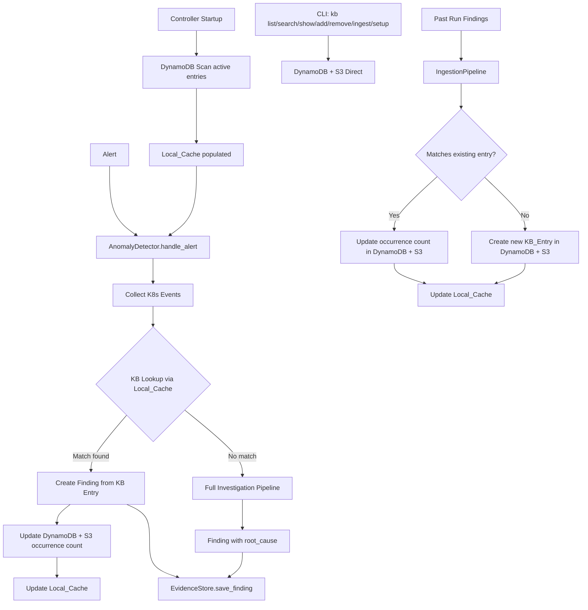
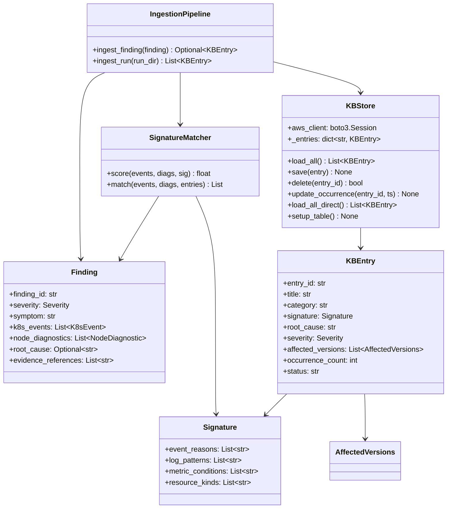

# Design Document: Known Issues Knowledge Base

## Overview

The Known Issues KB adds a persistent, DynamoDB + S3-backed store of known EKS scale test failure patterns to the existing `k8s_scale_test` package. It integrates into the anomaly detection pipeline as an early-exit optimization: before the detector spends time on SSM commands and EC2 API calls, it checks whether the current alert's K8s events match a known pattern. If they do, the finding is resolved immediately with the stored root cause.

The KB is populated two ways:
1. **Seed entries** — migrated from the hardcoded patterns in `scale-test-observability.md` (IPAMD failures, MAC collisions, Karpenter capacity errors, etc.)
2. **Automated ingestion** — resolved findings from past runs are converted into KB entries via a signature extraction pipeline.

### Storage Architecture

- **DynamoDB** stores the entry index and structured fields. Primary query pattern: "given this K8s event reason, is there a known pattern?" — served by a GSI on `event_reasons`. Single-digit ms lookups.
- **S3** stores full entry JSON bodies with versioning enabled. S3 versioning preserves previous versions automatically on every PutObject, giving entry history for free.
- **Local in-memory cache** (`dict[str, KBEntry]`) is the hot-path data structure. Loaded at test startup via DynamoDB Scan of active entries. All reads during the investigation loop are pure in-memory — 0ms added latency.

### Access Patterns

| Path | Data Flow | Latency |
|---|---|---|
| Startup | DynamoDB Scan → Local_Cache | ~100ms one-time |
| Investigation loop (reads) | Local_Cache only | 0ms added |
| Writes (ingestion, curation, occurrence updates) | Write-through: DynamoDB + S3 → update Local_Cache | ~50ms |
| CLI reads/writes | Direct DynamoDB + S3, no local cache | ~10-50ms |
| Agent context snapshot | Local_Cache → `agent_context.json` at test start | 0ms (in-memory) |

### AWS Resources

- EKS cluster: `tf-shane` in `us-west-2`
- AWS profile: `shancor+test-Admin` (reuses existing `aws_client` from `TestConfig`)
- DynamoDB table: `scale-test-kb` (on-demand capacity)
- S3 bucket: existing test artifacts bucket or dedicated, with versioning enabled
- S3 key prefix: `kb-entries/`

## Architecture



### Integration Points

1. **AnomalyDetector** (`anomaly.py`) — Modified to accept a `KBStore` instance (pre-loaded at controller startup). The KB is queried from the Local_Cache after K8s event collection but before SSM/EC2 evidence gathering. No network I/O on the hot path.
2. **Controller** (`controller.py`) — Creates the `KBStore` once at startup, which eagerly loads all active entries from DynamoDB into the Local_Cache. Passes the store to `AnomalyDetector.__init__`. Uses the existing `aws_client` (boto3 session) already wired through the controller.
3. **EvidenceStore** (`evidence.py`) — Unchanged. Findings produced via KB match are saved the same way as fully-investigated findings.
4. **CLI** (`cli.py`) — Extended with `kb` subcommands. CLI operations go directly to DynamoDB/S3 (no local cache) since they're not latency-sensitive.
5. **Steering file** (`scale-test-observability.md`) — Trimmed to reference the KB instead of containing inline pattern descriptions.

## Components and Interfaces

### KBEntry (Data Model)

```python
@dataclass
class Signature(_SerializableMixin):
    event_reasons: List[str]          # e.g. ["FailedCreatePodSandBox", "FailedScheduling"]
    log_patterns: List[str]           # regex patterns, e.g. ["failed to generate Unique MAC"]
    metric_conditions: List[str]      # e.g. ["prefix_count == 0", "cpu_idle < 10"]
    resource_kinds: List[str]         # e.g. ["Pod", "NodeClaim"]

@dataclass
class AffectedVersions(_SerializableMixin):
    component: str                    # e.g. "vpc-cni", "karpenter", "eks", "containerd"
    min_version: Optional[str]        # e.g. "1.11.0" — None means no lower bound
    max_version: Optional[str]        # e.g. "1.12.3" — None means still present / no upper bound
    fixed_in: Optional[str]           # e.g. "1.12.4" — version where this was fixed, if known

@dataclass
class KBEntry(_SerializableMixin):
    entry_id: str                     # e.g. "ipamd-mac-collision"
    title: str                        # e.g. "VPC CNI MAC Address Collision"
    category: str                     # one of: networking, scheduling, capacity, runtime, storage, control-plane
    signature: Signature
    root_cause: str                   # explanation of why this happens
    recommended_actions: List[str]    # what the operator should do
    severity: Severity                # info, warning, critical
    affected_versions: List[AffectedVersions]
    created_at: datetime
    last_seen: datetime
    occurrence_count: int
    status: str = "active"            # "active" (confirmed) or "pending" (needs operator review)
    review_notes: Optional[str] = None
    alternative_explanations: List[str] = field(default_factory=list)
    checkpoint_questions: List[str] = field(default_factory=list)
```

### KBStore (DynamoDB + S3 Persistence with In-Memory Cache)

```python
class KBStore:
    def __init__(self, aws_client, table_name: str = "scale-test-kb",
                 s3_bucket: str = "", s3_prefix: str = "kb-entries/") -> None:
        """Initialize DynamoDB + S3 clients from the existing aws_client (boto3 session).
        Eagerly load all active entries from DynamoDB into _entries cache.
        If DynamoDB is unreachable, log error and start with empty cache."""
        ...

    # --- Read operations (from Local_Cache, zero network I/O) ---
    def load_all(self) -> List[KBEntry]: ...       # returns from cache
    def get(self, entry_id: str) -> Optional[KBEntry]: ...  # O(1) dict lookup
    def search(self, query: str) -> List[KBEntry]: ...  # scans cache

    # --- Write operations (write-through: DynamoDB + S3 → cache) ---
    def save(self, entry: KBEntry) -> None: ...    # DynamoDB PutItem (conditional) + S3 PutObject + update cache
    def delete(self, entry_id: str) -> bool: ...   # DynamoDB DeleteItem + S3 DeleteObject + remove from cache
    def update_occurrence(self, entry_id: str, timestamp: datetime) -> None: ...
        # DynamoDB UpdateItem (increment occurrence_count, set last_seen) + S3 PutObject + update cache

    # --- Direct operations (for CLI, bypass cache) ---
    def load_all_direct(self) -> List[KBEntry]: ...  # DynamoDB Scan, no cache
    def get_direct(self, entry_id: str) -> Optional[KBEntry]: ...  # DynamoDB GetItem, no cache

    # --- Cache management ---
    def reload(self) -> None: ...                  # force re-read from DynamoDB into cache

    # --- Infrastructure ---
    @staticmethod
    def setup_table(aws_client, table_name: str = "scale-test-kb") -> None: ...
        # CreateTable with entry_id PK + event_reasons GSI, skip if exists
    @staticmethod
    def verify_bucket(aws_client, bucket: str) -> bool: ...
        # Check bucket exists + versioning enabled
```

**DynamoDB Table Schema:**

| Attribute | Type | Role |
|---|---|---|
| `entry_id` | String | Partition Key |
| `title` | String | — |
| `category` | String | — |
| `status` | String | — |
| `severity` | String | — |
| `event_reasons` | StringSet | GSI partition key (flattened from Signature) |
| `root_cause` | String | — |
| `occurrence_count` | Number | — |
| `last_seen` | String (ISO 8601) | — |
| `created_at` | String (ISO 8601) | — |
| `s3_key` | String | Pointer to full JSON body in S3 |

**GSI: `event-reasons-index`**
- Partition key: `event_reason` (String) — each event reason gets its own item in the GSI via a denormalized pattern (one DynamoDB item per event_reason → entry_id mapping), or use a Scan with FilterExpression on the StringSet. Given the KB is ≤500 entries, a Scan with filter is simpler and sufficient.

**Design decision:** Since the KB is small (≤500 entries) and the primary read path is the Local_Cache (not DynamoDB), we use a simple Scan with FilterExpression for the GSI query pattern rather than a denormalized index. The GSI on `event_reasons` is kept for future optimization if the KB grows significantly.

**S3 Key Structure:**
- `{s3_prefix}{entry_id}.json` — e.g. `kb-entries/ipamd-mac-collision.json`
- S3 versioning on the bucket preserves all previous versions automatically
- Full KBEntry JSON body stored in S3 (DynamoDB item has structured fields for queries, S3 has the complete serialized entry)

**Write-through caching:** `save()`, `delete()`, and `update_occurrence()` write to DynamoDB and S3 first, then update the Local_Cache only on success. This ensures the cache never contains data that isn't persisted.

**Conditional writes:** `save()` uses `ConditionExpression: attribute_not_exists(entry_id) OR entry_id = :id` to prevent silent overwrites from concurrent writers. For updates (occurrence count), `update_occurrence()` uses an atomic `ADD` expression.

### SignatureMatcher (Matching Engine)

```python
class SignatureMatcher:
    def __init__(self, weights: Optional[Dict[str, float]] = None,
                 threshold: float = 0.7) -> None: ...

    def score(self, finding_events: List[K8sEvent],
              finding_diagnostics: List[NodeDiagnostic],
              signature: Signature) -> float: ...

    def match(self, finding_events: List[K8sEvent],
              finding_diagnostics: List[NodeDiagnostic],
              entries: List[KBEntry]) -> List[Tuple[KBEntry, float]]: ...
```

**Scoring algorithm:**
- Only entries with `status == "active"` are considered for matching. Entries in `"pending"` status are excluded.
- `event_score` = |intersection of finding event reasons ∩ signature event_reasons| / |signature event_reasons| (asymmetric — we care about how much of the signature is covered)
- `log_score` = fraction of signature log_patterns that match any SSM output line in the finding diagnostics
- `metric_score` = fraction of signature metric_conditions satisfied by the finding evidence_references
- `total_score` = w_event × event_score + w_log × log_score + w_metric × metric_score
- Default weights: `{"event": 0.6, "log": 0.3, "metric": 0.1}`

### IngestionPipeline (Finding → KB Entry with Skeptical Review)

```python
class IngestionPipeline:
    def __init__(self, kb_store: KBStore, matcher: SignatureMatcher) -> None: ...

    def ingest_finding(self, finding: Finding) -> Optional[KBEntry]: ...
    def ingest_run(self, run_dir: str, evidence_store: EvidenceStore = None) -> List[KBEntry]: ...
```

`ingest_finding` extracts a `Signature` from the finding's events and diagnostics, checks for duplicates via `SignatureMatcher`, and either updates an existing entry or creates a new one. Writes go through `KBStore.save()` which handles DynamoDB + S3 + cache update.

**Skeptical review integration:** When a finding has an associated skeptical review, the ingestion pipeline uses the review's confidence level to gate entry creation:
- **high confidence** → status="active", review reasoning included in root cause
- **medium confidence** → status="pending", checkpoint_questions and alternative_explanations stored
- **low confidence** → skip, log reason, return None

### CLI Extensions

New subcommand group `kb` added to the existing CLI:

```
k8s-scale-test kb setup                         # create DynamoDB table + verify S3 bucket
k8s-scale-test kb list                          # list all entries (shows status: active/pending)
k8s-scale-test kb list --pending                # list only pending entries awaiting review
k8s-scale-test kb search "MAC collision"        # text search
k8s-scale-test kb show ipamd-mac-collision      # show full entry
k8s-scale-test kb add --title "..." --category networking --root-cause "..." --event-reasons "FailedCreatePodSandBox"
k8s-scale-test kb remove ipamd-mac-collision
k8s-scale-test kb approve ipamd-mac-collision   # promote pending → active
k8s-scale-test kb ingest ./scale-test-results/2026-03-17_11-26-26
```

CLI commands use `load_all_direct()` and `get_direct()` to read directly from DynamoDB, bypassing the local cache. This ensures CLI always sees the latest state even if another machine wrote entries.

## Data Models

### KBEntry DynamoDB Item

```json
{
  "entry_id": {"S": "ipamd-mac-collision"},
  "title": {"S": "VPC CNI MAC Address Collision at High Pod Density"},
  "category": {"S": "networking"},
  "status": {"S": "active"},
  "severity": {"S": "critical"},
  "event_reasons": {"SS": ["FailedCreatePodSandBox"]},
  "root_cause": {"S": "At high pod density (>100 pods/node), the VPC CNI plugin exhausts the MAC address space..."},
  "occurrence_count": {"N": "1"},
  "last_seen": {"S": "2026-03-17T11:36:30+00:00"},
  "created_at": {"S": "2026-03-17T11:36:30+00:00"},
  "s3_key": {"S": "kb-entries/ipamd-mac-collision.json"}
}
```

### KBEntry S3 JSON Body

```json
{
  "entry_id": "ipamd-mac-collision",
  "title": "VPC CNI MAC Address Collision at High Pod Density",
  "category": "networking",
  "signature": {
    "event_reasons": ["FailedCreatePodSandBox"],
    "log_patterns": ["failed to generate Unique MAC addr"],
    "metric_conditions": ["prefix_count == 0"],
    "resource_kinds": ["Pod"]
  },
  "root_cause": "At high pod density (>100 pods/node), the VPC CNI plugin exhausts the MAC address space when creating veth pairs. The random MAC generation collides with existing interfaces.",
  "recommended_actions": [
    "Check VPC CNI version — v1.12+ has improved MAC generation",
    "Reduce pods-per-node via NodePool maxPods setting",
    "Restart aws-node DaemonSet to clear stale ENI state"
  ],
  "severity": "critical",
  "affected_versions": [
    {
      "component": "vpc-cni",
      "min_version": "1.11.0",
      "max_version": "1.12.3",
      "fixed_in": "1.12.4"
    }
  ],
  "created_at": "2026-03-17T11:36:30+00:00",
  "last_seen": "2026-03-17T11:36:30+00:00",
  "occurrence_count": 1,
  "status": "active",
  "review_notes": null,
  "alternative_explanations": [],
  "checkpoint_questions": []
}
```

### Seed Entries (from steering file)

The following patterns from `scale-test-observability.md` become seed KB entries:

| entry_id | category | signature event_reasons | signature log_patterns | affected_versions |
|---|---|---|---|---|
| `ipamd-mac-collision` | networking | `FailedCreatePodSandBox` | `failed to generate Unique MAC` | vpc-cni ≤1.12.3 |
| `ipamd-ip-exhaustion` | networking | `FailedCreatePodSandBox` | `no available IP/prefix`, `failed to allocate IP` | vpc-cni (all) |
| `subnet-ip-exhaustion` | networking | `FailedCreatePodSandBox` | `failed to attach ENI` | vpc-cni (all) |
| `coredns-bottleneck` | networking | — | `SERVFAIL`, `i/o timeout` | coredns (all) |
| `karpenter-capacity` | capacity | `InsufficientCapacityError`, `TerminationGracePeriodExpiring` | — | karpenter (all) |
| `image-pull-throttle` | runtime | `Failed`, `ErrImagePull` | `pull QPS exceeded` | containerd (all) |
| `oom-kill` | runtime | `OOMKilling`, `Evicted` | `oom`, `kill` | eks (all) |
| `disk-pressure` | storage | `Evicted` | `disk pressure` | eks (all) |
| `ec2-api-throttle` | networking | — | `throttl`, `rate exceeded`, `requestlimitexceeded` | vpc-cni (all) |
| `nvme-disk-init` | storage | `InvalidDiskCapacity` | `NVMe not initialized` | eks (i4i instances) |
| `kyverno-webhook-failure` | control-plane | `FailedCreate` | `failed calling webhook.*kyverno` | kyverno (all) |
| `systemd-cgroup-timeout` | runtime | `FailedCreatePodContainer` | `Timeout waiting for systemd` | containerd (all) |

Seed entries are loaded via `kb seed` CLI command or a Python helper that writes them to DynamoDB + S3.

### Configuration Extension

Add to `TestConfig`:

```python
kb_table_name: str = "scale-test-kb"
kb_s3_bucket: Optional[str] = None       # S3 bucket for KB entry bodies
kb_s3_prefix: str = "kb-entries/"
kb_match_threshold: float = 0.7
kb_auto_ingest: bool = True              # auto-ingest resolved findings after each run
```

### Relationship to Existing Models



## Correctness Properties

*A property is a characteristic or behavior that should hold true across all valid executions of a system — essentially, a formal statement about what the system should do. Properties serve as the bridge between human-readable specifications and machine-verifiable correctness guarantees.*

### Property 1: KB_Entry serialization round-trip

*For any* valid KB_Entry, serializing it via `to_dict()` and then deserializing via `from_dict()` SHALL produce an object equivalent to the original.

**Validates: Requirements 1.3**

### Property 2: KBStore save/load round-trip via DynamoDB + S3

*For any* set of valid KB_Entries, saving each to the KBStore (which writes to DynamoDB + S3 and updates the Local_Cache) and then calling `load_all()` SHALL return a set of entries equivalent to the originals (order-independent).

**Validates: Requirements 2.1, 2.2, 2.4**

### Property 3: Cache initialization loads only active entries

*For any* set of KB_Entries with mixed statuses (active and pending) stored in DynamoDB, initializing a new KBStore SHALL populate the Local_Cache with exactly the entries that have `status == "active"`, and no pending entries.

**Validates: Requirements 3.1**

### Property 4: Similarity score is bounded

*For any* Finding (with any combination of K8s events and node diagnostics) and *any* Signature, the computed Similarity_Score SHALL be in the range [0.0, 1.0].

**Validates: Requirements 5.1**

### Property 5: Match returns above-threshold entries sorted by descending score

*For any* Finding and *any* set of KB_Entries, the `match()` function SHALL return only entries whose individual score exceeds the threshold, and the returned list SHALL be sorted by descending Similarity_Score.

**Validates: Requirements 5.3, 5.4**

### Property 6: KB-matched Finding has correct root cause and entry reference

*For any* KB_Entry that matches a Finding (score > threshold), the resulting Finding SHALL have `root_cause` equal to the KB_Entry's root_cause, `resolved` equal to True, and `evidence_references` containing a reference to the KB_Entry's entry_id.

**Validates: Requirements 6.2, 6.3**

### Property 7: KB match increments occurrence count

*For any* KB_Entry that matches a Finding, after the match is used, the entry's `occurrence_count` SHALL be exactly one greater than before, and `last_seen` SHALL be updated to a timestamp no earlier than the match time.

**Validates: Requirements 6.5**

### Property 8: Signature extraction preserves Finding event reasons

*For any* resolved Finding with K8s events, the Signature extracted by the IngestionPipeline SHALL have `event_reasons` that is a subset of the unique event reasons present in the Finding's `k8s_events` list.

**Validates: Requirements 7.1, 7.7**

### Property 9: Duplicate ingestion is idempotent on entry count

*For any* resolved Finding, ingesting it through the IngestionPipeline twice SHALL result in the same number of KB entries as ingesting it once (the second ingestion updates the existing entry rather than creating a duplicate).

**Validates: Requirements 7.2**

### Property 10: Novel finding ingestion increases entry count

*For any* resolved Finding whose extracted Signature does not match any existing KB_Entry, ingesting it SHALL increase the total KB entry count by exactly one.

**Validates: Requirements 7.3**

### Property 11: Search returns only entries containing the query string

*For any* text query and *any* set of KB_Entries, the `search()` function SHALL return only entries where the query string appears (case-insensitive) in the entry's title or root_cause, and SHALL return all such entries.

**Validates: Requirements 9.3**

### Property 12: Add then remove round-trip

*For any* valid KB_Entry, adding it to the KBStore and then removing it by entry_id SHALL leave the store in the same state as before the add (the entry is no longer present, and no other entries are affected).

**Validates: Requirements 10.1, 10.2**

## Error Handling

| Scenario | Behavior |
|---|---|
| DynamoDB unreachable on KBStore init | Log error, start with empty Local_Cache, anomaly detector proceeds with full investigation for all alerts (Req 3.4) |
| DynamoDB write fails (save/delete) | Raise exception, do NOT update Local_Cache (write-through guarantee) |
| S3 PutObject fails during save | Raise exception, do NOT update Local_Cache. DynamoDB item may exist without S3 body — next load will detect missing S3 body and skip |
| Malformed S3 JSON body on load | Log warning, skip entry, continue loading other entries (Req 2.6) |
| DynamoDB item fails deserialization | Log warning, skip entry, continue loading (Req 2.6) |
| DynamoDB conditional write conflict | Raise `ConditionalCheckFailedException`, caller retries with fresh read (Req 2.5) |
| Signature with empty event_reasons and empty log_patterns | Score is 0.0 — no match possible |
| Invalid regex in Signature log_patterns | Catch `re.error`, log warning, treat pattern as non-matching |
| Run directory does not exist for ingest command | Print error, exit with non-zero status (Req 9.7) |
| Entry ID not found for remove command | Print error, exit with non-zero status (Req 10.3) |
| Finding with no K8s events | KB lookup returns empty matches, full investigation proceeds |
| S3 bucket does not exist during setup | Print error instructing operator to create bucket, exit non-zero (Req 4.4) |
| DynamoDB table already exists during setup | Skip creation, log informational message (Req 4.3) |

## Testing Strategy

### Property-Based Testing

Use `hypothesis` (already in dev dependencies) for property-based tests. Each property test runs a minimum of 100 iterations.

**Library:** `hypothesis` (version ≥ 6.92.0, already in `pyproject.toml`)

**AWS Mocking:** Use `moto` library to mock DynamoDB and S3 in tests. This avoids hitting real AWS resources and allows fast, deterministic property tests.

**Generators needed:**
- `KBEntry` generator — random entry_id, title, category from valid set, random Signature, random severity, timestamps, occurrence_count ≥ 0, status from {"active", "pending"}
- `Signature` generator — random lists of event reason strings, log pattern strings (valid regexes), metric condition strings, resource kind strings
- `Finding` generator — reuse existing Finding structure with random K8s events and diagnostics
- `K8sEvent` generator — random timestamps, namespaces, reasons, messages

Each property test is tagged with: `Feature: known-issues-kb, Property {N}: {title}`

### Unit Tests

Unit tests cover specific examples and edge cases:
- Seed entry loading (Req 8.1) — verify all 12 seed entries load with correct IDs
- Malformed JSON/DynamoDB handling (Req 2.6) — specific malformed data examples
- DynamoDB unreachable on init (Req 3.4) — verify empty cache, no crash
- CLI error cases (Req 9.7, 10.3) — non-existent paths and IDs
- Infrastructure setup idempotency (Req 4.3) — table already exists
- Integration test: AnomalyDetector with KB match vs no match (Req 6.1, 6.4)
- CLI list/show output format (Req 9.1, 9.4)
- Skeptical review confidence gating (Req 7.4, 7.5, 7.6) — high/medium/low examples

### Test Organization

Tests go in `tests/test_kb.py` (core KB logic) and `tests/test_kb_cli.py` (CLI integration). Property tests and unit tests coexist in the same files, with property tests clearly tagged.

All tests use `moto` to mock DynamoDB and S3. No real AWS calls in the test suite.
