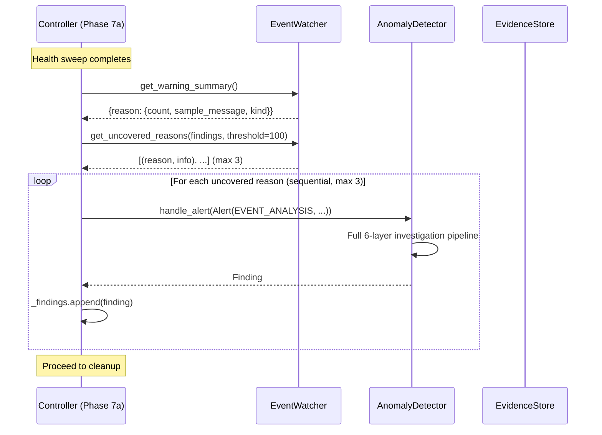

# Design Document: Post-Test Event Investigation

## Overview

This feature adds a post-test event analysis pass to the scale test controller that investigates high-volume Kubernetes warning events not already covered by rate-drop or pending-timeout investigations. The analysis runs during Phase 7a (hold-at-peak), after the health sweep completes, when the cluster is stable and SSM calls won't interfere with scaling.

The design is additive — the existing rate-drop investigation pipeline is unchanged. The new pass queries the EventWatcher's in-memory event data for warning reason counts, cross-references against existing findings to identify uncovered reasons, and feeds each uncovered reason through the existing AnomalyDetector pipeline as an `EVENT_ANALYSIS` alert.

Key design decisions:
- **EventWatcher owns the summary logic** rather than the EvidenceStore, because the EventWatcher already tracks events in memory via its `_seen` set and the EvidenceStore only has the JSONL file on disk. Querying in-memory data avoids re-reading potentially tens of thousands of JSONL lines.
- **Cap at 3 investigations** to bound hold-at-peak extension to ~5 minutes (each investigation takes 60-90s with SSM).
- **Sequential execution** to avoid SSM contention — the same constraint the existing pipeline uses for node diagnostics.
- **No chart changes needed** — the existing chart cross-referencing logic already checks all findings' `evidence_references` and `k8s_events` for warning reasons. EVENT_ANALYSIS findings are standard Finding objects and will be picked up automatically.

## Architecture



The flow integrates into the existing Phase 7a block in `controller.py`, after the health sweep `await` and before the `finally` block that stops monitors. This placement ensures:
1. The PodRateMonitor is still running (though not alerting — scaling is done)
2. The EventWatcher has accumulated all events from the test run
3. SSM calls won't interfere with scaling (scaling is complete)

## Components and Interfaces

### EventWatcher (events.py) — New Methods

Two new methods on the existing `EventWatcher` class:

```python
def get_warning_summary(self) -> dict[str, dict]:
    """Return {reason: {count, sample_message, kind}} for all warning reasons.
    
    Reads from the EvidenceStore's events.jsonl file to get complete event data.
    Groups Warning events by reason and returns count, a sample message, and
    the involved object kind for each reason.
    
    Returns empty dict if no warning events exist.
    """

def get_uncovered_reasons(
    self, findings: list[Finding], threshold: int = 100
) -> list[tuple[str, dict]]:
    """Return warning reasons with >threshold events not covered by any finding.
    
    Cross-references warning_summary against findings' evidence_references
    and k8s_events to identify reasons that were never investigated.
    
    Uses the same cross-referencing logic as chart.py:
    - Checks evidence_references for "warnings:Reason=N" patterns
    - Checks k8s_events for matching reason strings
    
    Returns list of (reason, info_dict) tuples sorted by count descending.
    """
```

**Design decision**: These methods read from `events.jsonl` via the EvidenceStore rather than maintaining a separate in-memory counter. Rationale: the EventWatcher's `_seen` set only tracks UIDs for dedup — it doesn't store event data. The EvidenceStore already has `query_events()` but it returns full K8sEvent objects which is wasteful when we only need reason counts. The new methods do a single pass over events.jsonl, which is efficient enough for the post-test context (events.jsonl is written sequentially and read once).

The `get_uncovered_reasons` method needs access to the run_id and evidence_store to read events. Both are already available on the EventWatcher instance (`self._run_id` and `self.evidence_store`).

### AlertType (models.py) — New Enum Member

```python
class AlertType(Enum):
    RATE_DROP = "rate_drop"
    PENDING_TIMEOUT = "pending_timeout"
    NODE_NOT_READY = "node_not_ready"
    MONITOR_GAP = "monitor_gap"
    EVENT_ANALYSIS = "event_analysis"  # NEW
```

### AnomalyDetector (anomaly.py) — Minor Logging Change

Add a log line at the top of `handle_alert` to distinguish EVENT_ANALYSIS investigations:

```python
if alert.alert_type == AlertType.EVENT_ANALYSIS:
    log.info("Post-test event analysis: %s", alert.message)
```

No pipeline changes — `handle_alert` already runs the full investigation regardless of alert type.

### Controller (controller.py) — New Post-Test Analysis Block

Insert after the health sweep results are collected (after `self._health_sweep = await ...`) and before the `finally` block:

```python
# Post-test event analysis — investigate uncovered warning patterns
uncovered = watcher.get_uncovered_reasons(self._findings, threshold=100)
if uncovered:
    log.info("Post-test event analysis: %d uncovered warning reason(s)", len(uncovered))
for reason, info in uncovered[:3]:
    try:
        alert = Alert(
            alert_type=AlertType.EVENT_ANALYSIS,
            timestamp=datetime.now(timezone.utc),
            message=f"Post-test analysis: {reason} x{info['count']}",
            context={
                "reason": reason,
                "count": info["count"],
                "sample": info["sample_message"],
                "namespaces": namespaces,
            },
        )
        finding = await anomaly.handle_alert(alert)
        self._findings.append(finding)
        log.info("  %s: %s", reason, finding.root_cause or "inconclusive")
    except Exception as exc:
        log.error("Event analysis failed for %s: %s", reason, exc)
```

## Data Models

### Alert Context for EVENT_ANALYSIS

The `Alert.context` dict for EVENT_ANALYSIS alerts contains:

| Field | Type | Description |
|-------|------|-------------|
| `reason` | `str` | The K8s warning reason string (e.g., "Failed", "FailedCreatePodContainer") |
| `count` | `int` | Total event count for this reason |
| `sample` | `str` | A sample event message for context |
| `namespaces` | `list[str]` | Namespaces to investigate (same as the test's namespace list) |

### Warning Summary Return Type

`get_warning_summary()` returns:

```python
{
    "Failed": {
        "count": 3059,
        "sample_message": "Error: failed to create containerd task: ...",
        "kind": "Pod",
    },
    "FailedCreatePodContainer": {
        "count": 20,
        "sample_message": "Error: ...",
        "kind": "Pod",
    },
}
```

### Uncovered Reasons Return Type

`get_uncovered_reasons()` returns a list of tuples:

```python
[
    ("Failed", {"count": 3059, "sample_message": "...", "kind": "Pod"}),
    ("FailedCreatePodContainer", {"count": 20, "sample_message": "...", "kind": "Pod"}),
]
```

Sorted by count descending. Only includes reasons where `count > threshold` and the reason was not found in any finding's evidence.


## Correctness Properties

*A property is a characteristic or behavior that should hold true across all valid executions of a system — essentially, a formal statement about what the system should do. Properties serve as the bridge between human-readable specifications and machine-verifiable correctness guarantees.*

### Property 1: Warning summary correctly aggregates events by reason

*For any* set of K8sEvent objects written to events.jsonl (with arbitrary reasons, messages, kinds, and event_types), calling `get_warning_summary()` should return a dictionary where: (a) every key is a reason that appeared in at least one Warning event, (b) the count for each reason equals the number of Warning events with that reason, (c) the sample_message matches the message of one of the Warning events for that reason, (d) the kind matches the involved_object_kind of one of the Warning events for that reason, and (e) Normal events are excluded from the summary.

**Validates: Requirements 1.1**

### Property 2: Uncovered reasons filtering is correct and complete

*For any* set of K8sEvent objects and any list of Finding objects (with arbitrary evidence_references and k8s_events), calling `get_uncovered_reasons(findings, threshold)` should return a list where: (a) every returned reason has a warning event count strictly greater than the threshold, (b) no returned reason appears in any finding's evidence_references (as a "warnings:Reason=N" pattern) or in any finding's k8s_events reason field, and (c) every warning reason NOT in the returned list either has count ≤ threshold or IS covered by at least one finding. The returned list should be sorted by count descending.

**Validates: Requirements 1.2**

## Error Handling

### EventWatcher Methods

- `get_warning_summary()`: If `events.jsonl` does not exist or is empty, returns an empty dict. Malformed JSONL lines are skipped with a warning log.
- `get_uncovered_reasons()`: If `get_warning_summary()` returns empty, returns an empty list immediately. If the findings list is empty, all reasons above threshold are returned (none are "covered").

### Controller Event Analysis Loop

- Each investigation is wrapped in a try/except. If `anomaly.handle_alert()` raises, the error is logged and the loop continues to the next uncovered reason. This prevents a single failed investigation from blocking the remaining ones.
- If `watcher.get_uncovered_reasons()` itself raises, the entire event analysis pass is skipped and the controller proceeds to cleanup. This is a non-critical failure — the test data is already collected.

### AnomalyDetector

- No new error handling needed. The existing `handle_alert` method already handles failures in each investigation layer (K8s events, pod phases, stuck nodes, etc.) independently, logging errors and continuing with available evidence.

## Testing Strategy

### Property-Based Testing

The project uses `hypothesis` for property-based testing. Two properties will be tested:

- **Property 1** (warning summary aggregation): Generate random lists of K8sEvent objects with varied reasons, messages, kinds, and event_types (Warning and Normal). Write them to a temp events.jsonl via EvidenceStore, call `get_warning_summary()`, and verify the aggregation invariants.
- **Property 2** (uncovered reasons filtering): Generate random events and random Finding objects with varied evidence_references patterns (including "warnings:Reason=N" format) and k8s_events. Call `get_uncovered_reasons()` and verify the filtering invariants — completeness (nothing missing) and soundness (nothing spurious).

Each property test should run a minimum of 100 iterations. Tests should be tagged with:
- `Feature: post-test-event-investigation, Property 1: Warning summary correctly aggregates events by reason`
- `Feature: post-test-event-investigation, Property 2: Uncovered reasons filtering is correct and complete`

### Unit Testing

Unit tests complement the property tests for specific examples and edge cases:

- `AlertType.EVENT_ANALYSIS` exists with value `"event_analysis"`
- `get_warning_summary()` returns empty dict when no events exist
- `get_warning_summary()` excludes Normal events
- `get_uncovered_reasons()` defaults to threshold=100
- `get_uncovered_reasons()` returns empty list when no events exist
- `get_uncovered_reasons()` returns empty list when all reasons are covered
- AnomalyDetector logs distinct message for EVENT_ANALYSIS alerts
- Controller caps event analysis at 3 investigations
- Controller continues after individual investigation failure

### Testing Library

- **Property-based testing**: `hypothesis` (already used in the project, see `tests/test_agent_context.py`)
- **Test runner**: `pytest` with `python3 -m pytest tests/ -v`
- **Strategies**: Reuse existing patterns from `test_agent_context.py` for generating K8sEvent, Finding, and related objects
