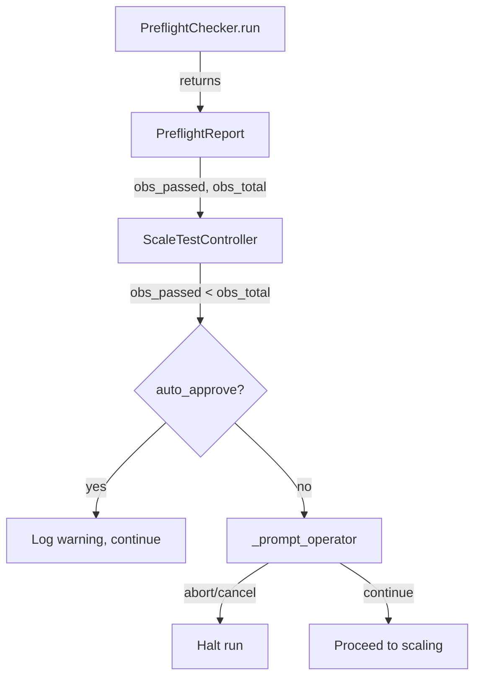

# Design Document: Preflight Observability Checks

## Overview

This feature adds unit test coverage for the three observability connectivity checks in `PreflightChecker` (AMP, CloudWatch Logs, EKS API) and changes the controller's behavior to prompt the operator when observability checks fail instead of silently continuing.

The design has two parts:
1. **Unit tests** — Mock-based tests for each observability check path (success, failure, skip, exception) to prevent regressions like the EKS endpoint URL bug.
2. **Operator prompt on failure** — The `PreflightReport` gains an `obs_passed` / `obs_total` field pair. After preflight, the controller checks whether any observability checks failed and prompts the operator (or auto-continues in CI mode).

## Architecture

The changes are minimal and localized to two files:



**Test architecture**: Each observability check is tested by constructing a `PreflightChecker` with mocked `aws_client` and `k8s_client`, then running the full `run()` method with all non-observability dependencies also mocked. The tests verify the `recommendations` list and `obs_passed`/`obs_total` counts in the returned `PreflightReport`.

## Components and Interfaces

### Modified: `PreflightChecker.run()` (preflight.py)

No logic changes to the observability checks themselves. The method already computes `obs_ok` and `obs_total` locally — the only change is exposing these values on the returned `PreflightReport`.

### Modified: `PreflightReport` (models.py)

Add two optional fields to carry observability results:

```python
@dataclass
class PreflightReport(_SerializableMixin):
    # ... existing fields ...
    obs_passed: int = 0
    obs_total: int = 0
```

### Modified: `ScaleTestController.run()` (controller.py)

After the existing preflight phase (Phase 1), before Phase 2 (Operator Approval), add an observability check:

```python
# After preflight report is saved
if report.obs_total > 0 and report.obs_passed < report.obs_total:
    failed_count = report.obs_total - report.obs_passed
    obs_response = await self._prompt_operator(
        f"Observability: {failed_count}/{report.obs_total} checks failed. "
        f"Investigation capability will be degraded. Continue or abort?",
        {"failed_checks": failed_count, "total_checks": report.obs_total,
         "recommendations": [r for r in report.decision.recommendations
                             if "AMP" in r or "CloudWatch" in r or "EKS" in r]},
    )
    if obs_response and obs_response.lower() in ("abort", "cancel"):
        return self._make_summary(run_id, start, report, ScalingResult(
            steps=[], total_pods_requested=0, total_pods_ready=0,
            total_nodes_provisioned=0, peak_ready_rate=0.0,
            completed=False, halt_reason="operator_aborted_observability",
        ))
```

In `auto_approve` mode, `_prompt_operator` already returns `"continue"` — so the existing behavior is preserved with clear logging.

### New: `tests/test_preflight_observability.py`

A new test module containing tests for all three observability checks. Tests use `unittest.mock` to mock:
- `self.aws_client.client(...)` — returns mock boto3 clients for `logs` and `eks`
- `AMPMetricCollector._query_promql` — returns mock AMP query results
- `PreflightChecker._get_ec2_quotas`, `_get_subnet_ip_availability`, `_get_nodepool_configs`, `_get_nodeclass_configs`, `_count_daemonsets` — return minimal valid data so `run()` can complete

Each test constructs a `TestConfig` with the relevant observability fields set (or unset), runs `await checker.run()`, and asserts on:
- `report.decision.recommendations` contents
- `report.obs_passed` and `report.obs_total` values
- Mock call arguments (e.g., `endpoint_url` passed to EKS client)

### New: `tests/test_controller_observability_prompt.py`

A test module for the controller's observability prompt behavior. Tests mock `_run_preflight` to return a `PreflightReport` with specific `obs_passed`/`obs_total` values and verify:
- `_prompt_operator` is called when checks fail
- `_prompt_operator` is not called when all checks pass
- Abort response halts the run
- Continue response proceeds
- Auto-approve mode skips the prompt

## Data Models

### PreflightReport (modified)

```python
@dataclass
class PreflightReport(_SerializableMixin):
    timestamp: datetime
    config: TestConfig
    ec2_quotas: EC2Quotas
    subnet_ips: List[SubnetIPInfo]
    total_available_ips: int
    nodepool_capacities: List[NodePoolCapacity]
    pods_per_node_breakdowns: List[PodsPerNodeBreakdown]
    pod_sizing_recommendations: List[PodSizingRecommendation]
    max_achievable_pods: int
    decision: GoNoGoDecision
    stressor_sizing: Optional[StressorSizing] = None
    obs_passed: int = 0      # NEW
    obs_total: int = 0        # NEW
```

### ScalingResult halt_reason (extended)

The existing `halt_reason` string field gains a new possible value: `"operator_aborted_observability"` — used when the operator aborts due to observability failures.


## Correctness Properties

*A property is a characteristic or behavior that should hold true across all valid executions of a system — essentially, a formal statement about what the system should do. Properties serve as the bridge between human-readable specifications and machine-verifiable correctness guarantees.*

### Property 1: Controller prompts operator on observability failure

*For any* `PreflightReport` where `obs_passed < obs_total` and `obs_total > 0`, the controller SHALL call `_prompt_operator` with a message referencing the observability failures before proceeding to Phase 2 operator approval.

**Validates: Requirements 4.1**

### Property 2: Preflight report observability invariants

*For any* execution of `PreflightChecker.run()` with any combination of observability configuration (AMP configured or not, CloudWatch configured or not, EKS configured or not), the returned `PreflightReport` SHALL satisfy: `0 <= obs_passed <= obs_total` AND the `decision.decision` field SHALL be `GO` if and only if `blocking_constraints` is empty (observability results do not influence the GO/NO_GO decision).

**Validates: Requirements 4.6, 5.1**

## Error Handling

- **AMP check exception**: Caught by the existing `except Exception` block. Adds a recommendation string, logs a warning, does not increment `obs_ok`. No change needed.
- **CloudWatch check exception**: Same pattern — caught, logged, recommendation added.
- **EKS API check exception**: Same pattern — caught, logged, recommendation added.
- **Operator prompt failure**: The existing `_prompt_operator` catches `EOFError` and `KeyboardInterrupt`, returning `"continue"`. No change needed.
- **All three checks fail**: The controller prompts once with the aggregate failure count. The operator can still choose to continue.

## Testing Strategy

### Unit Tests (pytest)

Located in `tests/test_preflight_observability.py` and `tests/test_controller_observability_prompt.py`.

**Preflight observability tests** — 14 test cases covering all paths for each check:
- AMP: success, non-success status, exception, skipped (4 tests)
- CloudWatch: success, not found, exception, skipped (4 tests)
- EKS API: success with endpoint_url, success without endpoint_url, non-ACTIVE status, exception, skipped, endpoint_url argument verification (6 tests)

**Controller prompt tests** — 5 test cases:
- Prompt called when obs checks fail
- Abort response halts run
- Continue response proceeds
- Auto-approve mode continues without interactive prompt
- No prompt when all checks pass

**Mocking strategy**: Tests mock at the boundary:
- `PreflightChecker`: mock `aws_client.client()` to return fake boto3 clients, mock `AMPMetricCollector._query_promql`, mock `_get_ec2_quotas`/`_get_subnet_ip_availability`/`_get_nodepool_configs`/`_get_nodeclass_configs`/`_count_daemonsets` to return minimal valid data
- `ScaleTestController`: mock `_run_preflight` to return a crafted `PreflightReport`, mock `_prompt_operator` to return controlled responses

### Property-Based Tests (hypothesis)

Each correctness property is implemented as a single property-based test with minimum 100 iterations.

- **Property 1 test**: Generate random `obs_passed` and `obs_total` values where `obs_passed < obs_total`, construct a `PreflightReport`, and verify the controller calls `_prompt_operator`.
  - Tag: **Feature: preflight-observability-checks, Property 1: Controller prompts operator on observability failure**

- **Property 2 test**: Generate random combinations of observability config (amp_workspace_id present/absent, cloudwatch_log_group present/absent, eks_cluster_name present/absent) with random mock responses (success/failure/exception), run the preflight checker, and verify `0 <= obs_passed <= obs_total` and that `decision.decision` depends only on `blocking_constraints`.
  - Tag: **Feature: preflight-observability-checks, Property 2: Preflight report observability invariants**
