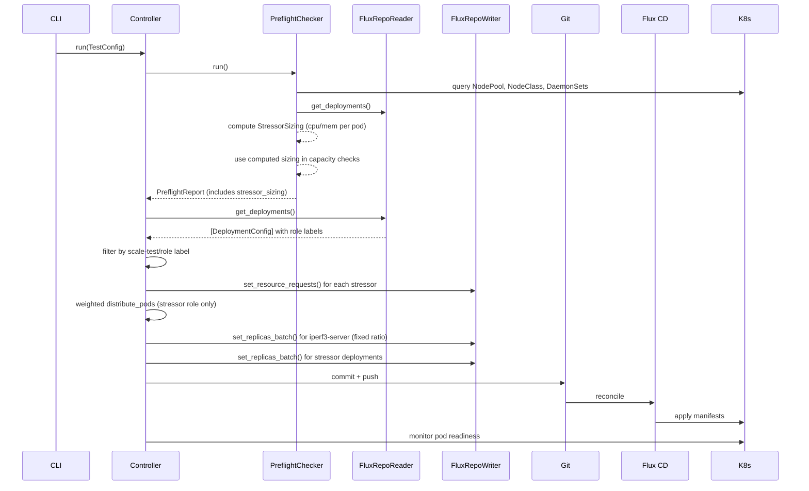

# Design Document: Stress-Test Integration

## Overview

This design replaces the pause/grow application with a suite of stress-test Deployments as the primary scaling workload for the K8s scale testing tool. The key changes span three layers:

1. **Flux manifests** — Rewrite stress-test Deployment YAMLs (remove sidecars, add `scale-test/role` labels, add topology spread, convert CronJob to Deployment), update kustomization, and switch the overlay-prod reference from `pause` to `stress-test`.
2. **Preflight checker** — Extend `_calculate_optimal_pod_sizing` to produce a `StressorSizing` dataclass that the controller can read. Use the computed sizing (not manifest defaults) in the existing capacity checks (vCPU quota, NodePool CPU limits, max achievable pods). Include `StressorSizing` in `PreflightReport`.
3. **Controller + FluxRepoWriter** — After preflight, read `stressor_sizing` from the report, patch manifest resource requests via a new `FluxRepoWriter.set_resource_requests()` method, then distribute pods using a new weighted distribution algorithm that respects `scale-test/role` labels.

The design preserves the existing single-commit-then-monitor scaling model. The only new git-commit content is the patched resource requests (written before the replica-count commit).

## Architecture



### Key Design Decisions

1. **Sizing computed in preflight, applied by controller.** The preflight checker already queries NodePool/NodeClass/daemonset data. Computing sizing there avoids duplicating those queries. The controller reads the sizing from the report and patches manifests — clean separation of concerns.

2. **Labels for role-based filtering.** Each Deployment gets a `scale-test/role` label (`stressor` or `infrastructure`). The FluxRepoReader reads this label into `DeploymentConfig`. The controller uses it to separate weighted-distribution targets from fixed-ratio infrastructure (iperf3 servers).

3. **Weighted distribution with floor + remainder.** Each stressor gets `floor(total * weight)` pods. Remainder pods go round-robin starting from the highest-weighted deployment. This is deterministic and preserves the total exactly.

4. **Resource limits as configurable multiplier.** Limits default to 2× CPU request and 1.5× memory request. This allows stress-ng to burst without runaway consumption. The multipliers live in `TestConfig`.

5. **Fallback to manifest defaults.** If preflight cannot determine instance type (missing CRDs), it logs a warning and skips sizing computation. The controller then skips `set_resource_requests()`, leaving the conservative defaults (10m CPU, 128Mi memory) in the manifests.

## Components and Interfaces

### 1. StressorSizing (new dataclass in models.py)

Produced by `PreflightChecker._calculate_optimal_pod_sizing()`, consumed by the controller.

```python
@dataclass
class StressorSizing(_SerializableMixin):
    cpu_request_millicores: int      # e.g. 290 for i4i.8xlarge
    memory_request_mi: int           # e.g. 2327 for i4i.8xlarge
    pod_ceiling: int                 # effective_max_pods - daemonset_count
    instance_type: str               # source instance type
    allocatable_cpu_millicores: int   # total allocatable after reservations
    allocatable_memory_mi: int        # total allocatable after reservations
    daemonset_count: int             # number of daemonset slots consumed
    cpu_limit_multiplier: float      # default 2.0
    memory_limit_multiplier: float   # default 1.5
```

### 2. PreflightChecker changes (preflight.py)

**New method: `_compute_stressor_sizing()`**

```python
def _compute_stressor_sizing(
    self,
    pod_sizing: PodSizingRecommendation,
    daemonset_count: int,
    effective_max_pods: int,
    instance_type: str,
    cpu_limit_multiplier: float = 2.0,
    memory_limit_multiplier: float = 1.5,
) -> StressorSizing:
    pod_ceiling = max(effective_max_pods - daemonset_count, 1)
    cpu_req = max(pod_sizing.allocatable_cpu_millicores // pod_ceiling, 1)
    mem_req = max(pod_sizing.allocatable_memory_mi // pod_ceiling, 1)
    return StressorSizing(
        cpu_request_millicores=cpu_req,
        memory_request_mi=mem_req,
        pod_ceiling=pod_ceiling,
        instance_type=instance_type,
        allocatable_cpu_millicores=pod_sizing.allocatable_cpu_millicores,
        allocatable_memory_mi=pod_sizing.allocatable_memory_mi,
        daemonset_count=daemonset_count,
        cpu_limit_multiplier=cpu_limit_multiplier,
        memory_limit_multiplier=memory_limit_multiplier,
    )
```

**Changes to `run()`:**
- After computing `PodSizingRecommendation` for the target instance type, call `_compute_stressor_sizing()`.
- Replace the manifest-based `total_cpu_m` / `total_mem_mi` calculation with the dynamically computed values: `total_cpu_m = stressor_sizing.cpu_request_millicores * target_pods`.
- Include `stressor_sizing` in the returned `PreflightReport`.
- If no NodeClass/NodePool data is available, set `stressor_sizing = None` and fall back to manifest-based resource values (current behavior).

### 3. PreflightReport changes (models.py)

Add optional field:

```python
@dataclass
class PreflightReport(_SerializableMixin):
    # ... existing fields ...
    stressor_sizing: Optional[StressorSizing] = None
```

### 4. DeploymentConfig changes (models.py)

Add optional fields for role label and weight:

```python
@dataclass
class DeploymentConfig(_SerializableMixin):
    # ... existing fields ...
    role: Optional[str] = None       # from scale-test/role label
    weight: Optional[float] = None   # from TestConfig.stressor_weights
```

### 5. TestConfig changes (models.py)

Add fields for stressor weights and limit multipliers:

```python
@dataclass
class TestConfig(_SerializableMixin):
    # ... existing fields ...
    stressor_weights: Optional[Dict[str, float]] = None
    cpu_limit_multiplier: float = 2.0
    memory_limit_multiplier: float = 1.5
    iperf3_server_ratio: int = 50  # 1 server per N clients
```

### 6. FluxRepoReader changes (flux.py)

**In `get_deployments()`:** Read the `scale-test/role` label from `metadata.labels` and populate `DeploymentConfig.role`:

```python
labels = meta.get("labels", {})
role = labels.get("scale-test/role")
# ... in DeploymentConfig constructor:
role=role,
```

### 7. FluxRepoWriter changes (flux.py)

**New method: `set_resource_requests()`**

```python
def set_resource_requests(
    self,
    name: str,
    cpu_request: str,
    memory_request: str,
    cpu_limit: str,
    memory_limit: str,
    source_path: str,
) -> bool:
    """Update resource requests and limits for a Deployment's first container."""
    if self.is_infrastructure_path(source_path):
        raise PermissionError(f"Cannot modify {source_path}")
    full = self.repo_path / source_path
    if not full.exists():
        return False
    docs = list(yaml.safe_load_all(full.read_text()))
    modified = False
    for doc in docs:
        if not isinstance(doc, dict):
            continue
        if doc.get("kind") == "Deployment" and doc.get("metadata", {}).get("name") == name:
            containers = doc["spec"]["template"]["spec"]["containers"]
            if containers:
                containers[0].setdefault("resources", {})
                containers[0]["resources"]["requests"] = {
                    "cpu": cpu_request,
                    "memory": memory_request,
                }
                containers[0]["resources"]["limits"] = {
                    "cpu": cpu_limit,
                    "memory": memory_limit,
                }
                modified = True
    if modified:
        with open(full, "w") as fh:
            yaml.dump_all(docs, fh, default_flow_style=False, sort_keys=False)
    return modified
```

**New method: `distribute_pods_weighted()`**

```python
def distribute_pods_weighted(
    self,
    deployments: list[DeploymentConfig],
    total_target: int,
    weights: dict[str, float],
) -> list[tuple[str, int, str]]:
    """Distribute pods proportionally by weight.

    Each deployment gets floor(total * weight) pods.
    Remainder distributed round-robin from highest-weighted.
    """
    if not deployments:
        return []
    # Validate weights sum to ~1.0
    total_weight = sum(weights.get(d.name, 0.0) for d in deployments)
    if abs(total_weight - 1.0) > 0.01:
        raise ValueError(
            f"Weights sum to {total_weight:.4f}, must be 1.0 ± 0.01"
        )
    # Floor allocation
    result = []
    allocated = 0
    for d in deployments:
        w = weights.get(d.name, 0.0)
        count = int(total_target * w)  # floor
        result.append((d.name, count, d.source_path))
        allocated += count
    # Remainder round-robin from highest weight
    remainder = total_target - allocated
    sorted_indices = sorted(
        range(len(result)),
        key=lambda i: weights.get(result[i][0], 0.0),
        reverse=True,
    )
    for i in range(remainder):
        idx = sorted_indices[i % len(sorted_indices)]
        name, count, path = result[idx]
        result[idx] = (name, count + 1, path)
    return result
```

### 8. Controller changes (controller.py)

**In `run()`, after preflight and before scaling:**

```python
# Read sizing from preflight report
if report.stressor_sizing:
    sizing = report.stressor_sizing
    cpu_req = f"{sizing.cpu_request_millicores}m"
    mem_req = f"{sizing.memory_request_mi}Mi"
    cpu_lim = f"{int(sizing.cpu_request_millicores * sizing.cpu_limit_multiplier)}m"
    mem_lim = f"{int(sizing.memory_request_mi * sizing.memory_limit_multiplier)}Mi"

    for d in deployments:
        if d.role == "stressor":
            writer.set_resource_requests(
                d.name, cpu_req, mem_req, cpu_lim, mem_lim, d.source_path
            )

# Separate stressor vs infrastructure deployments
stressors = [d for d in deployments if d.role == "stressor"]
infra = [d for d in deployments if d.role == "infrastructure"]
unlabeled = [d for d in deployments if d.role is None]
for d in unlabeled:
    log.warning("Deployment %s has no scale-test/role label, excluding", d.name)

# Scale iperf3 servers first (fixed ratio)
if infra:
    server_count = max(1, self.config.target_pods // self.config.iperf3_server_ratio)
    infra_targets = [(d.name, server_count, d.source_path) for d in infra]
    writer.set_replicas_batch(infra_targets)
    await self._git_commit_push("scale-test: deploy iperf3 servers")
    # Wait for servers to be ready
    await self._wait_for_ready(infra, server_count)

# Weighted distribution for stressors
if self.config.stressor_weights:
    targets = writer.distribute_pods_weighted(
        stressors, self.config.target_pods, self.config.stressor_weights
    )
else:
    targets = writer.distribute_pods_across_deployments(
        stressors, self.config.target_pods
    )
```

### 9. CLI changes (cli.py)

Add argument:

```python
parser.add_argument(
    "--stressor-weights",
    type=str,
    default=None,
    help='JSON dict of deployment name to weight, e.g. \'{"cpu-stress-test": 0.4, ...}\'',
)
```

Parse into `TestConfig`:

```python
stressor_weights = json.loads(args.stressor_weights) if args.stressor_weights else None
```

### 10. Manifest Changes

All stressor Deployments get these common additions:

```yaml
metadata:
  labels:
    scale-test/role: stressor   # or "infrastructure" for iperf3-server
spec:
  strategy:
    type: RollingUpdate
    rollingUpdate:
      maxSurge: 5000
      maxUnavailable: 0
  template:
    spec:
      nodeSelector:
        karpenter.sh/nodepool: alt
      topologySpreadConstraints:
      - maxSkew: 10
        topologyKey: topology.kubernetes.io/zone
        whenUnsatisfiable: ScheduleAnyway
        labelSelector:
          matchLabels:
            app: <deployment-name>
      - maxSkew: 10
        topologyKey: kubernetes.io/hostname
        whenUnsatisfiable: ScheduleAnyway
        labelSelector:
          matchLabels:
            app: <deployment-name>
      containers:
      - resources:
          requests:
            cpu: 10m        # conservative default, overwritten at runtime
            memory: 128Mi   # conservative default, overwritten at runtime
          limits:
            cpu: 20m
            memory: 192Mi
```

**cpu-stress.yaml:** Remove `validator` container, `host-root` volume. Single `stress-ng` container with continuous loop. Conservative default resources.

**memory-stress.yaml:** Remove `zram-validator` container. Single `stress-ng` container with `--vm` workers in continuous loop.

**network-stress.yaml:** Remove `network-validator` from iperf3-server. iperf3-server gets `scale-test/role: infrastructure`. iperf3-client gets `scale-test/role: stressor`. Headless Service retained.

**sysctl-stress.yaml:** Replace privileged `nsenter`/`curl` container with non-privileged `stress-ng --sock` workers for local TCP stack stress. Remove `privileged: true`.

**cronjob.yaml:** Delete entirely. Replace with `io-stress.yaml` — a Deployment running `stress-ng --iomix` in a continuous loop.

**kustomization.yaml:** Remove `cronjob.yaml`, add `io-stress.yaml`, add `image-puller-daemonset.yaml`.

**image-puller-daemonset.yaml:** Update init containers to pull `polinux/stress-ng:latest` and `networkstatic/iperf3:latest`.

**overlay-prod/kustomization.yaml:** Replace `../base/pause` with `../base/stress-test`.

## Data Models

### New: StressorSizing

```python
@dataclass
class StressorSizing(_SerializableMixin):
    cpu_request_millicores: int
    memory_request_mi: int
    pod_ceiling: int
    instance_type: str
    allocatable_cpu_millicores: int
    allocatable_memory_mi: int
    daemonset_count: int
    cpu_limit_multiplier: float = 2.0
    memory_limit_multiplier: float = 1.5
```

### Modified: PreflightReport

```python
@dataclass
class PreflightReport(_SerializableMixin):
    # ... all existing fields unchanged ...
    stressor_sizing: Optional[StressorSizing] = None  # NEW
```

### Modified: DeploymentConfig

```python
@dataclass
class DeploymentConfig(_SerializableMixin):
    # ... all existing fields unchanged ...
    role: Optional[str] = None       # NEW: from scale-test/role label
    weight: Optional[float] = None   # NEW: from TestConfig.stressor_weights
```

### Modified: TestConfig

```python
@dataclass
class TestConfig(_SerializableMixin):
    # ... all existing fields unchanged ...
    stressor_weights: Optional[Dict[str, float]] = None  # NEW
    cpu_limit_multiplier: float = 2.0                     # NEW
    memory_limit_multiplier: float = 1.5                  # NEW
    iperf3_server_ratio: int = 50                         # NEW
```

### Sizing Computation Example (i4i.8xlarge)

| Parameter | Value |
|---|---|
| Total vCPU | 32 (32000m) |
| Total Memory | 256 GiB (262144 Mi) |
| system_reserved_cpu | 100m |
| kube_reserved_cpu | 100m |
| system_reserved_memory | 100Mi |
| kube_reserved_memory | 1843Mi |
| eviction_hard_memory | 100Mi |
| **Allocatable CPU** | **31800m** |
| **Allocatable Memory** | **260101 Mi** |
| maxPods | 150 |
| daemonset_count | ~40 |
| **pod_ceiling** | **110** |
| **cpu_request per pod** | **289m** (31800 / 110) |
| **memory_request per pod** | **2364Mi** (260101 / 110) |
| cpu_limit per pod (2×) | 578m |
| memory_limit per pod (1.5×) | 3546Mi |


## Correctness Properties

*A property is a characteristic or behavior that should hold true across all valid executions of a system — essentially, a formal statement about what the system should do. Properties serve as the bridge between human-readable specifications and machine-verifiable correctness guarantees.*

### Property 1: Dynamic sizing computation produces correct requests and limits

*For any* valid allocatable CPU (millicores > 0), allocatable memory (MiB > 0), pod_ceiling (> 0), cpu_limit_multiplier (> 0), and memory_limit_multiplier (> 0), the `_compute_stressor_sizing()` function SHALL produce:
- `cpu_request_millicores == max(allocatable_cpu_millicores // pod_ceiling, 1)`
- `memory_request_mi == max(allocatable_memory_mi // pod_ceiling, 1)`
- The implied CPU limit equals `cpu_request_millicores * cpu_limit_multiplier`
- The implied memory limit equals `memory_request_mi * memory_limit_multiplier`
- `pod_ceiling` pods each requesting `cpu_request_millicores` fit within `allocatable_cpu_millicores` (i.e., `cpu_request_millicores * pod_ceiling <= allocatable_cpu_millicores`)
- `pod_ceiling` pods each requesting `memory_request_mi` fit within `allocatable_memory_mi`

**Validates: Requirements 2.1, 2.7, 2.8**

### Property 2: Preflight uses dynamic sizing in capacity demand calculation

*For any* valid `StressorSizing` with known `cpu_request_millicores` and `memory_request_mi`, and any `target_pods > 0`, the preflight total workload demand SHALL equal `stressor_sizing.cpu_request_millicores * target_pods` (for CPU) and `stressor_sizing.memory_request_mi * target_pods` (for memory), NOT the values from manifest resource requests.

**Validates: Requirements 2.2**

### Property 3: Preflight report includes complete stressor sizing

*For any* successful preflight run where NodePool and NodeClass data is available, the returned `PreflightReport.stressor_sizing` SHALL be non-None and SHALL contain all required fields: `cpu_request_millicores > 0`, `memory_request_mi > 0`, `pod_ceiling > 0`, a non-empty `instance_type`, `allocatable_cpu_millicores > 0`, `allocatable_memory_mi > 0`, and `daemonset_count >= 0`.

**Validates: Requirements 2.3**

### Property 4: set_resource_requests round-trip consistency

*For any* valid Deployment YAML document, deployment name matching a document in the file, and any CPU/memory request/limit strings, calling `FluxRepoWriter.set_resource_requests()` then reading the file back with `FluxRepoReader.get_deployments()` SHALL produce a `DeploymentConfig` whose `resource_requests["cpu"]` and `resource_requests["memory"]` match the values that were written.

**Validates: Requirements 2.4, 2.5**

### Property 5: Weighted distribution preserves total and respects proportions

*For any* list of N deployments (N > 0), any `total_target >= 0`, and any valid weight mapping (floats summing to 1.0 ± 0.01), `distribute_pods_weighted()` SHALL produce allocations where:
- The sum of all allocated replica counts equals `total_target` exactly
- Each deployment receives at least `floor(total_target * weight)` pods
- No deployment receives more than `floor(total_target * weight) + 1` pods (at most 1 remainder pod each)

**Validates: Requirements 4.1, 4.2**

### Property 6: Invalid weights are rejected

*For any* weight mapping where `abs(sum(weights) - 1.0) > 0.01`, calling `distribute_pods_weighted()` SHALL raise a `ValueError`.

**Validates: Requirements 4.4**

### Property 7: Even distribution fallback preserves total

*For any* list of N deployments (N > 0) and any `total_target >= 0`, `distribute_pods_across_deployments()` SHALL produce allocations where:
- The sum of all allocated replica counts equals `total_target` exactly
- The difference between the maximum and minimum allocation is at most 1

**Validates: Requirements 4.3**

### Property 8: Role-based filtering excludes non-stressor deployments

*For any* list of `DeploymentConfig` objects with mixed `role` values (some "stressor", some "infrastructure", some None), filtering for weighted distribution SHALL include only deployments where `role == "stressor"`. Deployments with `role == "infrastructure"` or `role is None` SHALL be excluded from the stressor distribution list.

**Validates: Requirements 6.2, 10.2, 10.4**

### Property 9: FluxRepoReader reads scale-test/role label into DeploymentConfig

*For any* valid Deployment YAML file containing a `metadata.labels` with key `scale-test/role` and any string value, `FluxRepoReader.get_deployments()` SHALL return a `DeploymentConfig` with `role` equal to that label value. For Deployment YAMLs without the label, `role` SHALL be None.

**Validates: Requirements 10.1**

### Property 10: FluxRepoReader discovers all Deployments in directory

*For any* directory containing N valid Deployment YAML files (N >= 0), `FluxRepoReader.get_deployments()` SHALL return exactly N `DeploymentConfig` objects, one per Deployment document.

**Validates: Requirements 1.3**

### Property 11: Stressor manifest compliance

*For any* Deployment discovered by `FluxRepoReader` from the stress-test directory with `role == "stressor"`, the Deployment SHALL have:
- `nodeSelector` containing `karpenter.sh/nodepool: alt`
- At least two `topologySpreadConstraints`: one with `topologyKey: topology.kubernetes.io/zone` and `maxSkew: 10`, and one with `topologyKey: kubernetes.io/hostname` and `maxSkew: 10`
- A `strategy` of type `RollingUpdate` with `maxSurge: 5000` and `maxUnavailable: 0`

**Validates: Requirements 8.1, 8.2, 8.3, 8.4**


## Error Handling

### Preflight Fallback (Requirement 2.10)
- If `_get_nodeclass_configs()` or `_get_nodepool_configs()` returns empty lists (CRDs missing), `_compute_stressor_sizing()` is skipped.
- `PreflightReport.stressor_sizing` is set to `None`.
- The controller checks `report.stressor_sizing is not None` before calling `set_resource_requests()`. If None, manifests retain their conservative defaults.
- A warning is logged: `"Cannot compute stressor sizing: no NodeClass/NodePool data. Using manifest defaults."`

### Weight Validation (Requirement 4.4)
- `distribute_pods_weighted()` validates `abs(sum(weights) - 1.0) > 0.01` and raises `ValueError` with a descriptive message including the actual sum.
- The controller catches this before any git commits are made, so no partial state is written.

### Missing Role Labels (Requirement 10.4)
- Deployments with `role is None` are logged as warnings and excluded from both stressor and infrastructure lists.
- They do not receive any replica allocation.
- The controller continues with the remaining labeled deployments.

### FluxRepoWriter Failures
- `set_resource_requests()` returns `False` if the file doesn't exist or the deployment name isn't found.
- `set_replicas()` already handles `PermissionError` for infrastructure paths.
- The controller logs failures but continues with remaining deployments (partial success is acceptable for manifest patching).

### Empty Deployment Lists
- If no stressor deployments are found after filtering, the controller logs a warning and returns early with `halt_reason="no_stressor_deployments"`.
- If no infrastructure deployments are found, the iperf3 server scaling step is skipped.


## Testing Strategy

### Framework and Libraries

- **Test runner:** pytest
- **Property-based testing:** hypothesis (Python)
- **Test location:** `tests/` directory at the package root (alongside `src/`)
- **Minimum iterations:** 100 per property test (configured via `@settings(max_examples=100)`)

### Dual Testing Approach

**Property-based tests** verify universal correctness properties across randomly generated inputs. Each property test maps to exactly one correctness property from the design document and is annotated with a comment referencing the property number.

**Unit tests** verify specific examples, edge cases, and integration points that are not well-suited to property-based testing (e.g., static YAML content checks, CLI argument parsing, specific error messages).

### Property-Based Test Plan

Each property below maps to a correctness property from the design. Tests use `hypothesis` strategies to generate random inputs.

#### Test File: `tests/test_sizing_properties.py`

**Property 1: Dynamic sizing computation**
- Tag: `Feature: stress-test-integration, Property 1: Dynamic sizing computation produces correct requests and limits`
- Strategy: Generate random `allocatable_cpu_millicores` (100–64000), `allocatable_memory_mi` (100–524288), `pod_ceiling` (1–200), `cpu_limit_multiplier` (1.0–5.0), `memory_limit_multiplier` (1.0–5.0)
- Assertions:
  - `cpu_request == max(alloc_cpu // pod_ceiling, 1)`
  - `mem_request == max(alloc_mem // pod_ceiling, 1)`
  - `cpu_request * pod_ceiling <= alloc_cpu`
  - `mem_request * pod_ceiling <= alloc_mem`
  - Implied limits match multiplier application

**Property 2: Preflight uses dynamic sizing in capacity demand**
- Tag: `Feature: stress-test-integration, Property 2: Preflight uses dynamic sizing in capacity demand calculation`
- Strategy: Generate random `StressorSizing` and `target_pods` (1–100000)
- Assertions: Total CPU demand == `sizing.cpu_request_millicores * target_pods`, total memory demand == `sizing.memory_request_mi * target_pods`
- Note: This test exercises the demand calculation logic extracted into a testable helper function

**Property 3: Preflight report includes complete stressor sizing**
- Tag: `Feature: stress-test-integration, Property 3: Preflight report includes complete stressor sizing`
- Strategy: Generate random valid NodePoolConfig, NodeClassConfig, and daemonset counts
- Assertions: `report.stressor_sizing is not None`, all fields > 0 (except daemonset_count >= 0), instance_type non-empty

#### Test File: `tests/test_distribution_properties.py`

**Property 5: Weighted distribution preserves total and respects proportions**
- Tag: `Feature: stress-test-integration, Property 5: Weighted distribution preserves total and respects proportions`
- Strategy: Generate random N (1–20) deployment names, random `total_target` (0–100000), random weights that sum to 1.0
- Assertions:
  - `sum(allocations) == total_target`
  - Each allocation >= `floor(total_target * weight)`
  - Each allocation <= `floor(total_target * weight) + 1`

**Property 6: Invalid weights are rejected**
- Tag: `Feature: stress-test-integration, Property 6: Invalid weights are rejected`
- Strategy: Generate random weight mappings where `abs(sum - 1.0) > 0.01`
- Assertions: `ValueError` is raised

**Property 7: Even distribution fallback preserves total**
- Tag: `Feature: stress-test-integration, Property 7: Even distribution fallback preserves total`
- Strategy: Generate random N (1–20) deployments and random `total_target` (0–100000)
- Assertions:
  - `sum(allocations) == total_target`
  - `max(allocations) - min(allocations) <= 1`

**Property 8: Role-based filtering excludes non-stressor deployments**
- Tag: `Feature: stress-test-integration, Property 8: Role-based filtering excludes non-stressor deployments`
- Strategy: Generate random lists of DeploymentConfig with roles sampled from {"stressor", "infrastructure", None}
- Assertions: Filtered list contains only deployments where `role == "stressor"`

#### Test File: `tests/test_flux_properties.py`

**Property 4: set_resource_requests round-trip**
- Tag: `Feature: stress-test-integration, Property 4: set_resource_requests round-trip consistency`
- Strategy: Generate random deployment names, random CPU request strings (1m–10000m), random memory request strings (1Mi–100000Mi)
- Setup: Write a minimal valid Deployment YAML to a temp directory, then call `set_resource_requests()`, then read back with `FluxRepoReader`
- Assertions: Read-back `resource_requests["cpu"]` and `resource_requests["memory"]` match written values

**Property 9: FluxRepoReader reads scale-test/role label**
- Tag: `Feature: stress-test-integration, Property 9: FluxRepoReader reads scale-test/role label into DeploymentConfig`
- Strategy: Generate random role label values (including None for missing label)
- Setup: Write Deployment YAMLs with/without the label to a temp directory
- Assertions: `DeploymentConfig.role` matches the label value or is None

**Property 10: FluxRepoReader discovers all Deployments**
- Tag: `Feature: stress-test-integration, Property 10: FluxRepoReader discovers all Deployments in directory`
- Strategy: Generate random N (0–10) valid Deployment YAML documents
- Setup: Write them to a temp directory under `apps/base/test/`
- Assertions: `len(get_deployments()) == N`

### Unit Test Plan

#### Test File: `tests/test_manifest_content.py`

Static YAML content verification (example-based tests):

- **Test overlay-prod reference** (Req 1.1): Parse `overlay-prod/kustomization.yaml`, assert `../base/stress-test` in resources, `../base/pause` not in resources.
- **Test kustomization resources** (Req 1.2, 3.1): Parse `stress-test/kustomization.yaml`, assert no CronJob references, assert `io-stress.yaml` present, assert `image-puller-daemonset.yaml` present.
- **Test namespace** (Req 1.4): Parse `namespace.yaml`, assert `metadata.name == "stress-test"`.
- **Test conservative defaults** (Req 2.6): Parse each stressor YAML, assert default requests are `10m` CPU and `128Mi` memory.
- **Test no sidecars** (Req 5.1–5.3): Parse cpu-stress, memory-stress, network-stress YAMLs, assert each has exactly 1 container.
- **Test sysctl non-privileged** (Req 5.4): Parse sysctl-stress YAML, assert no `privileged: true`, assert command contains `--sock`.
- **Test continuous loops** (Req 3.2, 3.3): Parse each stressor YAML, assert container command contains `while true`.
- **Test iperf3 headless service** (Req 6.4): Parse network-stress YAML, assert Service with `clusterIP: None`.
- **Test image-puller images** (Req 7.1): Parse image-puller YAML, assert init containers reference `stress-ng` and `iperf3` images.
- **Test image-puller nodeSelector** (Req 7.2): Assert `karpenter.sh/nodepool: alt`.
- **Test image-puller resources** (Req 7.3): Assert requests are `10m` CPU, `10Mi` memory.
- **Test stressor manifest compliance** (Req 8.1–8.4): For each stressor YAML, verify nodeSelector, topology spread constraints, and rolling update strategy. (This also serves as concrete examples for Property 11.)

#### Test File: `tests/test_cli.py`

- **Test --stressor-weights parsing** (Req 9.4): Call `parse_args()` with `--stressor-weights '{"cpu-stress-test": 0.5, "memory-stress-test": 0.5}'`, assert `TestConfig.stressor_weights` is correctly populated.
- **Test --stressor-weights omitted** (Req 9.3): Call `parse_args()` without the flag, assert `TestConfig.stressor_weights is None`.

#### Test File: `tests/test_preflight_fallback.py`

- **Test missing NodeClass fallback** (Req 2.10, edge case): Mock `_get_nodeclass_configs()` to return `[]`, run preflight, assert `report.stressor_sizing is None`.
- **Test missing NodePool fallback** (Req 2.10, edge case): Mock `_get_nodepool_configs()` to return `[]`, run preflight, assert `report.stressor_sizing is None`.

#### Test File: `tests/test_controller_integration.py`

- **Test iperf3 server scaling** (Req 6.1, 6.2): Mock FluxRepoWriter, verify `set_replicas_batch()` is called for infrastructure deployments before stressor deployments.
- **Test server ratio calculation** (Req 6.2): For `target_pods=1000` and `iperf3_server_ratio=50`, assert server count is 20.

### Test Tagging Convention

Each property-based test includes a docstring comment:

```python
def test_weighted_distribution_preserves_total(self):
    """Feature: stress-test-integration, Property 5: Weighted distribution preserves total and respects proportions"""
```

### Edge Cases Covered by Generators

The hypothesis strategies should include these edge cases in their search space:

- `pod_ceiling = 1` (single pod per node)
- `total_target = 0` (no pods to distribute)
- `total_target = 1` (single pod across multiple deployments)
- Single deployment with weight 1.0
- All deployments with equal weights
- Deployments with very small weights (e.g., 0.01)
- Very large `allocatable_cpu_millicores` and `allocatable_memory_mi` values
- `daemonset_count = 0` (no daemonsets)
- Empty deployment lists
- Deployment names with special characters
