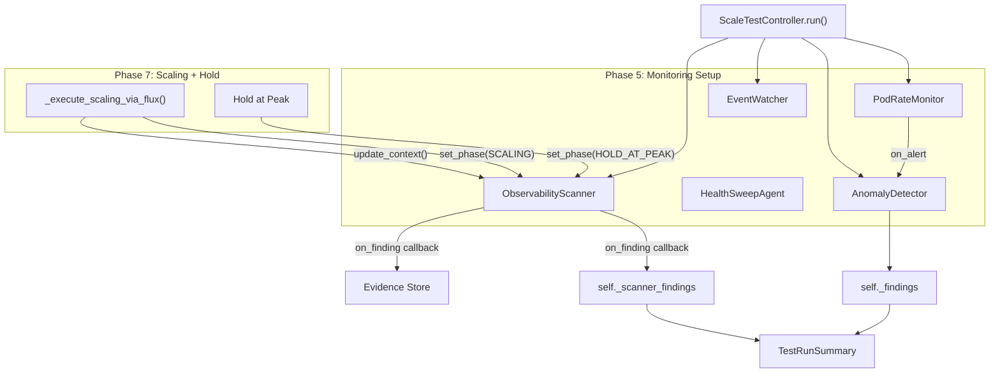
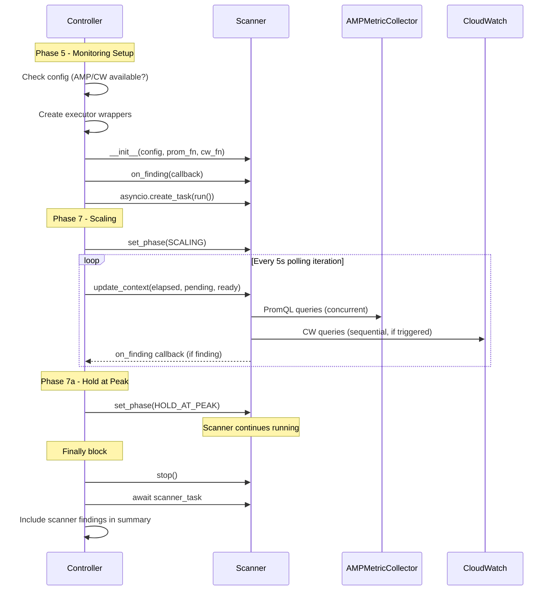

# Design Document: Wire Observability Scanner

## Overview

This design describes how to integrate the existing `ObservabilityScanner` into the `ScaleTestController` lifecycle. The scanner is already fully implemented — this work is purely about wiring: creating the scanner with the right executor functions, managing its async task, feeding it phase/context updates, collecting its findings, and including them in the summary.

The key design constraint is module boundary preservation: the scanner must not interfere with `PodRateMonitor`, `HealthSweepAgent`, `AnomalyDetector`, `InfraHealthAgent`, or `EventWatcher`. Each of these modules owns its own data path and query patterns.

## Architecture

The scanner slots into the controller's existing monitoring pipeline as a parallel, independent component:



### Lifecycle Sequence



## Components and Interfaces

### 1. Executor Factory Functions

Two factory functions in `controller.py` create the executor callables that the scanner needs. These wrap existing infrastructure without modifying it.

```python
def _make_prometheus_executor(config: TestConfig) -> Callable[[str], Awaitable[dict]] | None:
    """Create a PromQL executor from config, or return None if AMP/Prometheus not configured."""
    if not config.amp_workspace_id and not config.prometheus_url:
        return None
    
    collector = AMPMetricCollector(
        amp_workspace_id=config.amp_workspace_id,
        prometheus_url=config.prometheus_url,
        aws_profile=config.aws_profile,
    )
    
    async def executor(query: str) -> dict:
        return await collector._query_promql(query)
    
    return executor


def _make_cloudwatch_executor(config: TestConfig, aws_client) -> Callable[[str, str, str], Awaitable[dict]] | None:
    """Create a CloudWatch Logs Insights executor, or return None if not configured."""
    if not config.cloudwatch_log_group or not config.eks_cluster_name:
        return None
    
    async def executor(query: str, start_time: str, end_time: str) -> dict:
        # Use boto3 CloudWatch Logs client to run Insights query
        loop = asyncio.get_event_loop()
        result = await loop.run_in_executor(
            None,
            _run_cw_insights_query,
            aws_client, config.cloudwatch_log_group, query, start_time, end_time,
        )
        return result
    
    return executor
```

### 2. Scanner Wiring in Controller

The scanner is created and managed within `ScaleTestController.run()`. Key integration points:

- **Creation**: After monitoring setup (Phase 5), before scaling (Phase 7). Stored as `self._scanner` and `self._scanner_task`.
- **Phase setting**: `set_phase(Phase.SCALING)` before `_execute_scaling_via_flux`, `set_phase(Phase.HOLD_AT_PEAK)` before the hold period.
- **Context updates**: Inside the scaling loop's 5-second polling iteration, after `_count_pods()`.
- **Finding callback**: Registered via `on_finding()`, logs + persists + appends to `self._scanner_findings`.
- **Shutdown**: In the existing `finally` block alongside `monitor.stop()`, `watcher.stop()`, and `_stop_observer()`.

### 3. Finding Callback

```python
def _on_scanner_finding(self, result: ScanResult) -> None:
    """Handle a scanner finding: log, persist, collect."""
    log.warning("Scanner [%s] %s: %s", result.query_name, result.severity.value, result.title)
    try:
        self.evidence_store.save_scanner_finding(self._evidence_run_id, result)
    except Exception as exc:
        log.debug("Failed to persist scanner finding: %s", exc)
    self._scanner_findings.append(result)
```

### 4. Evidence Store Extension

A new method `save_scanner_finding()` on `EvidenceStore` serializes `ScanResult` to a JSONL file (`scanner_findings.jsonl`) in the run directory. This keeps scanner findings separate from anomaly findings on disk.

```python
def save_scanner_finding(self, run_id: str, result: ScanResult) -> None:
    """Append a scanner finding to scanner_findings.jsonl."""
    rd = self._run_dir(run_id)
    path = rd / "scanner_findings.jsonl"
    entry = {
        "query_name": result.query_name,
        "severity": result.severity.value,
        "title": result.title,
        "detail": result.detail,
        "source": result.source.value,
        "timestamp": datetime.now(timezone.utc).isoformat(),
    }
    with open(path, "a") as f:
        f.write(json.dumps(entry) + "\n")
```

## Data Models

### New Controller Attributes

```python
# Added to ScaleTestController.__init__
self._scanner: ObservabilityScanner | None = None
self._scanner_task: asyncio.Task | None = None
self._scanner_findings: list[ScanResult] = []
```

### TestRunSummary Extension

A new optional field on `TestRunSummary`:

```python
@dataclass
class TestRunSummary(_SerializableMixin):
    # ... existing fields ...
    scanner_findings: Optional[List[Dict]] = None  # Serialized ScanResult list
```

### ScanResult Serialization

`ScanResult` instances are serialized to dicts for inclusion in the summary:

```python
def _serialize_scan_result(result: ScanResult) -> dict:
    return {
        "query_name": result.query_name,
        "severity": result.severity.value,
        "title": result.title,
        "detail": result.detail,
        "source": result.source.value,
    }
```

### No Changes to Existing Models

- `Finding` dataclass: unchanged
- `TestConfig`: unchanged (already has `amp_workspace_id`, `prometheus_url`, `cloudwatch_log_group`, `eks_cluster_name`)
- `ScanResult`, `ScanQuery`, `Phase`, `Severity`, `Source`: unchanged (already in `observability.py`)


## Correctness Properties

*A property is a characteristic or behavior that should hold true across all valid executions of a system — essentially, a formal statement about what the system should do. Properties serve as the bridge between human-readable specifications and machine-verifiable correctness guarantees.*

### Property 1: Config-to-executor mapping determines scanner creation

*For any* `TestConfig`, the Prometheus executor is non-null if and only if `amp_workspace_id` or `prometheus_url` is set; the CloudWatch executor is non-null if and only if both `cloudwatch_log_group` and `eks_cluster_name` are set; and the scanner is created if and only if at least one executor is non-null.

**Validates: Requirements 1.2, 1.3, 1.4, 1.5, 1.6**

### Property 2: Scanner stop causes task completion

*For any* running `ObservabilityScanner`, calling `stop()` causes the `run()` coroutine to exit within a bounded time, and the scanner's `_running` flag is `False` after stop completes.

**Validates: Requirements 2.2**

### Property 3: Context update fidelity

*For any* non-negative float `elapsed_seconds`, non-negative integer `pending`, and non-negative integer `ready`, calling `scanner.update_context(elapsed_minutes=elapsed_seconds/60, pending=pending, ready=ready)` results in the scanner's internal context containing exactly those values: `context["elapsed_minutes"] == elapsed_seconds / 60`, `context["pending"] == pending`, `context["ready"] == ready`.

**Validates: Requirements 4.1, 4.2, 4.3, 4.4**

### Property 4: Finding callback collects and persists

*For any* `ScanResult`, when the finding callback fires, the result is appended to `self._scanner_findings` (not to `self._findings`), and the evidence store's `scanner_findings.jsonl` file contains a JSON line with the result's `query_name`, `severity`, and `title`.

**Validates: Requirements 5.2, 5.3, 5.4**

### Property 5: Summary includes scanner findings separately

*For any* list of scanner `ScanResult` findings and any list of anomaly `Finding` findings, the `TestRunSummary` produced by `_make_summary` contains the scanner findings in `scanner_findings` and the anomaly findings in `findings`, with no cross-contamination between the two fields.

**Validates: Requirements 6.1, 6.2**

## Error Handling

### Scanner Creation Failures

If executor factory functions raise (e.g., invalid AMP workspace ID format), the controller catches the exception, logs it, and proceeds without the scanner. The `self._scanner` attribute remains `None`.

### Scanner Task Failures

The scanner task is awaited in the finally block with exception handling:

```python
try:
    await scanner.stop()
    await scanner_task
except Exception as exc:
    log.warning("Scanner shutdown error: %s", exc)
```

If the task raised during execution, the exception is caught here. The controller continues with cleanup.

### Finding Callback Failures

The callback wraps evidence store persistence in a try/except. If `save_scanner_finding` fails (e.g., disk full), the finding is still appended to the in-memory list. The scanner's own `on_finding` dispatch already catches callback exceptions (see `_run_query` in `observability.py`).

### Executor Failures

Individual query failures are already handled by the scanner's `_run_query` method — it catches exceptions and logs at debug level. No additional error handling needed in the controller for per-query failures.

## Testing Strategy

### Property-Based Tests (pytest + hypothesis)

Each correctness property maps to a single property-based test with minimum 100 iterations.

| Property | Test | Generator Strategy |
|----------|------|--------------------|
| P1: Config-to-executor mapping | Generate random `TestConfig` with optional AMP/Prometheus/CW fields, verify executor nullity and scanner creation decision | `st.builds(TestConfig, ...)` with optional string fields |
| P2: Scanner stop causes completion | Generate scanner with mock executors, start run(), call stop(), verify task completes | Mock executors, `asyncio` test harness |
| P3: Context update fidelity | Generate random floats/ints for elapsed/pending/ready, call update_context, verify context dict | `st.floats(min_value=0)`, `st.integers(min_value=0)` |
| P4: Finding callback collects and persists | Generate random `ScanResult` instances, fire callback, verify collection and persistence | `st.builds(ScanResult, ...)` |
| P5: Summary includes scanner findings separately | Generate random lists of `ScanResult` and `Finding`, build summary, verify separation | `st.lists(st.builds(ScanResult, ...))` |

### Unit Tests

- Verify scanner is not created when config has no AMP/Prometheus/CloudWatch settings
- Verify phase transitions happen in correct order (SCALING before HOLD_AT_PEAK)
- Verify finding callback handles evidence store exceptions gracefully
- Verify scanner task exception does not prevent controller cleanup

### What NOT to Test

- Scanner query logic (already tested in `observability.py` tests)
- AMPMetricCollector internals (owned by `health_sweep.py`)
- Monitor, anomaly detector, health sweep behavior (module boundary — not modified)

### Test Configuration

- Framework: `pytest` with `hypothesis` for property-based tests
- Minimum 100 examples per property test (`@settings(max_examples=100)`)
- Each test tagged with: `Feature: wire-observability-scanner, Property N: <title>`
- Async tests use `pytest-asyncio`
