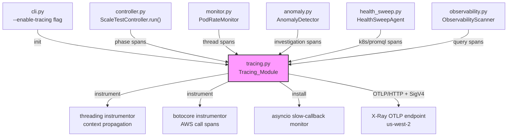

# Design Document: OpenTelemetry Tracing for k8s-scale-test

## Overview

This design adds opt-in distributed tracing to the k8s-scale-test CLI using OpenTelemetry with the ADOT SDK, exporting traces to AWS X-Ray via the OTLP endpoint. Operators can visualize the full test lifecycle — phase transitions, thread activity, blocking API calls, and asyncio event loop health — in the CloudWatch X-Ray console.

Key design decisions:

1. **OpenTelemetry + ADOT SDK** rather than the X-Ray SDK (which entered maintenance mode Feb 25, 2026). OpenTelemetry is the AWS-recommended path forward. The ADOT SDK provides the `aws-sdk-extension` for X-Ray ID generation and the OTLP exporter for direct-to-endpoint sending.

2. **Collector-less direct sending** — the ADOT SDK sends traces directly to the X-Ray OTLP endpoint (`https://xray.{region}.amazonaws.com/v1/traces`) via OTLP/HTTP with SigV4 authentication. No collector sidecar or X-Ray daemon needed. This is ideal for a local CLI tool.

3. **`opentelemetry-instrumentation-threading` for automatic context propagation** — this is the critical design choice. OpenTelemetry Python uses `contextvars.ContextVar` for context storage. `contextvars` propagate automatically into asyncio tasks (same thread) but NOT into OS threads. The threading instrumentor monkey-patches `threading.Thread.__init__`, `threading.Timer`, and `concurrent.futures.ThreadPoolExecutor` to copy the current `contextvars.Context` at thread/task creation time. This solves ALL 7 threading patterns in our codebase automatically — including the tricky `_safe_callback` closure pattern.

4. **`opentelemetry-instrumentation-botocore` for automatic AWS call tracing** — patches botocore (which underlies boto3) to create child spans for every AWS API call. SSM, EC2, CloudWatch calls are auto-captured. AMP PromQL queries use raw `urllib.request` and need manual spans.

5. **Decorator/context-manager pattern** — tracing is injected via decorators and context managers rather than modifying every function body. This keeps the diff small and makes tracing easy to remove if needed.

6. **No-op when disabled** — when `--enable-tracing` is not passed, the tracing module returns no-op decorators and context managers so there is zero overhead.

7. **Lightweight slow-callback monitor** — instead of `loop.set_debug(True)` (which wraps every callback and has significant overhead), we use a periodic `call_later` probe that measures event loop responsiveness by comparing scheduled vs actual callback time.

## Architecture



The Tracing_Module (`tracing.py`) is the single point of contact for all other modules. It exposes:
- `init_tracing(aws_session)` — one-time setup: configures TracerProvider, OTLP exporter, threading/botocore instrumentors
- `phase_span(name, **attributes)` — context manager for phase-level root spans
- `span(name, **attributes)` — context manager for operation-level child spans
- `trace_thread(name)` — decorator for background thread entry points (creates a child span for the thread's lifetime)
- `shutdown()` — flush and close
- `get_trace_url(run_id)` — returns the X-Ray console deep link

When tracing is disabled, all of these return no-ops (null object pattern).

## Components and Interfaces

### 1. Tracing Module (`tracing.py`)

The central module. Manages the OpenTelemetry TracerProvider lifecycle.

```python
"""OpenTelemetry tracing integration for k8s-scale-test."""

from __future__ import annotations
import contextlib
import functools
import logging
from typing import Any, Callable, Generator

log = logging.getLogger(__name__)

# Global state — set by init_tracing(), read by all helpers
_enabled: bool = False
_tracer = None  # opentelemetry.trace.Tracer
_region: str = "us-west-2"


def init_tracing(aws_session, service_name: str = "k8s-scale-test") -> bool:
    """Initialize OpenTelemetry SDK with OTLP/HTTP exporter to X-Ray.
    
    Steps:
    1. Create OTLPSpanExporter pointed at X-Ray OTLP endpoint with SigV4 auth
    2. Create TracerProvider with BatchSpanProcessor
    3. Set the AWS X-Ray ID generator for X-Ray-compatible trace IDs
    4. Instrument threading (Thread, Timer, ThreadPoolExecutor) for context propagation
    5. Instrument botocore for automatic AWS API call spans
    6. Set global TracerProvider
    
    Returns True if tracing was successfully initialized, False otherwise.
    Note: AMP PromQL queries use urllib, not boto3 — they need manual spans.
    """
    ...


def shutdown(timeout: float = 10.0) -> None:
    """Flush pending spans and shut down the TracerProvider."""
    ...


@contextlib.contextmanager
def phase_span(phase_name: str, **attributes) -> Generator:
    """Context manager that creates a root span for a test phase.
    
    Usage:
        with phase_span("scaling", run_id=rid, target_pods=500):
            await do_scaling()
    """
    ...


@contextlib.contextmanager
def span(name: str, **attributes) -> Generator:
    """Context manager that creates a child span under the current span.
    
    Usage:
        with span("k8s/list_pods", namespace="default"):
            pods = v1.list_namespaced_pod("default")
    """
    ...


def trace_thread(thread_name: str):
    """Decorator for background thread entry points.
    
    Creates a child span for the thread's lifetime. Context propagation
    into the thread is handled automatically by the threading instrumentor.
    
    Usage:
        @trace_thread("watch/deployments")
        def _watch_deployments(self, namespace):
            ...
    """
    ...


def install_slow_callback_monitor(loop, threshold_ms: float = 100.0) -> None:
    """Install a lightweight asyncio slow-callback detector.
    
    Uses a periodic call_later probe to measure event loop responsiveness
    WITHOUT enabling loop.set_debug(True) (which has significant overhead).
    Records each detected blockage as a span.
    """
    ...


def get_trace_url(run_id: str) -> str:
    """Return the X-Ray console URL for traces matching this run_id."""
    ...
```

### 2. CLI Integration (`cli.py` changes)

Minimal changes to `cli.py`:

```python
# In _add_run_args():
p.add_argument("--enable-tracing", action="store_true",
               help="Enable OpenTelemetry tracing (exports to X-Ray)")

# In main(), after aws_client creation:
if args.enable_tracing:
    from k8s_scale_test.tracing import init_tracing
    if not init_tracing(aws_client):
        log.warning("Tracing initialization failed, continuing without tracing")

# After asyncio.run(controller.run()):
if args.enable_tracing:
    from k8s_scale_test.tracing import shutdown, get_trace_url
    shutdown()
    print(f"  X-Ray trace: {get_trace_url(summary.run_id)}")
```

### 3. Controller Integration (`controller.py` changes)

Wrap each lifecycle phase in a `phase_span`:

```python
from k8s_scale_test.tracing import phase_span, span

async def run(self) -> TestRunSummary:
    with phase_span("preflight", run_id=run_id, target_pods=self.config.target_pods):
        report = await self._run_preflight()
    
    with phase_span("scaling", run_id=run_id, target_pods=self.config.target_pods):
        result = await self._execute_scaling_via_flux(...)
    
    with phase_span("hold-at-peak", run_id=run_id, hold_seconds=hold):
        await hold_task
        self._health_sweep = await health_sweep_task
    
    with phase_span("cleanup", run_id=run_id):
        await self._cleanup_pods(...)
```

### 4. Monitor Integration (`monitor.py` changes)

Trace thread lifetimes and ticker ticks:

```python
from k8s_scale_test.tracing import trace_thread, span

# Watch threads — decorated at the method level
@trace_thread("watch/deployments")
def _watch_deployments(self, namespace):
    ...

@trace_thread("watch/nodes")
def _watch_nodes(self):
    ...

# Ticker loop — decorated + per-tick spans
@trace_thread("ticker")
def _ticker_thread(self):
    while self._running:
        with span("monitor/tick", tick_number=self._tick_count):
            self._recompute()
            ...
        _time.sleep(self._TICK_INTERVAL)

# Alert dispatch — NO CHANGES NEEDED for context propagation!
# The opentelemetry-instrumentation-threading package patches threading.Thread.__init__
# to capture contextvars.Context at construction time. When _safe_callback spawns
# threading.Thread(target=_run_in_thread), the current context (including the active
# phase span) is automatically copied into the new thread.
#
# We only add a span for the investigation itself:
async def _safe_callback(self, cb, alert):
    def _run_in_thread():
        # Context is automatically propagated by the threading instrumentor
        with span("anomaly/investigation", alert_type=alert.alert_type.value):
            loop = asyncio.new_event_loop()
            try:
                loop.run_until_complete(cb(alert))
            except Exception as e:
                log.error("Alert callback error: %s", e)
            finally:
                loop.close()
                self._alert_in_flight = False

    t = threading.Thread(target=_run_in_thread, daemon=True)
    t.start()
```

**Why this works with OpenTelemetry but not with X-Ray SDK:**

The X-Ray SDK uses `threading.local()` for context storage. Thread-locals are per-thread and never propagate — each new thread starts with empty context. You'd need explicit `get_trace_context()`/`set_trace_context()` calls.

OpenTelemetry uses `contextvars.ContextVar`. While `contextvars` also don't propagate into OS threads by default, the `opentelemetry-instrumentation-threading` package patches `threading.Thread.__init__` to call `contextvars.copy_context()` at construction time and `Context.run()` in the thread's `run()` method. This means ANY `threading.Thread(target=fn)` call — including the anonymous closure in `_safe_callback` — automatically gets the parent's context.

### 5. Anomaly Detector Integration (`anomaly.py` changes)

Trace the investigation pipeline layers:

```python
from k8s_scale_test.tracing import span

async def handle_alert(self, alert: Alert) -> Finding:
    with span("alert/" + alert.alert_type.value, alert_id=str(alert)):
        with span("investigation/k8s_events"):
            events = await self._collect_k8s_events(...)
        with span("investigation/pod_phases"):
            phases = await self._get_pod_phase_breakdown(...)
        with span("investigation/stuck_nodes"):
            stuck = await self._find_stuck_pod_nodes(...)
        # ... ENI, SSM layers
```

### 6. Observability Scanner Integration (`observability.py` changes)

```python
from k8s_scale_test.tracing import span

with span("promql/query", query=query_str):
    result = await self._prometheus_fn(query_str)

with span("cloudwatch/insights_query", query=query_str):
    result = await self._cloudwatch_fn(query_str, start, end)
```

### 7. Health Sweep / Diagnostics Integration

- boto3 calls (SSM, EC2, CloudWatch) are auto-captured by `opentelemetry-instrumentation-botocore`
- K8s API calls wrapped with `span("k8s/{operation}")` context managers
- **AMP PromQL queries** (`health_sweep.py` `AMPMetricCollector._query_promql`) use raw `urllib.request` with SigV4 signing — NOT captured by botocore instrumentor, require manual `span("promql/query")`:

```python
from k8s_scale_test.tracing import span

async def _query_promql(self, query: str) -> dict:
    with span("promql/query", query=query, source="amp_collector"):
        # ... existing urllib.request + SigV4 signing code ...
```

- `run_in_executor` calls in `diagnostics.py` do NOT need explicit wrappers — the threading instrumentor patches `ThreadPoolExecutor` to propagate context automatically. boto3 calls within executor threads are auto-captured by the botocore instrumentor.

## Data Models

### TestConfig Extension

```python
@dataclass
class TestConfig(_SerializableMixin):
    # ... existing fields ...
    enable_tracing: bool = False
```

### Trace Context Propagation

OpenTelemetry uses `contextvars.ContextVar` backed by `contextvars.Context`. With the threading instrumentor active:

```
Main Thread (asyncio loop)
  └─ Span: "scale-test-scaling"
       ├─ Span: "monitor/tick" (ticker OS thread — context auto-propagated)
       ├─ Span: "thread/watch-deployments" (OS thread — context auto-propagated)
       │    └─ Span: "aws.ssm.SendCommand" (auto-captured by botocore instrumentor)
       ├─ Span: "anomaly/investigation" (closure thread — context auto-propagated)
       │    ├─ Span: "investigation/k8s_events"
       │    ├─ Span: "investigation/pod_phases"
       │    └─ Span: "investigation/ssm_diagnostics"
       │         └─ Span: "aws.ssm.SendCommand" (auto-captured)
       ├─ Span: "promql/query" (manual — urllib not auto-captured)
       └─ Span: "cloudwatch/insights_query" (auto-captured via botocore)
```

**Context propagation patterns:**

| Pattern | Mechanism | Example |
|---|---|---|
| Long-lived thread (watch, ticker) | `threading` instrumentor (auto) | `_watch_deployments`, `_ticker_thread` |
| `_safe_callback` closure thread | `threading` instrumentor (auto) | Alert investigation threads |
| `run_in_executor` lambda | `ThreadPoolExecutor` instrumentor (auto) | SSM commands, K8s API calls |
| Async tasks on main loop | `contextvars` (auto) | Scanner queries, health sweep |

### X-Ray Console URL Format

```
https://{region}.console.aws.amazon.com/cloudwatch/home?region={region}#xray:traces?filter=annotation.run_id%3D%22{run_id}%22
```

## Correctness Properties

### Property 1: Phase span lifecycle

*For any* phase name string, calling `phase_span(name)` as a context manager and exiting normally SHALL produce a closed span whose name equals `scale-test-{name}` and whose recorded duration is non-negative.

**Validates: Requirements 2.1, 2.2**

### Property 2: Span attributes

*For any* dictionary of string key-value attribute pairs passed to `phase_span()` or `span()`, all key-value pairs SHALL be present as attributes on the resulting span.

**Validates: Requirements 2.3, 6.3**

### Property 3: Child span naming convention

*For any* prefix string and name string, `span("{prefix}/{name}")` SHALL create a span whose name equals `{prefix}/{name}`. Similarly, `trace_thread(name)` SHALL create a span whose name equals `thread/{name}`.

**Validates: Requirements 3.1, 4.2, 6.1**

### Property 4: Span attribute recording

*For any* set of keyword attribute arguments passed to `span(name, **attributes)`, all key-value pairs SHALL appear in the span's attributes.

**Validates: Requirements 4.3, 4.4**

### Property 5: Trace URL format

*For any* run_id string and region string, `get_trace_url(run_id)` SHALL return a URL matching the pattern `https://{region}.console.aws.amazon.com/cloudwatch/home?region={region}#xray:traces?filter=annotation.run_id%3D%22{run_id}%22`.

**Validates: Requirements 7.4**

### Property 6: Concurrent span safety

*For any* set of N threads (N >= 2) each creating M spans concurrently under the same parent span, the total number of spans recorded SHALL equal N × M with no data loss or corruption.

**Validates: Requirements 8.1**

### Property 7: Trace context propagation across threads

*For any* parent span, when a child thread is started via `threading.Thread` (with the threading instrumentor active), the child thread's active context SHALL share the same trace_id as the parent span.

**Validates: Requirements 8.2**

## Error Handling

| Scenario | Behavior |
|---|---|
| OpenTelemetry import fails (not installed) | `init_tracing()` returns `False`, logs warning, all helpers become no-ops |
| OTLP exporter init fails (bad credentials, network) | `init_tracing()` returns `False`, logs warning, all helpers become no-ops |
| OTLP export fails mid-run | `BatchSpanProcessor` retries with backoff, logs warning, continues tracing |
| Span creation fails mid-run | Catch exception inside context manager, log warning, continue without tracing that operation |
| Phase span exception (user code throws) | Mark span status as ERROR, record exception, re-raise the original exception |
| Shutdown flush timeout (>10s) | `TracerProvider.shutdown()` respects timeout, logs warning, does not block process exit |
| KeyboardInterrupt during run | `finally` block in CLI calls `shutdown()`, which flushes with timeout |
| Thread creates span with no parent | OpenTelemetry creates a root span; threading instrumentor prevents this by propagating context |
| `_safe_callback` thread with no trace context | Threading instrumentor copies context at `Thread.__init__` time; if tracing is disabled, `span()` is a no-op |
| `run_in_executor` without threading instrumentor | Span created without parent — shows as orphan in X-Ray. The instrumentor prevents this. |

The no-op pattern is critical: when `_enabled` is `False`, every public function in `tracing.py` returns immediately or yields a dummy context. This means modules that import tracing helpers don't need `if tracing_enabled:` guards — the cost is one function call and one boolean check.

## Testing Strategy

### Property-Based Testing

Library: **Hypothesis** (Python's standard PBT library)

Each correctness property maps to a single Hypothesis test with `@given` decorators generating random inputs. Minimum 100 examples per test.

The OpenTelemetry SDK will be configured in test mode using `InMemorySpanExporter` (captures spans in a list instead of sending to X-Ray) so tests don't make real API calls.

| Property | Test Approach |
|---|---|
| P1: Phase span lifecycle | Generate random phase names via `st.text()`, verify span name and duration |
| P2: Attributes | Generate random `dict[str, str]` via `st.dictionaries()`, verify all present on span |
| P3: Child span naming | Generate random prefix/name pairs via `st.text()`, verify concatenated name |
| P4: Attribute recording | Generate random attribute dicts, verify all present in span attributes |
| P5: Trace URL format | Generate random run_id strings, verify URL matches regex pattern |
| P6: Concurrent safety | Generate random N (threads) and M (spans per thread), verify total count |
| P7: Context propagation | Generate random trace_ids, verify child thread inherits parent trace_id |

Tag format: `# Feature: xray-tracing, Property {N}: {title}`

### Unit Testing

Unit tests complement property tests for specific scenarios and edge cases:

- `--enable-tracing` flag parsing (present and absent)
- `init_tracing()` success and failure paths
- botocore instrumentor verification
- `phase_span` error/status marking when exception raised
- `shutdown()` timeout behavior
- Slow callback monitor installation and detection
- No-op behavior when tracing is disabled
- Investigation layer span structure (fixed set of layers)
- Threading instrumentor context propagation for `_safe_callback` pattern

### Test Configuration

- Property tests: `@settings(max_examples=100)`
- Unit tests: pytest with `InMemorySpanExporter` for span capture
- No real AWS calls in tests — mock the OTLP exporter

## Dependencies

```
opentelemetry-api
opentelemetry-sdk
opentelemetry-exporter-otlp-proto-http
opentelemetry-instrumentation-threading
opentelemetry-instrumentation-botocore
amazon-opentelemetry-distro          # ADOT: X-Ray ID generator, SigV4 auth
```
