# Anomaly Detection & Investigation

This document explains how the application investigates problems when they're detected during a scale test.

## When Investigation Triggers

The anomaly detector doesn't run continuously. It activates when the monitor fires one of these alerts:

| Alert Type | Trigger | What it means |
|-----------|---------|---------------|
| `RATE_DROP` | Pod ready rate dropped >75% below rolling average | Something is slowing down pod creation |
| `PENDING_TIMEOUT` | Pods still pending after timeout (default 600s) | Pods can't be scheduled or started |
| `NODE_NOT_READY` | Nodes in NotReady state detected | Nodes failing to join or leaving the cluster |
| `MONITOR_GAP` | Watch reconnect caused a blind spot in monitoring | K8s API connection broke under load |

## Investigation Pipeline

When an alert fires, the anomaly detector runs a multi-layer evidence collection pipeline. Each layer adds more detail. The layers run in order because later layers use results from earlier ones.

```mermaid
flowchart TB
    ALERT["Alert received"] --> L0

    L0["Layer 0: SharedContext Lookup\nQuery in-memory SharedContext for recent\nscanner findings within ±120s window\nClassify matches as strong or weak"]
    L0 --> L1

    L1["Layer 1: K8s Events\nCollect Warning events from target namespaces\ne.g. FailedCreatePodSandBox=210, FailedScheduling=5864"]
    L1 --> L2

    L2{"Layer 2: KB Lookup\nMatch events against\nKnown Issues KB\nscore > 0.7?"}
    L2 -->|"KB hit — short-circuit"| FINDING
    L2 -->|"No match — continue"| L3

    L3["Layer 3: Pod Phase Breakdown\nCount pods by phase:\nPending vs ContainerCreating vs Running"]
    L3 --> L4

    L4["Layer 4: Stuck Pod Nodes + Conditions\nGroup stuck pods by node\nCheck node conditions\n(NotReady, DiskPressure, MemoryPressure)"]
    L4 --> L45

    L45["Layer 4.5: AMP Metric Query\nNode-level CPU, memory, network errors,\nIPAMD metrics, pod restarts\n(only when AMPMetricCollector configured)"]
    L45 --> L5

    L5["Layer 5: EC2 ENI State\nTop 10 affected nodes: ENI count,\nIPv4 prefixes, subnet IPs remaining\n0 prefixes = IPAMD failure"]
    L5 --> L6

    L6["Layer 6: SSM Node Diagnostics\nTop 3 affected nodes: dynamic command\nselection based on layers 1-5 evidence"]
    L6 --> CORRELATE

    CORRELATE["Correlate all evidence\nSeverity + Root cause + Affected resources\n+ Evidence refs + Scanner correlation + AMP evidence"]
    CORRELATE --> FINDING

    FINDING["Save to findings/finding-id.json"]
    FINDING --> REVIEW["FindingReviewer (async)\nRe-query AMP/CW independently\nAssign confidence: high/medium/low\nList alternatives + checkpoint questions"]

    style ALERT fill:#7c2d12,stroke:#a3441a,color:#e0e0e0
    style L2 fill:#4a3728,stroke:#6b5040,color:#e0e0e0
    style FINDING fill:#14532d,stroke:#1a7a3a,color:#e0e0e0
    style REVIEW fill:#4a1d6e,stroke:#6b2fa0,color:#e0e0e0
```



## Dynamic SSM Command Selection

The SSM commands aren't hardcoded. The `_pick_ssm_commands` method looks at what the K8s events and EC2 data revealed, then chooses which commands to run. This avoids wasting time collecting irrelevant data.

```python
# Example: events show FailedCreatePodSandBox and EC2 shows 0 prefixes
# → Run IPAMD log collection and CNI config check

# Example: events show Evicted and OOMKilling
# → Run memory check and PSI (Pressure Stall Information)

# Example: events show FailedScheduling but nothing else
# → Run kubelet config check and mpstat (per-core CPU)
```

## Root Cause Extraction

The `_extract_root_cause` method scans all collected evidence and builds a human-readable explanation. It looks for specific patterns:

| Evidence | Root Cause |
|----------|-----------|
| InsufficientCapacityError events | Karpenter can't provision nodes (spot exhaustion or NodePool limit) |
| FailedCreatePodSandBox > 10 | VPC CNI failures (likely MAC collision at high density) |
| Nodes with 0 ENI prefixes | IPAMD failed to allocate IPs |
| Subnet available IPs < 100 | Subnet IP exhaustion |
| IPAMD log shows "rate exceeded" | EC2 API throttling |
| IPAMD log shows "accessdenied" | IAM permission issue on node role |
| dmesg shows OOM kills | Memory exhaustion on node |
| PSI avg10 > 25% for CPU | CPU contention (processes waiting for CPU time) |
| mpstat shows cores with idle < 10% | Specific CPU cores saturated |
| AMP: CPU > 90% on node | Node CPU saturation (from AMP/Prometheus) |
| AMP: Memory > 90% on node | Node memory pressure (from AMP/Prometheus) |
| AMP: Network errors > 0/s on node | CNI or VPC networking issues (from AMP/Prometheus) |
| AMP: Pod restarts > 5 on node | Crashloops or OOM kills on node (from AMP/Prometheus) |
| Scanner pre-detected: {title} | ObservabilityScanner found the issue before the alert fired |

## Severity Assessment

| Severity | Criteria |
|----------|---------|
| CRITICAL | Nodes with 0 ENI prefixes, OR >10 stuck nodes, OR >50 warning events |
| WARNING | Some stuck nodes, OR >10 warning events |
| INFO | Events present but no clear impact |

## Known Issues KB

The KB is checked in Layer 2, before the expensive SSM/EC2 calls. It contains 12 built-in patterns covering the most common scale test failures. Each entry has:

- **Signature**: Event reasons and log patterns that identify this issue
- **Root cause**: What's actually happening
- **Recommended actions**: How to fix it
- **Affected versions**: Which VPC CNI / Karpenter versions are affected

When the KB matches with score > 0.7, the investigation short-circuits — no SSM commands, no EC2 API calls. The known root cause and actions are returned directly.
