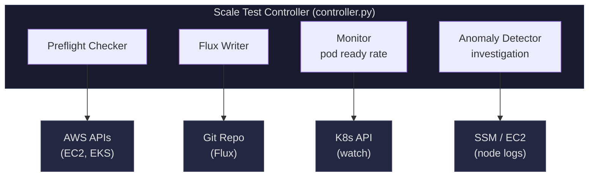
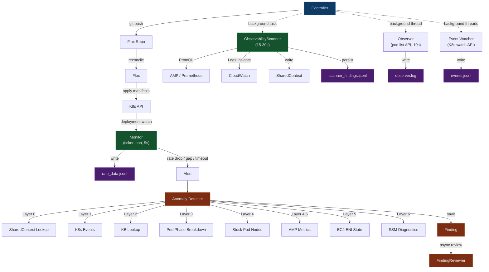

# Architecture Overview

This document explains how the k8s-scale-test application is built, what each piece does, and how they work together.

## What This Application Does

This tool tests how well an EKS (Elastic Kubernetes Service) cluster handles large numbers of pods. It creates thousands of pods on the cluster, measures how fast they start up, detects problems along the way, and produces a report when it's done.

The tool uses a GitOps workflow — instead of talking to Kubernetes directly to create pods, it writes the desired pod counts to a Git repository. A tool called Flux watches that repository and makes the cluster match what's in Git. This is the same workflow used in production, so the test exercises the real deployment path.

## System Diagram

## Module Map

Every Python file in `src/k8s_scale_test/` has one job. Here's what each one does:

```mermaid
flowchart TB
    subgraph ORCH["ORCHESTRATION LAYER"]
        direction LR
        CLI["cli.py\nparse args"] --> CTRL["controller.py\nrun the test"]
    end

    subgraph MEAS["MEASUREMENT LAYER"]
        direction LR
        MONITOR["monitor.py\npods/sec via\ndeployment watch"]
        OBSERVER["observer\n(in controller.py)\npod count via\npod list API"]
    end

    subgraph INVEST["INVESTIGATION LAYER"]
        direction LR
        ANOMALY["anomaly.py\nreactive deep dive"]
        HSWEEP["health_sweep.py\nper-node snapshot"]
        INFRA["infra_health.py\nKarpenter check"]
        METRICS["metrics.py\nnode conditions"]
        DIAG["diagnostics.py\nSSM node logs"]
        EVENTS["events.py\nK8s event stream"]
        REVIEWER["reviewer.py\nskeptical review"]
        SHARED["shared_context.py\nscanner ↔ anomaly"]
    end

    subgraph INFRAL["INFRASTRUCTURE LAYER"]
        direction LR
        FLUX["flux.py\nGit manifests"]
        PREFLIGHT["preflight.py\ncapacity checks"]
        EVIDENCE["evidence.py\nartifact persistence"]
        CL2["cl2_parser.py\nCL2 results"]
        CHART["chart.py\nHTML chart"]
        AGENT["agent_context.py\nAI sub-agent"]
    end

    subgraph KNOW["KNOWLEDGE & CROSS-CUTTING"]
        direction LR
        KBSTORE["kb_store.py\nDynamoDB + S3"]
        KBMATCH["kb_matcher.py\nsignature matching"]
        KBSEED["kb_seed.py\nbuilt-in patterns"]
        KBINGEST["kb_ingest.py\nauto-ingestion"]
        MODELS["models.py\ndata structures"]
        OBS["observability.py\nproactive PromQL + CW"]
        SCHEMA["agent_schema.py\nfinding validation"]
        TRACING["tracing.py\nOpenTelemetry / X-Ray"]
    end

    ORCH --> MEAS --> INVEST --> INFRAL --> KNOW

    style ORCH fill:#0d3b66,stroke:#1d5a8e,color:#e0e0e0
    style MEAS fill:#14532d,stroke:#1a7a3a,color:#e0e0e0
    style INVEST fill:#7c2d12,stroke:#a3441a,color:#e0e0e0
    style INFRAL fill:#4a1d6e,stroke:#6b2fa0,color:#e0e0e0
    style KNOW fill:#4a3728,stroke:#6b5040,color:#e0e0e0
```

## Data Flow During a Test

This diagram shows what data flows where during the scaling phase — the most active part of the test.

## Key Design Decisions

**Why GitOps instead of direct kubectl?**
The test exercises the real deployment path. In production, changes go through Git → Flux → K8s. Testing this path catches Flux reconciliation delays, Git push failures, and kustomization issues that a direct `kubectl scale` would miss.

**Why two pod counting methods (monitor + observer)?**
The monitor uses the Deployment watch API (`.status.readyReplicas`). The observer uses the Pod list API (actual Running pods). These are different K8s API endpoints with different failure modes. If the deployment controller's bookkeeping drifts from reality, the observer catches it. If the observer's pod list call fails, the monitor still works.

**Why reactive investigation instead of continuous monitoring?**
The anomaly detector only runs when something goes wrong (rate drop, timeout, monitor gap). This is intentional — at 30K pods, the K8s API is under heavy load. Running continuous SSM commands and EC2 API calls would add more pressure. The anomaly detector fires targeted queries only when needed. The ObservabilityScanner complements this with lightweight fleet-wide PromQL queries (one HTTP request covers all nodes) that run every 15-30s — cheap enough to run continuously without adding API pressure. CloudWatch drill-downs only trigger when Prometheus finds something.

**Why a Known Issues KB?**
Many scale test failures are the same patterns repeating (IPAMD MAC collision, ECR pull throttle, NVMe disk init). The KB short-circuits investigation — if the K8s events match a known pattern, the anomaly detector returns the known root cause immediately instead of running SSM commands on 3 nodes.
