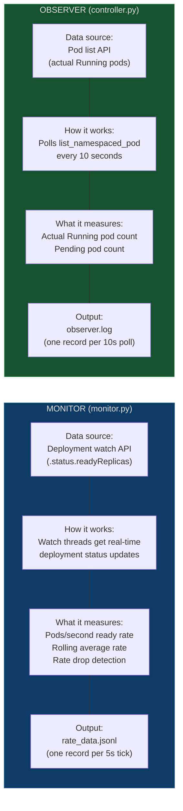
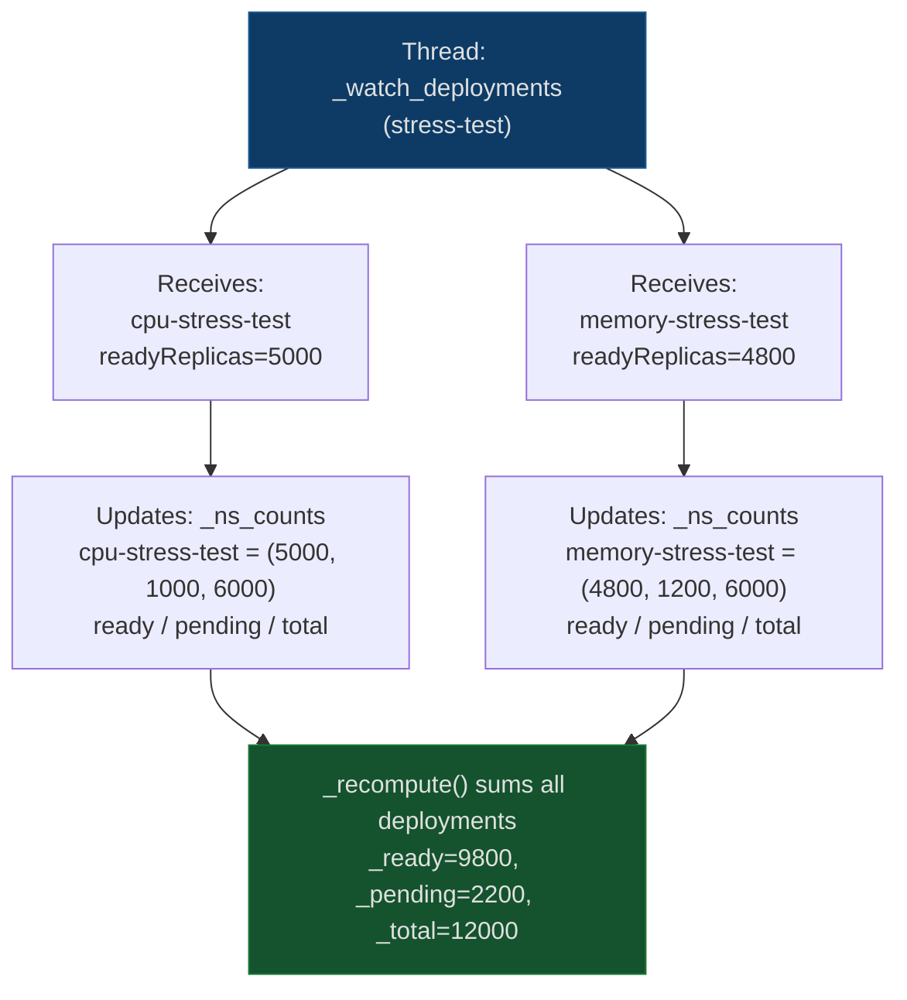
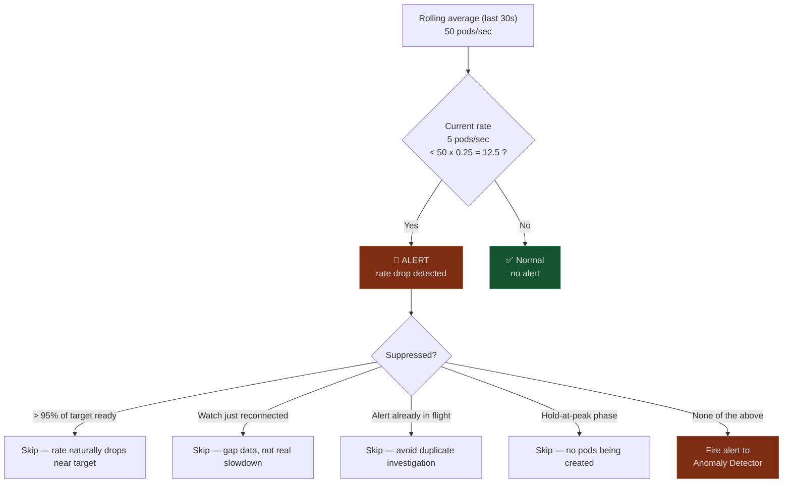
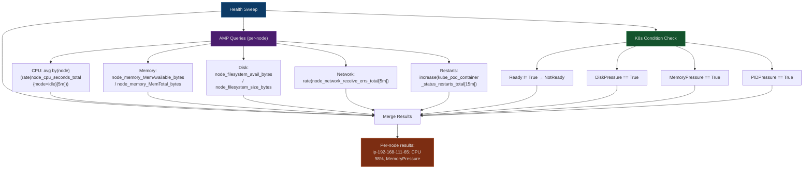

# Monitoring & Measurement

This document explains how the application measures pod scaling performance and detects problems in real time.

## The Two Measurement Systems

The application has two independent systems that count pods. They use different Kubernetes APIs on purpose — if one breaks, the other still works. If they disagree, that tells you something is wrong.

## Monitor Deep Dive (monitor.py)

The monitor has three parts running concurrently:

### 1. Deployment Watch Threads

One background thread per namespace watches for deployment status changes. When Kubernetes updates a deployment's `readyReplicas` count, the watch thread receives the event immediately and updates the shared counters.

### 2. Node Watch Thread

A single background thread watches for node additions and deletions. This tracks how many nodes Karpenter has provisioned.

### 3. Ticker Loop (async, 5s interval)

The ticker runs on the main async event loop. Every 5 seconds it:

1. Reads the current `_ready`, `_pending`, `_total` from the shared counters
2. Computes the rate: `(current_ready - previous_ready) / elapsed_seconds`
3. Checks for gaps (watch disconnects that caused stale data)
4. Checks for hold-at-peak (ready stable, pending zero — skip recording)
5. Records the data point to `rate_data.jsonl`
6. Checks if the rate dropped below the rolling average threshold
7. If rate dropped: fires an alert to the anomaly detector

### Rate Drop Detection

The monitor fires an alert when the instantaneous rate drops significantly below the rolling average. This catches sudden slowdowns caused by infrastructure problems.

### Watch Reconnect Handling

At 30K pods, the K8s API is under heavy load. Watch connections break. When a watch thread reconnects, it does a full re-list of all deployments. This causes `_ready` to jump by thousands in one tick — which would produce a nonsensical rate like 2000 pods/sec.

The monitor detects this by tracking when re-lists happen (`_last_relist_time`). If a large delta coincides with a re-list, the data point is marked as a gap. Gap data points are still recorded (so you can see when disconnects happened) but they don't affect the rolling average or trigger alerts.

## Observer Deep Dive

The observer is simpler — it's a background thread that calls `list_namespaced_pod` every 10 seconds and counts pods by phase. It writes one line per poll to `observer.log`.

The observer exists solely for cross-validation. After the test, `_verify_run_data` compares the monitor's peak ready count against the observer's peak. If they disagree by more than 500 pods, it flags a verification issue.

## Health Sweep (health_sweep.py)

The health sweep runs once during hold-at-peak. Unlike the monitor (which tracks fleet-level rates), the health sweep identifies specific problematic nodes.

The key difference from the monitor: the health sweep returns **per-node** results. It tells you "node X has 98% CPU" not "the fleet average is 65%". This is how you find frozen or problematic nodes.

If AMP is not configured, the health sweep falls back to SSM — it runs shell commands on sampled nodes to check PSI (Pressure Stall Information), kubelet health, disk capacity, and per-core CPU utilization.

## Event Watcher (events.py)

The event watcher streams Kubernetes Warning events in real time via the watch API. One background thread per namespace. Events are written to `events.jsonl` as they arrive — no polling, no pagination.

The event watcher is separate from the monitor because events and pod counts are different data. Events tell you *why* something failed. Pod counts tell you *how many* failed. The anomaly detector uses both.

## Observability Scanner (observability.py)

The scanner is a proactive monitoring layer that runs alongside the monitor and event watcher. While the monitor tracks pod ready rate and the anomaly detector investigates after problems are detected, the scanner queries AMP/Prometheus and CloudWatch every 15-30 seconds looking for fleet-wide early warning signs (CPU pressure, pending pod backlogs, Karpenter queue depth, network errors).

When the scanner detects an issue, it writes the finding to an in-memory `SharedContext` (`shared_context.py`). If a rate drop alert fires shortly after, the anomaly detector checks the SharedContext first and can reference the scanner's finding instead of re-investigating from scratch.

See [docs/observability-scanner.md](observability-scanner.md) for the full query catalog, tiered investigation model, and cross-source correlation details.
