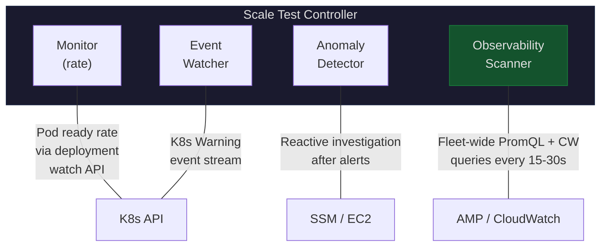
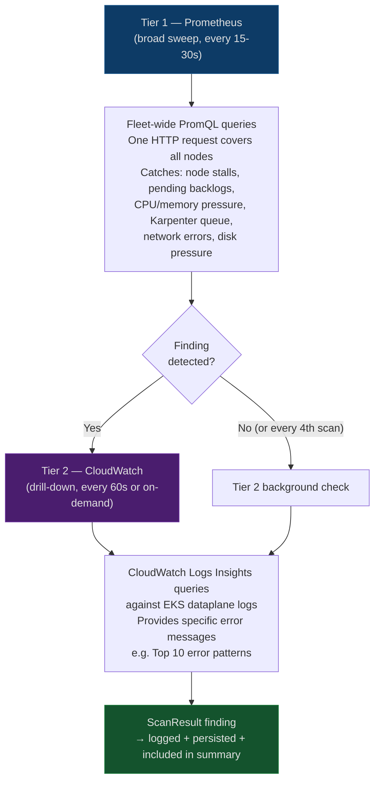
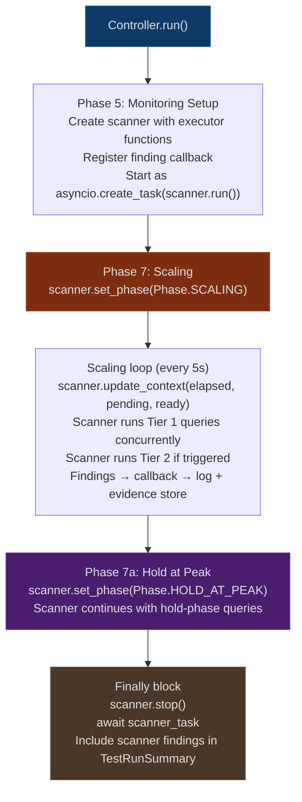

# Observability Scanner

This document explains how the ObservabilityScanner works and how it fits into the scale test monitoring pipeline.

## What It Does

The scanner is the "always-on" monitoring layer that runs alongside the existing monitor, anomaly detector, and health sweep. While the monitor tracks pod ready rate and the anomaly detector investigates after problems are detected, the scanner proactively queries Prometheus and CloudWatch to catch problems before they affect the pod ready rate.

Think of it as a smoke detector — it runs cheap fleet-wide queries every 15-30 seconds looking for early warning signs (CPU pressure, pending pod backlogs, Karpenter queue depth, network errors). When it finds something, it triggers a more expensive CloudWatch drill-down to get the specific error messages.

## How It Fits In

The scanner runs as a parallel, independent component. It does not replace or modify any existing module.

Each module owns its own data path:

| Module | What it owns | How it works |
|--------|-------------|--------------|
| monitor.py | Pod ready rate | Deployment watch API, 5s ticker loop |
| anomaly.py | Reactive investigation | K8s events → SSM → EC2 ENI state |
| health_sweep.py | Per-node health at peak | Per-node PromQL (`avg by(node)(...)`) |
| events.py | K8s event streaming | Watch API for Warning events |
| **observability.py** | **Fleet-wide proactive scans** | **Fleet-aggregated PromQL + CW Insights** |

The scanner's fleet-aggregated queries (`avg(...)`, `count(...)`, `sum(...)`) serve a different purpose than the health sweep's per-node queries (`avg by(node)(...)`). Both are needed — the scanner catches fleet-wide trends early, the health sweep identifies specific problematic nodes at peak.

## Tiered Investigation Model

The scanner uses two tiers to balance cost and depth:

Tier 2 only runs when Tier 1 finds something (or every 4th scan cycle as a background check). This avoids unnecessary CloudWatch costs during normal scaling.

## Query Catalog

Queries are defined as data (`ScanQuery` objects) rather than hardcoded logic. Each query specifies which phases it runs in, a condition function, and an evaluator. Adding a new query means appending to the catalog — no changes to the scanner loop.

### Prometheus Queries (Tier 1)

| Query | Phases | Interval | Threshold | What it catches |
|-------|--------|----------|-----------|----------------|
| `node_count` | scaling | 15s | stall detection | Karpenter stopped provisioning |
| `node_not_ready` | scaling, hold | 30s | > 10 nodes | Nodes failing to join cluster |
| `pending_pods` | scaling | 15s | > 60% of target after 5m | Scheduling bottleneck |
| `pod_restarts` | scaling, hold | 30s | > 50 in 5m | Crashloops or OOM kills |
| `cpu_pressure` | scaling, hold | 30s | > 90% fleet avg | CPU saturation |
| `memory_pressure` | hold | 30s | > 80% fleet avg | Memory exhaustion |
| `cpu_outliers` | scaling, hold | 30s | > 5 nodes at 95%+ | CPU hotspots |
| `network_errors` | scaling, hold | 30s | > 10 errors/s | CNI or VPC issues |
| `karpenter_queue_depth` | scaling | 15s | > 1000 | Karpenter backlog |
| `karpenter_errors` | scaling | 30s | > 5 in 2m | EC2 API failures |
| `disk_pressure` | scaling, hold | 30s | > 0 nodes at <10% free | Disk exhaustion |

### CloudWatch Queries (Tier 2)

| Query | Phases | Interval | Trigger | What it provides |
|-------|--------|----------|---------|-----------------|
| `cw_top_errors` | scaling, hold | 60s | Prometheus finding or every 4th scan | Top 10 error patterns in dataplane logs |

## Lifecycle

The scanner follows the controller's test phases:

## Context Updates

The controller feeds the scanner live data each polling iteration so that condition functions and evaluators have current state:

| Context Key | Type | Source | Used By |
|-------------|------|--------|---------|
| `elapsed_minutes` | float | Controller scaling loop | `pending_pods` condition (skip first 2m) |
| `pending` | int | `_count_pods()` | `node_count` evaluator (stall detection) |
| `ready` | int | `_count_pods()` | Future evaluators |
| `target_pods` | int | TestConfig | `pending_pods` evaluator (ratio calc) |
| `scan_count` | int | Scanner internal | `cw_top_errors` condition (every 4th scan) |
| `prev_node_count` | float | Scanner internal | `node_count` evaluator (growth tracking) |
| `has_prometheus_finding` | bool | Scanner internal | `cw_top_errors` condition (Tier 2 trigger) |

## Findings

Scanner findings are `ScanResult` dataclass instances with:

| Field | Description |
|-------|-------------|
| `query_name` | Which catalog query produced this (e.g., "cpu_pressure") |
| `severity` | INFO, WARNING, or CRITICAL |
| `title` | One-line summary (e.g., "Fleet avg CPU: 92.3% (threshold: 90)") |
| `detail` | Longer explanation with context |
| `source` | PROMETHEUS or CLOUDWATCH |
| `raw_result` | Raw query response for evidence storage |
| `drill_down_source` | If set, triggers Tier 2 follow-up |

Findings are:
- Logged at WARNING level as they occur
- Persisted to `scanner_findings.jsonl` in the evidence store
- Collected in `self._scanner_findings` (separate from anomaly findings)
- Written to the in-memory SharedContext for cross-source correlation with the anomaly detector
- Included in the `TestRunSummary` under `scanner_findings`

## Cross-Source Correlation

Scanner findings are shared with the anomaly detector via an in-memory `SharedContext` (`shared_context.py`). When the scanner produces a finding, the controller writes it to the SharedContext. When an alert triggers investigation, the anomaly detector queries the SharedContext for temporally relevant scanner findings (within ±120s by default).

If a scanner finding matches the alert's symptoms (same time window, overlapping affected nodes), the anomaly detector references it as prior evidence instead of re-investigating. Matches are classified as:

- **Strong**: Temporal overlap AND resource overlap (scanner found issues on the same nodes)
- **Weak**: Temporal overlap only (scanner found issues but on different or unknown nodes)

This avoids redundant investigation when the scanner already identified the cause. For example, if the scanner detects CPU pressure proactively and a rate drop fires 30 seconds later, the anomaly detector sees the scanner finding and references it rather than re-querying AMP.

## Graceful Degradation

The scanner adapts to what's available:

| Config State | Behavior |
|-------------|----------|
| AMP or Prometheus URL configured | Prometheus queries run, CloudWatch queries run if also configured |
| Only CloudWatch configured | Prometheus queries skipped, CloudWatch queries run |
| Neither configured | Scanner not created at all, test runs normally without it |
| Prometheus query fails at runtime | Error logged, scanner continues with next query |
| CloudWatch query fails at runtime | Error logged, scanner continues |
| Scanner task crashes entirely | Controller logs the failure, test completes without scanner data |

The scanner never blocks or crashes the test run. All query failures are caught and logged at debug level.

## Output Files

| File | Location | Contents |
|------|----------|----------|
| `scanner_findings.jsonl` | Evidence run directory | One JSON line per finding with query_name, severity, title, detail, source, timestamp |

Scanner findings also appear in `summary.json` under the `scanner_findings` key, separate from anomaly detector findings.
